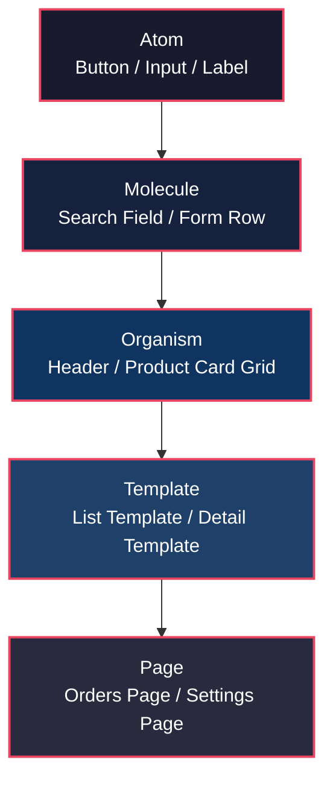
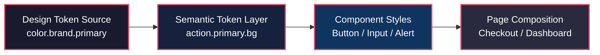
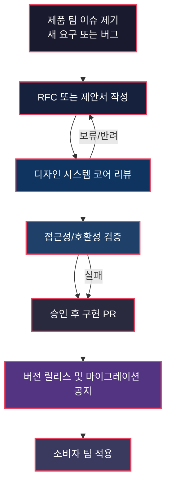

# 디자인 시스템 — 재사용 가능한 인터페이스의 설계 문서
> **한 줄 요약**: 디자인 시스템은 "화면을 빨리 만드는 도구"가 아니라, 여러 팀이 동시에 UI를 만들어도 일관성과 접근성을 유지하게 하는 컴포넌트 라이브러리 운영 체계다.
## 면책 조항 (Disclaimer)
> 이 글은 디자인 시스템을 소프트웨어 엔지니어링 관점으로 해석한 시스템 분석 문서입니다.
> 비유는 이해를 돕기 위한 도구이며, 현실을 완전히 대체하지 않습니다.
> 실제 도입·운영 의사결정에는 각 조직의 제품 맥락, 규제 맥락, 사용자 맥락을 함께 검토해야 합니다.
---
## 핵심 개념 매핑 (Terminology Map)
이 글은 디자인 시스템을 "컴포넌트 라이브러리"로 읽습니다.
아래 6개 개념을 먼저 잡고 들어가면 전체 구조가 보입니다.
| 개념 | 이 시스템에서의 의미 |
|---|---|
| **컴포넌트 계약** | 버튼, 입력창, 모달 같은 UI 단위가 어떤 속성(props), 상태(state), 접근성 속성을 가져야 하는지 정의한 인터페이스 규약 |
| **디자인 토큰** | 색상, 간격, 타이포그래피, 모서리 반경 같은 값을 이름 기반으로 중앙 관리하는 설정 계층 |
| **버전 정책** | 컴포넌트 변경이 소비자 제품에 미치는 영향을 `major/minor/patch`로 구분하고 이행 계획을 강제하는 규칙 |
| **접근성 기준** | WCAG를 기준으로 컴포넌트 단위에서 검사 가능한 준수 항목을 테스트 스위트처럼 운영하는 체계[^1][^2] |
| **거버넌스 모델** | 누가 컴포넌트를 소유하고, 누가 변경을 승인하며, 누가 예외를 허용하는지 정의하는 운영 규칙 |
| **소비자 계약** | 제품 팀이 시스템 컴포넌트를 사용할 때 지켜야 하는 사용 규칙과 마이그레이션 의무 |
---
## 시스템 브리프 — 왜 디자인 시스템이 필요한가
> **설계 문제**: "UI를 만들어야 하는데, 팀이 커지면 일관성이 깨진다. 어떻게 확장 가능한 인터페이스 시스템을 만들 것인가?"
초기 스타트업에서는 한두 명의 디자이너와 프론트엔드 엔지니어가 화면을 빠르게 만든다.
이 단계에서는 버튼이 조금씩 달라도 제품이 돌아간다.
문제는 팀이 늘고 제품 수가 늘어나는 시점이다.
같은 "Primary Button"인데 서비스마다 색이 다르고,
폼 에러 메시지 위치가 제각각이며,
키보드 포커스 이동 규칙도 화면마다 달라진다.
이 상태가 누적되면 릴리스 속도보다 유지보수 비용이 더 빠르게 증가한다.
디자인 시스템은 이 문제를
"개별 화면 제작"
관점이 아니라
"재사용 가능한 인터페이스 부품 생산"
관점으로 전환한다.
즉,
화면을 직접 반복 구현하는 대신,
공통 컴포넌트와 토큰을 중앙에서 관리하고,
제품 팀은 이를 조합해 페이지를 만든다.
이 구조는 소프트웨어에서
공유 라이브러리,
설정 관리,
버전 관리,
테스트 자동화,
오픈소스 거버넌스를
동시에 적용한 운영 모델과 유사하다.
핵심은 하나다.
핫테이크보다 구조.
디자인 취향보다 계약.
---
## §1. 컴포넌트의 설계와 계약 — API Contract
> **설계 문제**: 재사용 가능한 컴포넌트를 만들고 싶다. 그런데 팀마다 구현 방식이 다르면 재사용이 아니라 포크가 된다. 무엇을 "고정 계약"으로 정의해야 하는가?
컴포넌트 라이브러리의 첫 번째 원칙은
"모양"
보다
"계약"
이다.
예를 들어 버튼 컴포넌트를 정의할 때,
색상과 그림자보다 먼저 확정해야 할 것은
다음과 같은 인터페이스다.
- 어떤 variant를 지원하는가 (`primary`, `secondary`, `danger`)
- 어떤 상태를 지원하는가 (`default`, `hover`, `focus`, `disabled`, `loading`)
- 키보드 사용 시 어떤 상호작용을 보장하는가
- 스크린 리더 이름은 어디서 오는가 (`aria-label`, visible label)
- 비동기 처리 중 중복 클릭을 어떻게 방지하는가
이 항목이 문서화되지 않으면,
각 제품 팀은 "비슷한 버튼"을 다시 만든다.
그 결과는 재사용이 아니라 API 분열이다.
Atomic Design은 UI를
Atom,
Molecule,
Organism,
Template,
Page
계층으로 분해해 재사용 범위를 명확히 하자는 접근이다.[^3]
중요한 점은,
Atomic Design이 시각 스타일 철학이 아니라
분해 단위와 조합 단위를 정하는 아키텍처 프레임이라는 것이다.

엔지니어 관점에서 보면,
Atom은 표준 라이브러리 함수에 가깝고,
Organism은 도메인 조합 컴포넌트,
Template은 라우트 수준 스캐폴딩이다.
이때 반드시 분리해야 하는 것이 있다.
컴포넌트의
"시맨틱 계약"
과
"브랜드 스킨"
을 구분해야 한다.
예를 들어,
`Button`의 클릭 가능 영역,
포커스 표시,
비활성 상태 전달은 계약이다.
하지만 그림자 강도나 라운드 값은 토큰으로 분리 가능한 스킨이다.
계약과 스킨을 섞어 버리면
브랜드 리뉴얼 때 컴포넌트 API까지 깨진다.
반대로 둘을 분리하면
토큰 교체만으로 다수 화면을 안전하게 업데이트할 수 있다.
Material Design,
Carbon,
Lightning,
USWDS 같은 공개 시스템이 공통으로 강조하는 것도
컴포넌트의 사용 원칙,
상태,
접근성,
코드 구현의 동기화다.[^4][^5][^6][^7]
요약하면,
컴포넌트 라이브러리의 본질은
UI 조각 모음이 아니라
계약 기반 인터페이스 레이어다.
---
## §2. 디자인 토큰 — Configuration as Code
> **설계 문제**: 색상·간격·타이포그래피를 팀마다 직접 하드코딩하면 일관성이 깨진다. 공통 값을 어떻게 중앙 설정으로 관리할 것인가?
디자인 토큰은
"디자인 값"
을
"이름 있는 설정"
으로 다루는 방식이다.
예를 들어
`#005ea2`
라는 색 값을 페이지마다 직접 쓰는 대신,
`color.brand.primary`
같은 토큰 이름을 사용한다.
그다음 플랫폼별로
웹 CSS 변수,
iOS semantic color,
Android resource,
디자인 툴 변수
로 변환한다.
이 구조는 환경변수 관리와 유사하다.
애플리케이션 코드가 실제 비밀값을 직접 들고 있지 않고,
키 이름을 통해 주입받는 것과 같다.
토큰 계층은 보통 다음처럼 나눈다.
- **Primitive token**: 원시값 (`blue-60`, `space-2`)
- **Semantic token**: 의미값 (`text-primary`, `surface-danger`)
- **Component token**: 컴포넌트 전용값 (`button-primary-bg`, `input-border-focus`)
중요한 운영 원칙은
"페이지는 primitive를 직접 참조하지 않는다"
이다.
페이지가 primitive를 직접 참조하기 시작하면
중앙 제어가 무너지고,
브랜드 변경 비용이 급증한다.
W3C Design Tokens Community Group 문서는
토큰을 교환 가능한 포맷으로 정의하려는 이유를
도구 종속성 감소,
플랫폼 간 일관성,
자동화 가능성으로 설명한다.[^8]
USWDS 역시
색상·간격·타이포그래피를 토큰으로 제공하고,
컴포넌트는 이 토큰을 조합해 구성하도록 안내한다.[^7]

토큰 운영이 실패하는 전형적 패턴도 있다.
첫째,
토큰 이름이 의미가 아니라 값 기반일 때다.
`blue-500`를 비즈니스 맥락에 직접 쓰면,
팔레트 변경 시 이름 자체가 기술 부채가 된다.
둘째,
컴포넌트가 토큰을 우회해 로컬 값을 직접 선언할 때다.
이 경우 "공통 시스템"이 아니라 "권고사항"으로 격하된다.
셋째,
디자인 툴과 코드 저장소의 토큰이 분리될 때다.
도구 간 동기화 실패는 디자인 리뷰와 실제 구현 간 차이를 만든다.
결론적으로,
토큰은 장식용 사전이 아니라
시스템 구성값의 단일 진실 공급원이어야 한다.
---
## §3. 버전 관리와 Breaking Change — Semantic Versioning
> **설계 문제**: 컴포넌트를 개선하면 기존 제품이 깨질 수 있다. 변경을 멈추지 않으면서도 소비자 팀의 안정성을 어떻게 보장할 것인가?
디자인 시스템은 라이브러리다.
라이브러리라면 버전 정책이 있어야 한다.
실무에서 가장 흔한 실패는
"스타일 수정"이라고 배포했는데
실제로는 접근성이나 레이아웃 계약을 깨는 변경인 경우다.
예를 들어,
버튼 높이를 줄였더니
터치 타깃이 작아져 모바일 사용성이 떨어진다.
혹은 포커스 링을 제거해 키보드 탐색 가능성이 사라진다.
이건 미관 변경이 아니라 계약 파손이다.[^1][^2]
그래서 버전 정책은
코드 API뿐 아니라
시각·상호작용·접근성 API를 함께 다뤄야 한다.
권장되는 분류는 다음과 같다.
- `MAJOR`: 기존 마크업/속성/행동을 깨는 변경
- `MINOR`: 하위 호환되는 기능 추가
- `PATCH`: 결함 수정, 시각 미세조정, 문서 오타 수정
중요한 점은
"무엇이 breaking인지"
를 문서화해 공유하는 것이다.
예시로,
다음 변경은 MAJOR로 취급하는 편이 안전하다.
- 필수 prop 이름 변경 (`size` -> `scale`)
- 기본 색상 대비가 달라져 명암비 계약이 깨짐
- 키보드 이벤트 흐름 변경 (Enter/Space 동작 불일치)
- 슬롯 구조 변경으로 기존 children 렌더링이 깨짐
반대로,
아이콘 정렬 1px 보정,
문구 오탈자 수정,
내부 리팩터링은 보통 PATCH다.
Material,
Carbon,
Lightning,
USWDS는 모두 릴리스 노트,
마이그레이션 가이드,
사용 규칙 문서를 통해
소비자 팀이 "무엇이 바뀌는지"를 사전에 알 수 있게 운영한다.[^4][^5][^6][^7]
버전 정책이 없는 디자인 시스템은
중앙화된 혼란일 뿐이다.
버전 정책이 있는 디자인 시스템만이
확장 가능한 공유 인프라가 된다.
---
## §4. 접근성 — Compliance as Test Suite
> **설계 문제**: 모든 사용자가 시스템을 사용할 수 있어야 한다. 접근성을 "좋으면 하는 것"이 아니라 "출시 조건"으로 어떻게 강제할 것인가?
접근성은 옵션이 아니다.
공통 컴포넌트라면 기본적으로 접근성을 내장해야 한다.
WCAG는 웹 접근성의 국제 기준을 제시한다.
핵심 원칙은
지각 가능,
운용 가능,
이해 가능,
견고성(POUR)
이다.[^1][^2]
엔지니어링적으로는
이를 테스트 가능한 항목으로 변환해야 한다.
예를 들어 컴포넌트 단위의 체크리스트는 다음과 같다.
- 명도 대비가 기준을 만족하는가
- 키보드만으로 모든 상호작용이 가능한가
- 포커스 순서가 시각 순서와 일치하는가
- 상태 변화가 스크린 리더에 전달되는가
- 오류 메시지가 필드와 프로그래매틱하게 연결되는가
여기서 포인트는
"페이지가 아니라 컴포넌트에서 먼저 통과"
다.
기본 부품이 접근성을 만족하면,
페이지 수준 검증 비용이 크게 줄어든다.
W3C WAI는 WCAG뿐 아니라
Authoring Practices,
튜토리얼,
체크 도구 가이드를 통해
패턴별 구현 지침을 제공한다.[^1][^9]
운영 모델로 보면,
접근성은 QA 마지막 단계 검수가 아니라
컴포넌트 CI 파이프라인의 품질 게이트여야 한다.
예를 들어 다음 흐름이 필요하다.
1. 토큰/컴포넌트 변경 PR 생성
2. 시각 회귀 테스트 실행
3. 접근성 규칙 검사 실행
4. 수동 보조기기 점검(필요 컴포넌트)
5. 릴리스 승인
이 파이프라인이 없으면,
접근성 결함은 제품 팀으로 전가된다.
그 순간 디자인 시스템은 품질 증폭기가 아니라 결함 증폭기가 된다.
---
## §5. 거버넌스 — 누가 컴포넌트를 관리하는가
> **설계 문제**: 시스템은 공용 자산인데, 우선순위는 팀마다 다르다. 누가 변경을 승인하고, 누가 예외를 통제하며, 누가 장기 부채를 상환하는가?
디자인 시스템은 도구가 아니라 조직 구조다.
거버넌스 없이는 유지되지 않는다.
가장 실용적인 모델은
"코어 팀 + 소비자 기여"
모델이다.
- 코어 팀: 아키텍처, 품질 기준, 릴리스 정책 소유
- 소비자 팀: 기능 요구 제안, 버그 제보, 기여 PR 제출
- 리뷰 위원회: 예외 승인, 우선순위 조정, 분쟁 해결
오픈소스 프로젝트의
`CODEOWNERS`,
RFC,
릴리스 캘린더,
deprecation 정책과
매우 유사하다.

거버넌스에서 자주 충돌하는 질문은 세 가지다.
첫째,
"제품 출시 일정이 급한데 예외를 허용할 것인가?"
둘째,
"한 서비스만 필요한 컴포넌트를 공통 라이브러리에 넣을 것인가?"
셋째,
"브레이킹 체인지의 이행 비용을 누가 부담할 것인가?"
이 질문에 대한 조직의 답이
곧 디자인 시스템의 실제 형태다.
USWDS,
Carbon,
Lightning처럼 장기 운영되는 시스템은
기여 가이드,
거버넌스 문서,
릴리스 정책을 명시해
의사결정을 사람 의존이 아닌 규칙 의존으로 전환한다.[^6][^7][^10]
핵심은 단순하다.
컴포넌트 품질은 코드에서 결정되지만,
컴포넌트 수명은 거버넌스에서 결정된다.
---
## 조직 내 위치 (Organizational Context)
> **설계 문제**: 디자인 시스템 팀은 조직의 어디에 있어야 가장 큰 레버리지를 만들 수 있는가?
디자인 시스템은 단일 기능 팀의 하위 모듈이 아니다.
제품 조직 전반에 걸친 플랫폼 기능에 가깝다.
| 구분 | 주요 대상 | 의존 관계 | 기대 산출물 |
|---|---|---|---|
| **상위 의존성** | 브랜드 전략, 접근성/법무, 제품 전략 | 브랜드 원칙·규제 요구를 입력받음 | 토큰 원칙, 접근성 기준, 컴포넌트 우선순위 |
| **하위 의존성** | 웹/앱 프론트엔드, 디자인 툴 체인, 문서 플랫폼 | 시스템을 실제 제품에 적용 | 컴포넌트 구현, 예제 코드, 변경 알림 |
| **수평 의존성** | QA, 데이터, 콘텐츠, 고객지원 | 품질 지표와 운영 피드백 교환 | 결함 리포트, 사용성 지표, FAQ 패턴 반영 |
실행 관점에서,
디자인 시스템 팀은
"중앙 통제 조직"
이 아니라
"공유 플랫폼 팀"
처럼 운영될 때 성공 확률이 높다.
---
## 성숙도 단계 (Maturity Model)
> **설계 문제**: 모든 조직이 같은 수준의 시스템을 한 번에 만들 수는 없다. 현재 단계에 맞는 최소 운영 모델은 무엇인가?
| 단계 | 운영 특징 | 기술 특징 | 리스크 | 다음 단계 진입 조건 |
|---|---|---|---|---|
| **Startup** | 소수 인원이 암묵 규칙으로 UI 생산 | 공통 컴포넌트 일부, 토큰 미정형 | 속도는 빠르나 일관성 급락 | 핵심 컴포넌트 10~20개 계약 문서화 |
| **Growth** | 코어 팀 형성, 기여 프로세스 시작 | 토큰 계층 도입, 버전 정책 도입 | 소비자 팀 이행 비용 증가 | 접근성 게이트와 마이그레이션 자동화 |
| **Enterprise** | 거버넌스 정착, 다중 제품 동기화 | 멀티플랫폼 토큰 파이프라인, 릴리스 캘린더 | 의사결정 지연, 과도한 표준화 | 예외 처리 SLA와 도메인 확장 전략 |
성숙도 모델의 포인트는
"완벽한 시스템을 한 번에"
가 아니라
"다음 병목을 제거하는 수준까지"
다.
---
## 변경 이력 — 세 번의 전환점
> **설계 문제**: 인터페이스 표준화는 어떤 압력에서 진화해 왔는가?
### 1) 프리디지털 시기 — 브랜드 매뉴얼 중심
인쇄 중심 시대의 브랜드 가이드는
색상,
로고,
타이포그래피 규정이 핵심이었다.
이 시기의 강점은 정체성 통일,
약점은 상호작용 규칙 부재였다.
### 2) SaaS/데이터 시기 — 도구 기반 협업 확장
웹·모바일 제품이 급증하면서
정적 매뉴얼만으로는 속도를 감당할 수 없게 되었다.
Material,
HIG,
USWDS,
Carbon,
Lightning 같은 공개 시스템은
"가이드 + 코드 + 운영 문서"
구조를 제도화했다.[^4][^5][^6][^7][^10]
### 3) AI/현재 시기 — 토큰 자동화와 생성형 UI 실험
현재 전환점의 핵심은
토큰의 표준 포맷화 시도,
컴포넌트 생성 자동화,
접근성 자동검사 강화다.[^8][^9]
다만 생성형 UI가 빠르게 확산될수록,
거버넌스 없는 자동화는
일관성 붕괴를 더 빠르게 만든다.
즉,
AI는 시스템의 대체재가 아니라
운영 체계를 더 엄격히 요구하는 증폭기다.
---
## 운영 모델 비교
> **설계 문제**: 대표적 공개 디자인 시스템은 같은 문제를 어떻게 다르게 푸는가?
| 시스템 | 운영 초점 | 강점 | 주의점 |
|---|---|---|---|
| **Material Design (Google)** | 대규모 제품군의 일관된 상호작용·컴포넌트 원칙 | 컴포넌트/패턴 문서와 실사용 가이드가 풍부 | 제품 특수성을 반영하지 않으면 과도한 동형화 위험[^4] |
| **Human Interface Guidelines (Apple)** | 플랫폼 네이티브 경험, 입력 방식·플랫폼 관습 준수 | OS 맥락과 사용자 기대를 강하게 반영 | 크로스플랫폼 제품에서 단일 규칙으로 복제하기 어려움[^5] |
| **Carbon (IBM)** | 엔터프라이즈 업무 제품의 확장성과 접근성 | 복잡한 B2B 워크플로우에 맞춘 컴포넌트 체계 | 조직 내 학습 비용이 큼[^6] |
| **Lightning Design System (Salesforce)** | 대규모 제품 생태계의 통합 UI 규칙 | 디자인/개발 자산 동기화와 명확한 패턴 가이드 | 생태계 외부 제품에 적용 시 커스터마이징 비용 발생[^10] |
이 비교에서 중요한 결론은
"정답 시스템 선택"
이 아니라
"우리 조직의 제약에 맞는 운영 원칙 선택"
이다.
---
## 이 비유의 한계 (Limits of the Analogy)
> **설계 문제**: 디자인 시스템을 소프트웨어 비유로 설명할 때 무엇이 잘 설명되고, 무엇이 왜곡되는가?
| 비유가 작동하는 곳 | 비유가 깨지는 곳 | 이유 |
|---|---|---|
| **컴포넌트 계약 = API 계약**으로 보면 재사용 조건을 명확히 정의할 수 있다. | 디자인은 감성·브랜드 맥락이 강해 동일 API여도 체감 품질이 달라진다. | 함수 계약은 기계적으로 검증되지만 미적 품질은 사용자 맥락 의존적이다. |
| **토큰 = 설정 관리**로 보면 테마 전환과 다중 브랜드 운영을 체계화할 수 있다. | 색상·타이포그래피의 문화적 해석은 숫자 설정만으로 환원되지 않는다. | 동일 명도 대비를 만족해도 문화권별 인지·선호가 다를 수 있다. |
| **접근성 기준 = 테스트 스위트**는 품질 게이트 설계에 매우 유용하다. | 자동 검사 통과가 실제 사용성 보장을 의미하지는 않는다. | WCAG 준수와 사용자 경험의 충분조건은 다르며 수동 검증이 필요하다.[^1][^2] |
| **버전 정책 = 세맨틱 버저닝**은 변경 위험을 전달하는 공통 언어를 준다. | UI 변화의 파급은 코드 의존성 외에 교육·운영·지원 비용까지 포함한다. | 프런트 변경은 고객센터 스크립트, 온보딩 문서, 내부 교육에도 영향 준다. |
| **거버넌스 = 오픈소스 운영**은 기여 모델 설계에 직접 적용 가능하다. | 사내 권력 구조와 KPI 충돌은 오픈소스보다 비대칭적이다. | 동일 규칙이 있어도 조직 정치와 예산 구조가 의사결정을 왜곡할 수 있다. |
| **Atomic 계층 = 아키텍처 계층**은 분해·조합 관점을 제공한다. | 실제 제품은 도메인별 예외가 많아 계층 경계가 자주 흐려진다. | 복잡한 도메인 화면은 Organism과 Template의 경계가 고정되지 않는다. |
종합하면,
엔지니어링 비유는 구조를 설명하는 데 강하다.
하지만 경험 품질의 전부를 설명하지는 못한다.
비유는 도구이지 결론이 아닙니다.
---
## 출처 (Sources)
### 1순위 — 표준 및 규격
- W3C Web Accessibility Initiative (WAI), "WAI Standards and Guidelines: WCAG". https://www.w3.org/WAI/standards-guidelines/wcag/
- W3C, "Web Content Accessibility Guidelines (WCAG) 2.2". https://www.w3.org/TR/WCAG22/
### 2순위 — 공개 디자인 시스템 공식 문서
- U.S. Web Design System (USWDS). https://designsystem.digital.gov/
- Material Design 3. https://m3.material.io/
- Apple Human Interface Guidelines. https://developer.apple.com/design/human-interface-guidelines/
- IBM Carbon Design System. https://carbondesignsystem.com/
- Salesforce Lightning Design System. https://www.lightningdesignsystem.com/
### 참고 — 방법론 및 표준화 논의
- Atomic Design by Brad Frost. https://atomicdesign.bradfrost.com/
- Design Tokens Community Group (W3C Community Group). https://design-tokens.github.io/community-group/format/
- WAI-ARIA Authoring Practices Guide (APG). https://www.w3.org/WAI/ARIA/apg/
---
## 각주
[^1]: W3C WAI, "WAI Standards and Guidelines: WCAG". WCAG의 원칙과 버전(2.0/2.1/2.2), 관련 보조 문서 체계를 제시한다. https://www.w3.org/WAI/standards-guidelines/wcag/
[^2]: W3C, "Web Content Accessibility Guidelines (WCAG) 2.2". 성공 기준과 준수 레벨(A/AA/AAA)을 명시한다. https://www.w3.org/TR/WCAG22/
[^3]: Brad Frost, "Atomic Design". UI를 Atom/Molecule/Organism/Template/Page 계층으로 설명하는 방법론. https://atomicdesign.bradfrost.com/
[^4]: Google, "Material Design 3" 공식 문서. 컴포넌트, 패턴, 토큰 기반 테마 가이드를 제공한다. https://m3.material.io/
[^5]: Apple, "Human Interface Guidelines". 플랫폼별 인터랙션 관습과 구성 요소 원칙을 정의한다. https://developer.apple.com/design/human-interface-guidelines/
[^6]: IBM, "Carbon Design System". 엔터프라이즈 제품을 위한 컴포넌트/가이드/접근성 문서를 제공한다. https://carbondesignsystem.com/
[^7]: U.S. General Services Administration, "U.S. Web Design System". 토큰, 컴포넌트, 접근성 중심 운영 원칙을 공개한다. https://designsystem.digital.gov/
[^8]: Design Tokens Community Group, "Format Module". 디자인 토큰의 교환 가능한 데이터 형식 표준화를 다룬다. https://design-tokens.github.io/community-group/format/
[^9]: W3C WAI-ARIA Authoring Practices Guide. 공통 위젯 패턴의 접근성 구현 관행을 제시한다. https://www.w3.org/WAI/ARIA/apg/
[^10]: Salesforce, "Lightning Design System". 컴포넌트 패턴과 디자인 가이드, 구현 리소스를 제공한다. https://www.lightningdesignsystem.com/
---
## 관련 글 (See Also)
- [브랜드 가이드라인 — Identity as Interface Contract](./brand-guideline-as-interface-contract.md) *(예정)*
- [디자인 QA — Visual Regression as Quality Gate](./design-qa-as-regression-pipeline.md) *(예정)*
- [프론트엔드 플랫폼 — Shared UI Infra](../../engineering/platform/frontend-platform-as-shared-infra.md) *(예정)*
- [제품 실험 — A/B 테스트와 컴포넌트 거버넌스](../case/ab-test-vs-design-consistency.md) *(예정)*
---
<!--
시스템 분석 체크리스트 (methodology.md):
- [x] 1순위 또는 2순위 출처가 최소 1개 인용되어 있는가
- [x] Terminology map이 포함되어 있는가 (6개 핵심 개념 매핑)
- [x] Source basis가 명시되어 있는가
- [x] Limits of the analogy가 구체적으로 작성되어 있는가
- [x] Disclaimer가 포함되어 있는가
- [x] Mermaid 다이어그램이 포함되어 있는가 (3개)
- [x] 사용된 모든 메타포가 섹션별로 분리되어 있는가
- [x] 규범적 판단과 시스템 기술이 분리되어 있는가
- [x] See also 링크가 관련 글을 정확히 가리키는가 (예정 표시)
- [ ] notable_cases에 관련 케이스가 등록되어 있는가 (아직 케이스 글이 없음)
-->
