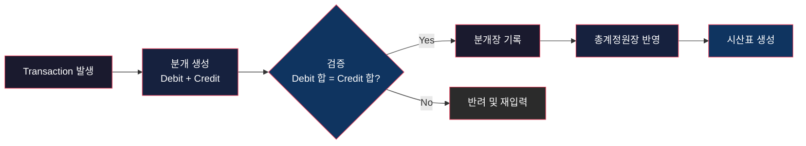
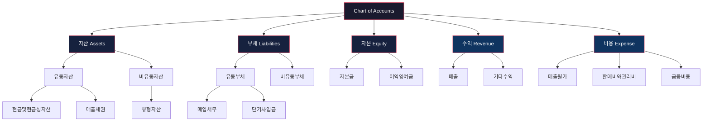
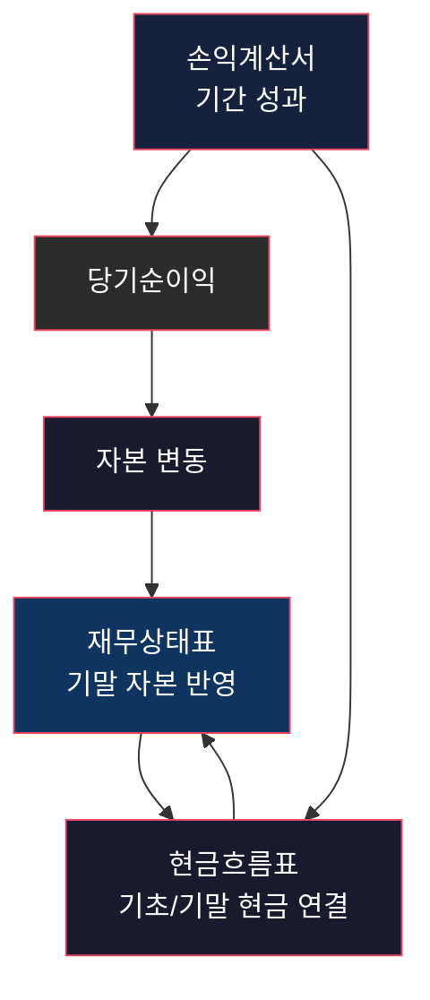

# 회계 체계 — Layered Accounting Architecture
> **한 줄 요약**: 회계는 기업의 모든 경제적 활동을 기록·검증·보고하는 계층형 아키텍처다.

## 면책 조항 (Disclaimer)
> 이 문서는 회계 제도를 소프트웨어 엔지니어링 관점으로 해석한 시스템 분석 글입니다.
> 비유는 구조 이해를 돕기 위한 도구이며, 법적·회계적 판단을 대체하지 않습니다.
> 실제 회계처리, 공시, 감사 대응은 반드시 K-IFRS, 외감법, 상법, 금융감독원 공식 자료를 확인하세요.

---

## 이 글을 읽기 전에 — 핵심 개념 매핑
회계를 처음 접하는 엔지니어 독자를 위해 핵심 용어를 먼저 매핑한다.
아래 7개 키워드가 이 문서의 공통 인터페이스다.

| 회계 개념 | 시스템 비유 | 의미 |
|---|---|---|
| **분개 (Journal Entry)** | **Event Write** | 경제적 사건을 원자 단위로 기록하는 입력 연산 |
| **원장 (Ledger)** | **Append-only Log** | 이벤트 누적 기록 저장소, 수정은 보정 이벤트로 반영 |
| **계정과목 (Chart of Accounts)** | **Schema / Type System** | 데이터 의미를 고정하고 집계를 가능하게 하는 분류 체계 |
| **결산 (Closing)** | **Batch Close / Cron Cycle** | 연속 입력을 기간 단위로 확정하는 배치 사이클 |
| **재무제표 (Financial Statements)** | **System Dashboard** | 이해관계자에게 시스템 상태를 공개하는 표준 뷰 |
| **내부통제 (Internal Control)** | **Validation Layer** | 입력 오류, 권한 남용, 누락을 사전 차단하는 검증 계층 |
| **외부감사 (External Audit)** | **Independent Code Review** | 내부 산출물의 신뢰성을 독립된 제3자가 검증 |

---

## 시스템 브리프 — 신뢰 가능한 기업 기록 시스템은 어떻게 만들어지는가
기업에서는 매일 수천 건의 경제적 이벤트가 발생한다.
매출이 인식되고,
구매가 발생하고,
급여가 지급되고,
차입과 상환이 반복된다.
이 흐름을 빠짐없이 기록하고,
기록이 기준에 맞는지 검증하고,
외부 이해관계자에게 비교 가능한 형태로 보고해야 한다.
핵심 설계 질문은 단순하다.
**"어떻게 신뢰 가능한 기록 시스템을 운영할 것인가?"**
회계는 이 질문에 대해,
입력 계층,
스키마 계층,
배치 확정 계층,
관측 계층,
외부 검증 계층으로 답한다.
즉 회계는 문서 작업이 아니라 계층형 정보 시스템이다.

---

## §1. 복식부기 — Event Sourcing / Append-only Log
> **설계 문제**: 모든 거래를 누락 없이 기록하고, 나중에 검증 가능하게 유지하려면 어떤 입력 모델이 필요한가?

복식부기는 거래 1건을 최소 2개의 방향으로 기록한다.
차변과 대변의 합이 항상 같아야 한다.
이 제약은 분개 입력 시점에서 기본 무결성을 강제한다.
단순 메모형 기록과 달리,
복식부기는 검증 가능한 이벤트 시스템을 만든다.

### 1-1. 입력 연산의 기본 원리
회계 이벤트는 결과값만 저장하지 않는다.
"현재 잔액"만 저장하면 원인 추적이 불가능해진다.
따라서 이벤트 히스토리를 누적 저장한다.
현재 상태는 누적 이벤트의 합성 결과다.
정정이 필요해도 과거를 지우지 않고 보정 이벤트를 추가한다.
이 접근은 감사 추적성과 원인 분석 비용을 동시에 최적화한다.

### 1-2. 복식부기 흐름도

흐름의 핵심은 "원장 반영 전 검증"이다.
검증 순서가 역전되면 오류가 하류 계층 전체로 전파된다.

### 1-3. 불변성 설계와 운영 정책
실무에서 잘못된 전표를 발견하면 삭제보다 반대분개를 사용한다.
왜냐하면 감사인은 숫자 자체뿐 아니라 변경 경로를 본다.
경로가 사라지면 데이터 품질을 입증할 수 없다.
그래서 회계 시스템은 기능적으로 append-only에 가깝다.
이 구조는 사고 조사,
책임 추적,
통제 점검에서 강력하다.

### 1-4. 엔지니어가 알아야 할 실패 모드
- 거래 성격과 계정 매핑이 불일치하면 보고 계층에서 의미 오류가 발생한다.
- 승인 절차 없는 수기 전표가 많아지면 권한 통제가 약해진 신호다.
- 결산 직전 대규모 조정은 상류 데이터 품질 저하를 의미한다.
- 분개와 증빙 연결이 끊기면 감사 비용과 리드타임이 급증한다.

---

## §2. 계정과목 체계 — Schema Design / Type System
> **설계 문제**: 수만 건의 거래를 분석 가능한 구조로 분류하려면 어떤 스키마를 강제해야 하는가?

계정과목은 회계 데이터의 타입 시스템이다.
분류가 흔들리면 집계는 가능해도 해석이 불가능해진다.
따라서 계정체계는 기술적으로도,
거버넌스적으로도 핵심 설계 요소다.

### 2-1. 5대 계정과 계층 트리

트리 구조를 갖추면 상세 계정에서 상위 계정으로 롤업 집계가 가능하다.
또한 정책 변경 시 영향 범위를 계층 단위로 추적할 수 있다.

### 2-2. 스키마 설계 원칙
1. **배타성**: 한 라인은 하나의 의미를 가져야 한다.
2. **완전성**: 반복 거래를 우회 처리 없이 수용해야 한다.
3. **비교 가능성**: 전기/당기 비교를 위한 정의 안정성이 필요하다.
4. **추적 가능성**: 계정 신설/변경/폐기 이력과 승인자를 남겨야 한다.
5. **정책 연동성**: 계정 정의는 회계정책 문서와 정합해야 한다.

### 2-3. 스키마 붕괴가 만드는 리스크
동일한 비용을 월마다 다른 계정으로 넣으면,
숫자는 합산되지만 의미가 손상된다.
이는 코드베이스에서 동일 도메인 객체를 파일마다 다른 타입으로 선언한 것과 같다.
런타임 오류보다 더 위험한 "해석 오류"가 누적된다.
그래서 회계팀의 중요한 운영 업무 중 하나가 계정 딕셔너리 거버넌스다.

---

## §3. 결산 — Batch Processing / Cron Job
> **설계 문제**: 실시간으로 유입되는 거래를 특정 시점 기준의 신뢰 가능한 보고서로 변환하려면 어떤 배치 주기가 필요한가?

결산은 회계 시스템의 배치 확정 계층이다.
월,
분기,
연 단위로 입력 스트림을 잘라 확정 스냅샷을 만든다.
핵심은 "마감"보다 "동결과 검증"이다.

### 3-1. 결산 파이프라인
일반적인 결산 흐름은 다음과 같다.
- 거래 컷오프 검토
- 미지급/미수/선수/선급 등 귀속 조정
- 감가상각 및 충당부채 반영
- 계정 재분류 및 내부거래 제거
- 시산표 검증
- 재무제표 초안 생성
- 리뷰와 승인

여기서 병목은 계산량이 아니라 예외 처리량이다.
예외 비율이 높을수록 사람 의존이 커지고 리드타임이 늘어난다.

### 3-2. 컷오프의 시스템 의미
컷오프는 단순 날짜 구분이 아니다.
성과 귀속 경계를 정의하는 일종의 commit boundary다.
경계가 흔들리면 기간별 성과 비교가 무너진다.
특히 상장사의 경우 공시 시점과 결합되어 시장 신뢰에 직접 영향을 준다.[^1]

### 3-3. 배치 사이클의 운영 지표
결산 품질을 보려면 다음 지표를 본다.
- 마감 리드타임(D+N)
- 수기 조정 전표 비율
- 재오픈(reopen) 건수
- 예외 승인 건수
- 공시 일정 준수율
이 지표들은 결산팀 성과가 아니라 전사 데이터 품질의 선행지표다.

### 3-4. 자동화의 현실적 설계
완전 자동 결산은 대부분 조직에서 실익이 낮다.
실무적으로는 규칙 기반 자동화 + 예외 인간 검토가 효율적이다.
반복성 높은 분개를 자동화하고,
고판단 영역은 책임자 리뷰를 유지하는 구조가 안정적이다.
즉 목표는 무인화가 아니라,
재현 가능한 마감이다.

---

## §4. 재무제표 — System Dashboard / Observability
> **설계 문제**: 경영진, 투자자, 채권자, 감독기관이 동일한 기업 상태를 일관되게 해석할 수 있도록 어떤 관측 인터페이스가 필요한가?

재무제표는 기업 시스템의 공식 대시보드다.
핵심 화면은 세 가지다.
재무상태표,
손익계산서,
현금흐름표.
각 화면은 서로 다른 시간 축과 관점을 가진다.

### 4-1. 보고서별 관측 역할
- **재무상태표(Balance Sheet)**: 특정 시점의 상태 스냅샷
- **손익계산서(P&L)**: 기간 동안의 성과 흐름
- **현금흐름표(Cash Flow)**: 현금 유입·유출의 실제 이동

세 보고서를 함께 봐야 착시를 줄일 수 있다.
이익이 증가해도 현금이 마이너스면 운영 위험 신호일 수 있다.
자산이 증가해도 부채 구조가 악화되면 재무 안정성은 낮아질 수 있다.

### 4-2. 재무제표 상호관계 다이어그램

해석 관점에서는 "단일 화면 정확성"보다 "화면 간 정합성"이 더 중요하다.

### 4-3. 관측 계층의 품질 조건
좋은 재무 대시보드는 다음 속성을 가져야 한다.
- 비교 가능성: 기간/회사 간 비교가 가능해야 한다.
- 검증 가능성: 숫자 원천과 계산 경로가 추적 가능해야 한다.
- 적시성: 의사결정 타이밍을 놓치지 않도록 기한 내 제공되어야 한다.
- 중요성 반영: 사소한 잡음보다 의사결정 영향도가 큰 정보가 우선되어야 한다.

---

## §5. 감사 — External Audit / Independent Code Review
> **설계 문제**: 내부에서 만든 기록과 보고를 왜 외부인이 검증해야 하며, 그 검증은 어떤 가치를 만드는가?

회계 데이터는 자본시장과 계약을 움직이는 공적 신호다.
따라서 "자기검증"만으로는 이해관계자가 신뢰하기 어렵다.
이때 외부감사가 독립 검증 계층으로 동작한다.[^2]

### 5-1. 감사의 기능적 역할
감사는 숫자 재입력이 아니라 신뢰성 검토다.
감사인은 기준 적합성,
내부통제 작동성,
중요 왜곡표시 위험,
공시 완전성을 검토한다.
즉 감사는 QA + 아키텍처 리뷰 + 리스크 평가를 합친 기능이다.

### 5-2. 외감법이 강제하는 독립성
외감법은 감사인의 선임,
독립성,
감독,
제재 프레임을 규정한다.[^2]
핵심 목적은 검증자와 피검증자의 이해상충을 제도적으로 분리하는 것이다.
검증자가 종속되면 프로세스는 남아도 신뢰는 사라진다.

### 5-3. 감사의견은 시스템 신호다
감사보고서의 의견 유형은 신뢰도 레벨을 외부에 전달한다.
적정,
한정,
부적정,
의견거절은 단순 레이블이 아니라 리스크 시그널이다.
이 신호는 기업의 자본비용과 평판에 실질적 영향을 준다.

### 5-4. 내부통제와의 피드백 루프
내부통제가 강하면 감사 효율이 올라간다.
감사 지적사항은 다시 통제 개선 과제로 환류된다.
이 루프가 유지되면 결산은 예측 가능한 운영 사이클이 된다.
루프가 깨지면 결산은 매 분기 비상 대응 이벤트가 된다.

---

## 조직 내 위치 — 재무팀의 상위/하위/수평 의존성
> **설계 문제**: 회계 시스템은 조직 내 어디에 위치하며, 어떤 인터페이스를 통해 다른 기능과 연결되는가?

회계팀은 지원 조직처럼 보이지만 실질적으로 전사 데이터 허브다.
의존성 그래프를 보면 역할이 선명해진다.

### 상위 의존성
- 경영진/이사회: 회계정책, 중요 추정, 리스크 허용치 결정
- 감사위원회: 재무보고 감독, 감사인 커뮤니케이션

### 하위 의존성
- 회계 실무 조직: 입력, 결산, 보고서 생성
- ERP/데이터 조직: 인터페이스, 마스터데이터, 배치 운영

### 수평 의존성
- 영업: 수익 인식 트리거, 채권 회수 데이터
- 구매/SCM: 매입채무, 재고, 원가 데이터
- HR: 급여, 퇴직급여, 복리후생 원가
- 법무/컴플라이언스: 공시, 계약, 규제 대응
- 세무: 과세조정, 신고 일정, 세액 계산

회계는 "기록 부서"가 아니라 "전사 상태 모델"을 관리하는 팀이다.

---

## 성숙도 단계 — Startup / Growth / Enterprise
> **설계 문제**: 조직 성장에 맞춰 회계 아키텍처를 어떻게 단계적으로 진화시킬 것인가?

| 단계 | 운영 형태 | 도구 스택 | 주요 리스크 | 다음 단계 트리거 |
|---|---|---|---|---|
| **Startup** | 창업자/소수 인력 중심 수기 처리 | 엑셀, 간단 회계 소프트웨어 | 개인 의존, 증빙 누락, 마감 지연 | 거래량 증가, 투자 실사 대응 |
| **Growth** | 거래량 급증, 표준 프로세스 도입 | ERP 초기 도입, 승인 워크플로우 | 계정 오분류, 인터페이스 오류 | 다부서 협업, 월마감 단축 요구 |
| **Scale-up** | 다법인·다통화 운영 시작 | ERP 고도화, 연결 패키지 | 인터컴퍼니 불일치, 통제 사각지대 | 외부감사 고도화, 상장 준비 |
| **Enterprise** | 공시/감사 대응 체계화 | 통합 ERP, EPM, 룰엔진 | 복잡성 과잉, 변경관리 실패 | 글로벌 확장, 대형 M&A |
| **Global Regulated** | 멀티 기준·멀티 감독 동시 대응 | 멀티 GAAP 리포팅 스택 | 기준 충돌, 타임라인 리스크 | 국제 자본시장 운영 고도화 |

성숙도의 핵심은 툴 업그레이드보다 통제 가능성과 재현 가능성의 향상이다.

---

## 변경 이력 — 3개의 전환점
> **설계 문제**: 회계 시스템은 어떤 변화를 거쳐 현재의 계층형 아키텍처로 진화했는가?

### 전환점 1: 수기 장부 중심 운영
초기 회계는 종이 전표와 수기 원장 기반이었다.
강점은 현장 직관성과 낮은 초기 비용이었다.
약점은 확장성과 재현성,
그리고 통제 로그 부재였다.
오류 탐지 비용이 높고,
조직 성장과 함께 병목이 급격히 커졌다.

### 전환점 2: ERP/SAP 기반 통합
전표 입력,
승인,
원장 반영,
결산 보조 기능이 시스템에 통합되었다.
데이터 정합성과 속도는 크게 개선되었다.
대신 리스크 성격이 바뀌었다.
수기 오류는 줄었지만,
설정 오류가 대규모로 복제되는 문제가 나타났다.
즉 운영 리스크가 "사람 실수"에서 "시스템 설계 실수"로 이동했다.

### 전환점 3: 클라우드 회계 + AI 자동 분개
API 연동으로 거래 데이터가 자동 유입되고,
반복 전표가 규칙 기반으로 생성된다.
AI는 증빙 매칭,
이상거래 탐지,
전표 추천까지 지원한다.
하지만 책임 주체는 여전히 회사와 경영진이다.[^10]
자동화율이 높아질수록 오탐·미탐 관리와 책임 경계 설계가 중요해진다.

---

## 운영 모델 비교 — K-IFRS(한국) vs US-GAAP(미국) vs IFRS(글로벌)
> **설계 문제**: 같은 경제 실체를 서로 다른 기준으로 보고할 때 어떤 구조적 차이가 발생하는가?

| 항목 | K-IFRS (한국) | US-GAAP (미국) | IFRS (글로벌) |
|---|---|---|---|
| 표준 성격 | IFRS 채택 기반의 원칙 중심 | 상대적으로 규정 중심, 세부 가이드 다수 | 원칙 중심 국제 공통 프레임 |
| 제정/운영 주체 | 한국회계기준원(KASB) 중심[^4] | FASB 중심, SEC 공시 체계 연동 | IFRS Foundation/IASB 중심[^5] |
| 공시 인프라 | DART 전자공시와 결합[^1] | EDGAR 체계와 결합 | 국가별 채택 채널 상이 |
| 엔지니어링 영향 | 국내 감독/감리 대응 로직 필수 | 문서화·해석 룰 매핑 비용 큼 | 국가 간 비교 가능성 확보 용이 |
| 조직 적용 맥락 | 국내 상장/비상장 법인 기준 운영 | 미국 상장/투자자 대응 시 중요 | 다국가 그룹의 공통 언어 역할 |

실무에서는 기준의 우열보다,
자본시장 노출,
감독 요구,
조직 역량에 맞는 운영 조합을 설계하는 것이 핵심이다.

---

## 이 비유의 한계 (Limits of the Analogy)
회계를 소프트웨어 비유로 읽으면 구조는 선명해진다.
하지만 제도적 맥락과 법적 책임은 비유만으로 설명되지 않는다.

| 비유가 잘 맞는 지점 | 비유가 깨지는 지점 | 한계가 생기는 이유 |
|---|---|---|
| 분개를 Event Write로 보면 입력 무결성의 중요성이 드러난다. | 실제 분개는 계약조건, 세법, 규제 공시 맥락에 따라 해석이 달라진다. | 코드 이벤트보다 법적 해석 변수의 비중이 높다. |
| 원장을 Append-only Log로 보면 변경 추적 논리가 이해된다. | 시스템 전환, 정정공시, 회계정책 변경이 결합되면 단일 로그 모델이 단순화된다. | 역사 관리가 기술 로그보다 제도 절차에 더 의존한다. |
| 결산을 Batch Job으로 보면 마감 운영이 직관적이다. | 충당금·손상평가 등 핵심 항목은 인간 판단이 크게 작동한다. | 결산은 계산 파이프라인 + 전문 판단의 하이브리드다. |
| 재무제표를 Dashboard로 보면 관측 구조가 선명해진다. | 재무제표는 법적 책임을 수반하는 공시 문서다. | 잘못된 표시가 단순 버그가 아니라 법적 제재로 이어진다. |
| 외부감사를 Independent Review로 보면 독립성의 의미가 명확하다. | 감사인은 코드리뷰어보다 엄격한 감사기준·법적 책임 체계 하에서 행동한다. | 검증 방법론과 책임 구조가 훨씬 강하게 규정된다. |
| 내부통제를 Validation Layer로 보면 설계 필요성이 보인다. | 통제는 기술 규칙만으로 완성되지 않고 문화·윤리·조직 권한 구조가 필요하다. | 통제 실패는 기술 오류보다 거버넌스 실패에 가깝다. |

따라서 비유는 이해를 시작하는 도구로 쓰고,
최종 판단은 반드시 기준서와 법령 원문에서 내려야 한다.

---

## 출처 (Sources)
### 1순위 — 법령·감독·기준 제정 기관
- 주식회사 등의 외부감사에 관한 법률(국가법령정보센터): https://www.law.go.kr/법령/주식회사등의외부감사에관한법률
- 상법 제5편 회사(회계 관련 규정 포함): https://www.law.go.kr/법령/상법
- 한국회계기준원(KASB): http://www.kasb.or.kr
- 금융감독원 전자공시시스템(DART): https://dart.fss.or.kr
- IFRS Foundation: https://www.ifrs.org

### 2순위 — 공식 해석/운영 자료
- 금융감독원 공식 공지 및 감리 결과 자료
- 한국회계기준원 K-IFRS 제·개정 공지

### 출처 정책
본 문서는 위키,
개인 블로그,
비공식 요약 글을 출처로 사용하지 않았다.

---

## 각주
[^1]: 금융감독원 전자공시시스템(DART)은 국내 자본시장 재무정보 공시의 공식 채널이다. https://dart.fss.or.kr
[^2]: 「주식회사 등의 외부감사에 관한 법률」은 외부감사의 대상, 절차, 독립성, 감독 체계를 규정한다. https://www.law.go.kr/법령/주식회사등의외부감사에관한법률
[^3]: 상법 제5편 회사는 계산, 재무제표 승인, 이익배당 등 회사 회계의 법적 프레임을 제공한다. https://www.law.go.kr/법령/상법
[^4]: 한국회계기준원은 K-IFRS 기준서 제개정과 해석 관련 공식 정보를 제공한다. http://www.kasb.or.kr
[^5]: IFRS Foundation은 IFRS 기준서 및 관련 자료의 공식 제공 기관이다. https://www.ifrs.org
[^6]: K-IFRS는 국제회계기준(IFRS)을 한국 실무에 채택한 회계 기준 체계다. (KASB 공식 자료 참조)
[^7]: 재무제표는 일반목적재무보고의 핵심 산출물이며 투자자·채권자의 의사결정에 사용된다. (IFRS Foundation 개념체계 참조)
[^8]: 외부감사 의견 유형(적정/한정/부적정/의견거절)은 보고 신뢰 수준을 시장에 전달한다. (외감법 및 감독체계 참조)
[^9]: 감사와 감리는 구분된다. 감사는 독립 감사인의 검증이며 감리는 감독당국의 사후 점검 기능이다. (금융감독원 공식 채널 참조)
[^10]: 자동화 도입 여부와 무관하게 재무보고의 최종 책임은 회사와 경영진에 귀속된다. (외감법 체계 참조)

---

## 관련 글 (See Also)
- [예산 편성 프로세스 — Resource Allocation Optimization](../system/budgeting-as-resource-allocation.md) *(예정)*
- [성과 분석 — Profiling으로 보는 기업 효율성](../system/performance-analysis-as-profiling.md) *(예정)*
- [법무 체계 — Compliance as Runtime Guardrail](../../legal/system/compliance-as-runtime-guardrail.md) *(예정)*
- [운영 체계 — Operations as Reliability Engineering](../../operations/system/operations-as-reliability-engineering.md) *(예정)*

---

## 부록 B — 설계 은유 빠른 참조
문서 내 은유를 빠르게 찾을 수 있도록 최소 인덱스만 남긴다.

| 섹션 | 회계 개념 | 소프트웨어 은유 |
|---|---|---|
| §1 | 복식부기 | Event Sourcing / Append-only Log |
| §2 | 계정과목 | Schema Design / Type System |
| §3 | 결산 | Batch Processing / Cron Job |
| §4 | 재무제표 | Dashboard / Observability |
| §5 | 외부감사 | Independent Code Review |

은유는 학습 인터페이스이고,
최종 판단 기준은 법령과 기준서 원문이다.

---

<!--
시스템 분석 체크리스트
- [x] frontmatter 요구사항 충족
- [x] 핵심 개념 매핑 7개
- [x] §1~§5 설계 문제 블록
- [x] Mermaid 다이어그램 3개
- [x] Limits 테이블 6행
- [x] 운영 모델 비교 테이블
- [x] 공식 출처만 사용
- [x] 각주 포함
- [x] 관련 글 포함
-->
