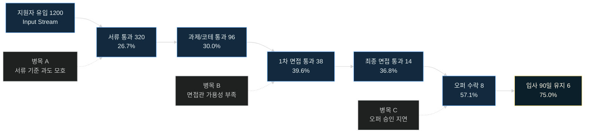
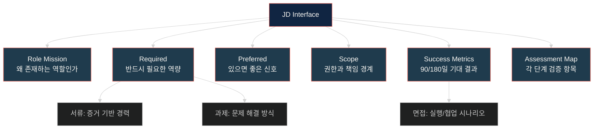
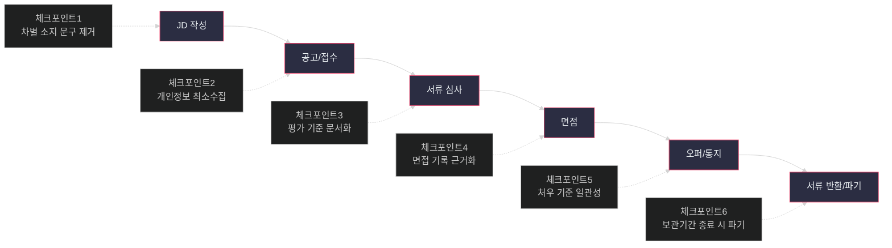

# 채용 프로세스 — 인재 확보 파이프라인의 설계 문서
> **한 줄 요약**: 채용 프로세스는 불확실한 입력에서 적합한 인재를 선별하는 다단계 파이프라인이다.

## 면책 조항 (Disclaimer)
> 이 글은 채용 실무를 소프트웨어 시스템 설계 관점으로 해석한 분석 문서입니다.
> 비유는 이해를 위한 도구이며, 사람의 존엄과 노동권을 대체하지 않습니다.
> 법률 해석과 적용은 개별 사안의 사실관계에 따라 달라질 수 있으므로 공식 원문과 전문가 자문을 우선하십시오.

---

## 핵심 개념 매핑
> **설계 문제**: HR 실무 언어와 시스템 설계 언어를 어떻게 정렬해, 같은 대상을 서로 다른 오해 없이 토론할 것인가?

| HR 개념 | 시스템 비유 | 운영 의미 |
|---|---|---|
| **지원자 풀** | Input Stream | 다양한 채널에서 품질이 다른 후보가 지속 유입된다. |
| **서류 심사** | First Filter | 저비용 단계에서 노이즈를 줄이되 우수 후보 오탈락을 통제한다. |
| **면접** | Multi-stage Validation | 짧은 샘플링으로 장기 퍼포먼스 가능성을 검증한다. |
| **채용 제안** | Offer/SLA | 의사결정 기한, 처우 일관성, 커뮤니케이션 품질이 수락률을 좌우한다. |
| **온보딩** | System Initialization | 채용 결과를 성과로 전환하는 초기화 루틴이다. |
| **JD** | Interface Spec | 역할의 경계, 필수 역량, 성공 기준을 정의하는 계약서다. |
| **이탈율** | Drop-off Rate | 단계별 전환 실패 비율로 병목과 후보 경험 문제를 조기 탐지한다. |

이 매핑은 "사람을 기계화"하기 위한 것이 아니다.
복잡한 채용 과정을 분석 가능한 단위로 분해하기 위한 렌즈다.

---

## 시스템 브리프
> **설계 문제**: 회사에 딱 맞는 사람을 찾아야 하는데, 지원자의 실제 능력은 입사 전에 완전히 파악할 수 없다. 제한된 정보와 시간 안에서 어떻게 최선의 판단을 내릴 것인가?

채용은 정보 비대칭이 큰 의사결정 시스템이다.
지원자는 본인의 역량을 최대한 보여주려 하고,
회사는 제한된 관찰로 미래 협업 성과를 예측해야 한다.

이때 시스템은 네 가지를 동시에 만족해야 한다.
첫째, 속도: 포지션 공백 비용을 줄여야 한다.
둘째, 품질: 잘못된 채용의 재작업 비용을 낮춰야 한다.
셋째, 공정성: 차별과 절차 불공정을 방지해야 한다.
넷째, 경험: 불합격 후보에게도 존중과 투명성을 제공해야 한다.

소프트웨어 관점에서 보면,
채용은 불완전 데이터 기반 추론 파이프라인이다.
정답 데이터셋이 없고,
레이블(입사 후 성과)은 지연되어 도착하며,
피드백은 노이즈가 많다.

그래서 채용 시스템의 핵심은 "완벽한 예측"이 아니라,
오탐·미탐 비용을 관리하고,
학습 가능한 운영 루프를 만드는 것이다.

---

## §1. 채용 파이프라인의 구조 — Multi-stage Pipeline
> **설계 문제**: 수백 명의 지원자를 어떻게 단계적으로 평가할 것인가?

전형적 흐름은 아래와 같다.
JD 정의 -> 소싱 -> 서류 -> 코딩테스트/과제 -> 실무 면접 -> 최종 면접 -> 오퍼 -> 온보딩.

핵심은 모든 후보를 동일 비용으로 평가하지 않는 것이다.
초기 단계는 넓고 빠르게,
후기 단계는 좁고 깊게 설계한다.

이 파이프라인을 운영할 때 가장 흔한 실패는 "국소 최적화"다.
예를 들어 코딩테스트 난이도를 크게 올리면 면접 부담은 줄지만,
실무형 후보가 과도하게 탈락할 수 있다.

반대로 서류를 너무 넓게 통과시키면,
면접 단계가 즉시 병목이 된다.
면접 리드타임이 늘어나는 순간 우수 후보는 다른 오퍼로 이탈한다.

스타트업 사례:
채용 담당자 1명, 면접관 3명 구조에서,
동시에 4개 포지션을 열면 일정 조율이 핵심 병목이 된다.

대기업 공채 사례:
입력은 풍부하지만 직무별 평가 축이 느슨하면,
대량 선발 후 배치 불일치 비용이 후단에서 폭증한다.

따라서 파이프라인 운영의 실제 목표는
"최대한 많이 통과"가 아니라,
"각 단계에서 다음 단계에 필요한 신호를 충분히 남기는 것"이다.

---

## §2. JD — Interface Specification
> **설계 문제**: "어떤 사람을 뽑아야 하는가"를 어떻게 명확히 정의할 것인가?

JD는 채용 공고 문구가 아니라,
평가 시스템의 인터페이스 명세다.
모호한 JD는 모호한 면접을 낳고,
모호한 면접은 책임 없는 합격/불합격을 낳는다.

좋은 JD는 최소 다섯 요소를 분리한다.
Role Mission,
Required Skills,
Preferred Skills,
Scope/Boundaries,
Success Metrics.

"열정 있는 분",
"커뮤니케이션이 좋은 분" 같은 표현은 보조 설명으로는 가능하다.
하지만 평가 기준의 중심이 되면 안 된다.

개발자 채용 예시로 보면,
"대규모 트래픽 경험"보다
"p95 latency 개선을 본인 역할로 설명 가능"이 훨씬 검증 가능하다.

잘못된 JD의 비용은 크게 세 가지다.
첫째, 적합 후보 유입 감소.
둘째, 면접관 간 판단 불일치 증가.
셋째, 입사 후 역할 충돌로 초기 이탈률 상승.

JD는 HR 문서가 아니라 조직 계약서다.
현업 매니저,
리크루터,
면접관이 동일한 문제를 보게 만드는 인터페이스여야 한다.

---

## §3. 면접 — Multi-stage Validation
> **설계 문제**: 짧은 만남에서 장기적 적합성을 어떻게 판단하는가?

면접은 샘플 기반 테스트다.
후보자의 전체 능력을 볼 수 없으므로,
관찰 가능한 단면에서 신뢰 가능한 추정을 해야 한다.

핵심은 신호 대 잡음 비율(signal-to-noise ratio) 관리다.
즉흥 질문과 자유 대화만으로는 노이즈가 커진다.

구조화 면접의 기본은 다음과 같다.
질문 은행을 역량 축에 연결하고,
질문별 채점 앵커를 사전 정의하며,
면접관 독립 평가 후 사후 캘리브레이션을 수행한다.

비구조화 면접에서 흔한 오류는 다음과 같다.
anchoring,
similarity bias,
presentation bias,
recency bias.

개발 조직에서는 특히 "알고리즘 점수 과잉 의존"에 주의해야 한다.
실무는 코드베이스 이해,
트레이드오프 설명,
협업 커뮤니케이션,
장애 대응 책임이 결합된 일이다.

그래서 면접을 단계별로 분리하는 편이 안정적이다.
1단계: 과제로 기본 구현 역량 확인.
2단계: 코드 리뷰 인터뷰로 의사결정 근거 확인.
3단계: 시스템 설계 인터뷰로 확장성 사고 확인.
4단계: 협업 인터뷰로 팀 상호작용 위험 확인.

대기업 공채에서는 또 다른 문제가 있다.
면접관 수가 많을수록 일관성 관리가 어렵다.
이때 면접관 교육과 루브릭 통일 없이는 공정성 논란이 반복된다.

면접의 목적은 "정답자 선발"이 아니다.
불확실성 하에서 실패 확률을 낮추는 검증 설계를 하는 것이다.

---

## §4. 공정성과 규제 — Compliance Constraints
> **설계 문제**: 효율적으로 뽑고 싶지만, 채용 과정에서 차별이나 불공정이 있으면 안 된다.

채용 시스템은 성능 지표만으로 운영할 수 없다.
법령 준수,
개인정보 보호,
차별 예방,
절차 투명성이 동시에 충족되어야 한다.

한국 실무에서 최소한 확인해야 할 축은 다음과 같다.
채용절차의 공정화에 관한 법률,[^1][^2]
근로기준법,[^3][^4]
개인정보 보호법,[^5][^6]
고용노동부 정책 자료,[^7]
국가인권위원회 가이드.[^8]

규제 관점의 핵심은 "후행 감사 대응"이 아니라,
전형 설계 단계의 제약 내장이다.
즉 프로세스를 만들 때부터 금지사항과 기록 요건을 넣어야 한다.

블라인드 채용은 정보 삭제만으로 완성되지 않는다.[^9]
평가 질문과 의사결정 규칙이 동일하게 재설계되어야 한다.
형식적 블라인드만 하고
면접에서 비정형 정보로 우회하면 실질 공정성은 개선되지 않는다.

AI 기반 스크리닝을 쓰는 경우에는 추가 제약이 생긴다.[^10]
입력 변수의 정당성,
편향 전이 감시,
설명 가능성,
최종 책임 주체를 명확히 해야 한다.

준수는 속도의 반대가 아니다.
초기에 제약을 설계하면,
오히려 분쟁과 재작업을 줄여 전체 리드타임을 안정화한다.

---

## §5. 온보딩 — System Initialization
> **설계 문제**: 좋은 사람을 뽑았는데 초기 적응에 실패하면 의미가 없다. 온보딩을 어떻게 설계할 것인가?

오퍼 수락은 성공의 끝이 아니라 시작이다.
입사 후 30~90일은 채용 품질이 실측되는 구간이다.

온보딩 실패의 대표 징후:
권한 발급 지연,
역할 기대치 불명확,
초기 과제 부재,
피드백 루프 단절.

개발 조직에서는 Day 1~7의 세팅 품질이 결정적이다.
로컬 환경,
레포 접근권한,
배포 권한,
코드 리뷰 규칙이 늦게 열리면 초반 몰입이 급격히 떨어진다.

권장 초기화 루틴 예시:
Day 0: 계정/장비/권한 선행 준비.
Day 1: 팀 미션과 역할 경계 설명.
Week 1: 작은 성공 과제 배치.
Day 30: 리스크 리뷰와 역할 재정렬.
Day 60: 크로스팀 협업 확대.
Day 90: 성과 회고와 다음 목표 확정.

온보딩을 채용과 분리하면,
파이프라인 마지막 단계에서 누수가 발생한다.
따라서 채용 KPI는 오퍼 수락률에서 끝나면 안 되고,
최소 90일 잔존·성과 지표까지 연결되어야 한다.

---

## 조직 내 위치
> **설계 문제**: HR의 채용 운영과 현업의 최종 판단 책임을 어떻게 분리·연결할 것인가?

채용은 다중 의존 시스템이다.
경영진은 헤드카운트와 예산을 결정한다.
HR/TA는 파이프라인 운영과 후보자 경험을 관리한다.
Hiring Manager는 직무 적합성의 최종 책임을 진다.
면접관 그룹은 다면 평가 근거를 제공한다.

의존 흐름은 보통 다음처럼 작동한다.
경영진 -> HR/TA -> Hiring Manager -> 인터뷰 패널 -> HR/TA 운영 집계.

실패는 주로 경계에서 생긴다.
예를 들어 JD는 현업이 정의했지만,
오퍼 밴드는 보상 정책과 충돌할 수 있다.
따라서 "누가 승인하는가"뿐 아니라
"누가 어느 단계에서 veto를 가지는가"를 문서화해야 한다.

---

## 성숙도 단계
> **설계 문제**: 채용 운영을 개인 역량 의존에서 시스템 학습 구조로 어떻게 발전시킬 것인가?

| 단계 | 운영 특징 | 강점 | 리스크 |
|---|---|---|---|
| **Startup** | 대표/핵심 인력이 직접 선발 | 빠른 의사결정, 맥락 밀착 | 기준 개인화, 재현성 낮음 |
| **Growth** | 리크루터 + ATS 도입 | 지표 가시성 확보, 운영 분업 | 부서별 평가 편차, 면접 품질 불균형 |
| **Enterprise** | TA팀 분화, 데이터 기반 운영 | 표준화·컴플라이언스·학습 루프 | 절차 과중, 후보 경험 경직 위험 |

성숙도의 본질은 도구 수가 아니다.
평가 일관성,
학습 루프,
책임 경계의 명확성이 핵심이다.

---

## 변경 이력
> **설계 문제**: 채용 시장과 기술이 바뀔 때 파이프라인은 어떤 압력으로 재설계되는가?

### 1) 공채 중심 체제
한국 대기업에서 신입 대량 선발이 중심이던 시기다.
운영 효율과 집단 교육에는 강했지만,
직무 정밀 매칭과 시기 유연성은 약했다.

### 2) 수시/경력 채용 + 온라인 플랫폼 확산
직무 중심 채용이 확대되며 연중 채용 비중이 증가했다.
입력 채널은 풍부해졌지만,
품질 편차와 평가 피로도가 함께 증가했다.

### 3) AI 채용 도구 도입
이력서 스크리닝, 화상면접 분석, 보조 평가 도구가 확산됐다.
처리량은 증가할 수 있으나,
편향 전이와 설명 가능성 문제가 새로운 병목으로 등장했다.

핵심 교훈은 동일하다.
기술은 기존 구조를 대체하기보다 증폭한다.
기준이 불명확한 조직은 AI로 더 빨리 불명확해진다.

---

## 운영 모델 비교
> **설계 문제**: 동일한 채용 문제라도 제도·관행이 다르면 어떤 운영 전략 차이가 발생하는가?

| 항목 | 한국 | 미국 | 일본 |
|---|---|---|---|
| 채용 리듬 | 공채 전통 + 수시 확대 | 수시 채용 중심 | 신졸 일괄 채용 전통 |
| 제도/관행 | 블라인드·공정성 이슈 민감 | at-will 관행, 이동성 높음 | 장기고용 관행과 초기 육성 비중 |
| 평가 중심 | 스펙에서 직무역량 중심으로 전환 중 | 즉시 전력성·직무 핏 강조 | 잠재력·조직 적응성 강조 |
| 병목 포인트 | 대량 입력 대비 평가 일관성 | 오퍼 경쟁과 속도 | 배치 불일치의 장기 비용 |
| 최적화 전략 | 기준 명확화 + 리드타임 단축 | 후보 경험 + 빠른 의사결정 | 입사 후 배치/육성 정합성 |

이 비교는 우열 비교가 아니다.
채용 시스템이 항상 노동시장 구조와 결합되어 설계된다는 사실을 보여준다.

---

## 이 비유의 한계
> **설계 문제**: 파이프라인 비유가 유용한 지점과 위험한 지점을 어디서 구분할 것인가?

| 비유가 유효한 지점 | 한계 또는 왜곡 | 운영상 주의점 |
|---|---|---|
| 단계별 전환율 분석은 병목 탐지에 효과적이다. | 사람을 처리량 단위로 환원할 위험이 있다. | KPI에 후보 경험·존중 지표를 반드시 병행한다. |
| JD를 인터페이스로 보면 평가 정렬이 쉬워진다. | 실제 역할은 조직 변화에 따라 계속 변한다. | 정기 재검토 없는 고정 JD는 미스매치를 키운다. |
| 구조화 면접은 신호/잡음 통제에 유리하다. | 인간의 잠재력과 학습성은 완전 계량화가 어렵다. | 점수표 외 질적 근거를 문서로 함께 남긴다. |
| 컴플라이언스 체크포인트는 분쟁 리스크를 낮춘다. | 형식 준수가 실질 공정성을 보장하지는 않는다. | 금지 항목 관리 + 질문 설계 개선을 함께 수행한다. |
| 온보딩을 초기화로 보면 초반 실패를 줄이기 쉽다. | 개인의 적응 속도와 팀 문화는 편차가 크다. | 동일 템플릿 강제가 아닌 직무별 가변 설계를 적용한다. |
| 데이터 기반 최적화는 학습 속도를 높인다. | 과거 편향이 데이터로 재생산될 수 있다. | 편향 모니터링과 인과 해석 없이 자동화하지 않는다. |

가장 중요한 문장은 하나다.
**사람은 모듈이 아니다.**
비유는 설계 도구이지,
사람에 대한 결론이 아니다.

---

## 출처
> **설계 문제**: 채용 시스템 분석에서 신뢰 가능한 근거를 어떻게 선별할 것인가?

### 1순위: 법령 원문
- 채용절차의 공정화에 관한 법률: https://www.law.go.kr/법령/채용절차의공정화에관한법률
- 근로기준법: https://www.law.go.kr/법령/근로기준법
- 개인정보 보호법: https://www.law.go.kr/법령/개인정보보호법

### 2순위: 정부·공공기관 공식 자료
- 고용노동부: https://www.moel.go.kr
- 국가인권위원회: https://www.humanrights.go.kr

### 출처 사용 원칙
- 블로그, 위키, 2차 요약 글은 근거로 사용하지 않는다.
- 실무 해석이 필요한 경우 조문, 행정기관 공식 문서, 공공기관 자료를 우선한다.

---

## 각주
[^1]: 채용절차의 공정화에 관한 법률 제1조는 채용절차의 공정화와 구직자 권익 보호를 목적으로 규정한다.
[^2]: 채용절차의 공정화에 관한 법률은 채용강요 금지, 채용서류 반환 등 절차 통제를 포함한다.
[^3]: 근로기준법 제1조는 근로조건의 기준 설정을 통한 근로자 보호를 명시한다.
[^4]: 채용 설계는 입사 후 근로관계와 연동되므로 근로기준법 관점을 분리해 볼 수 없다.
[^5]: 개인정보 보호법은 목적 제한, 최소수집, 보유기간 관리, 파기 원칙을 규정한다.
[^6]: 채용서류 보관·반환·파기 정책은 채용절차법과 개인정보 보호법의 교차 지점이다.
[^7]: 고용노동부는 고용정책 및 노동관계 법령 관련 공식 행정 정보를 제공한다.
[^8]: 국가인권위원회 자료는 고용 차별 예방과 평등권 관점의 공공 가이드로 활용된다.
[^9]: 블라인드 채용은 정보 비식별화와 함께 평가 기준 구조화가 병행되어야 효과가 커진다.
[^10]: AI 채용 도구 사용 시 최종 책임은 조직에 있으며, 자동화 자체가 책임을 대체하지 않는다.

---

## 관련 글
> **설계 문제**: 채용 파이프라인은 어떤 인접 시스템과 함께 읽어야 해석 오류가 줄어드는가?

- [평가·보상 시스템 — Compensation as Control Loop](../../finance/system/compensation-as-control-loop.md) *(예정)*
- [성과관리 시스템 — Performance Review as Feedback System](../system/performance-review-as-feedback-loop.md) *(예정)*
- [조직 설계 — Org Structure as Dependency Graph](../../strategy/system/org-structure-as-dependency-graph.md) *(예정)*

---

## 부록: 운영 점검 질문
> **설계 문제**: 월별 운영 회고에서 무엇을 물어야 병목이 숫자와 행동으로 연결되는가?

1. JD의 필수 역량이 실제 평가 단계에 1:1로 매핑되어 있는가?
2. 서류 기준이 면접 결과와 상관관계를 보이는가, 아니면 단순 필터링인가?
3. 면접관별 합격 편차가 과도하지 않은가?
4. 최종 면접 이후 의사결정 지연의 주요 원인은 무엇인가?
5. 오퍼 거절 사유는 보상, 역할, 리드타임 중 어디에 집중되는가?
6. 입사 90일 이탈 사례는 채용 실패인가, 온보딩 실패인가?
7. 개인정보 보관·파기 로그가 감사 가능 형태로 남아 있는가?

이 질문들은 정답표가 아니다.
하지만 같은 질문을 반복해서 측정하면,
채용 시스템은 감각이 아닌 학습 구조로 진화한다.

---

## 마무리
> **설계 문제**: 채용을 빠르게 하면서도 사람을 소모품처럼 다루지 않으려면 무엇을 고정해야 하는가?

채용 시스템의 성숙도는 처리량만으로 정의되지 않는다.
좋은 시스템은
속도,
정확도,
공정성,
존중을 함께 다룬다.

파이프라인 비유는 병목을 드러내고 개선 실험을 가능하게 만든다.
그러나 그 비유가 사람을 객체화하는 순간,
시스템은 기술적으로 빨라져도 조직적으로 실패한다.

따라서 결론은 단순하다.
채용은 최적화 대상이면서 동시에 관계 설계다.
그리고 언제나 기억해야 한다.
**비유는 도구이지 결론이 아니며, 사람은 모듈이 아니다.**
