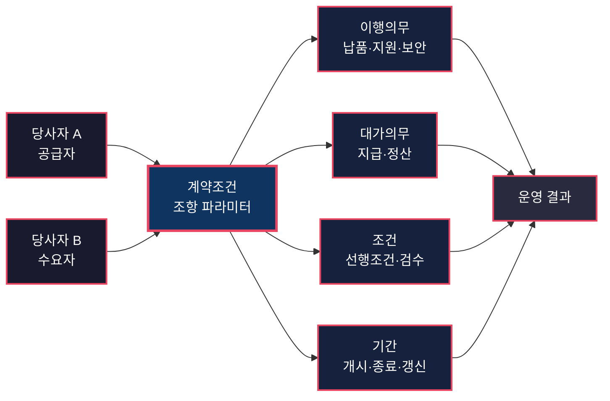
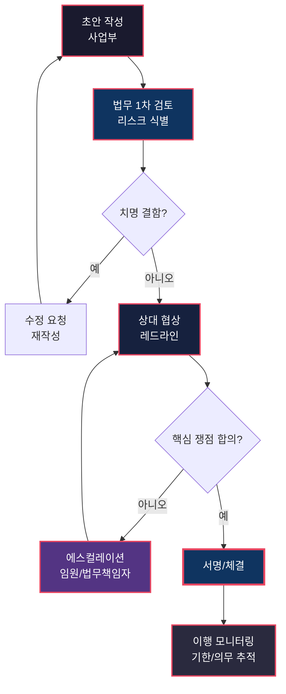
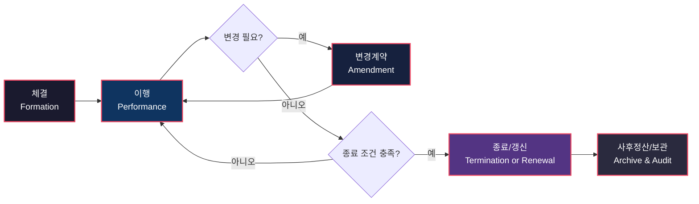

# 계약의 구조 — 두 시스템을 연결하는 인터페이스 설계
> **한 줄 요약**: 계약은 두 조직 사이의 인터페이스를 정의하는 설계 문서다.
## 면책 조항 (Disclaimer)
> 이 글은 법률 자문이 아니라, 계약 실무를 시스템 설계 관점으로 해석한 분석 문서입니다.
> 비유는 구조 이해를 돕기 위한 도구이며, 실제 분쟁에서는 개별 사실관계와 최신 판례가 우선합니다.
> 중요한 의사결정은 반드시 변호사, 사내 법무팀, 공식 법령 원문을 통해 검증하세요.
---
## 이 글을 읽기 전에 — 핵심 개념 매핑
이 글은 계약서를 "문장 모음"이 아니라 "인터페이스 명세"로 본다.
아래 7개 개념만 잡으면 전체 구조가 읽힌다.
| 개념 | 이 시스템에서의 의미 |
|------|---------------------|
| **계약 (Interface Contract)** | 두 조직이 서로 기대할 수 있는 외부 동작을 약속하는 경계 명세.[^1] |
| **조항 (Function Parameter)** | 가격, 납기, 책임 한도, 준거법처럼 실행 결과를 바꾸는 입력 파라미터. |
| **이행 (Implementation)** | 계약 명세를 실제 운영 프로세스로 실행하는 단계. |
| **위반 (Exception)** | 지체, 불완전이행, 불능처럼 기대 동작을 벗어난 상태.[^2] |
| **해지/해제 (Connection Termination)** | 관계를 정상/비정상 종료하고 정산하는 절차.[^3] |
| **분쟁해결 (Error Handling / Dispute Resolution)** | 충돌이 생겼을 때 재현 가능한 해결 경로를 제공하는 장치. |
| **계약검토 (Code Review)** | 배포 전 결함을 잡아 비용을 줄이는 품질 게이트. |
---
## 시스템 브리프 — 불투명한 조직 사이에서 신뢰를 정의하는 방법
> **설계 문제**: 두 조직이 협력해야 하는데, 각 조직의 내부 동작은 상대방에게 불투명하다. 어떻게 신뢰 가능한 인터페이스를 정의할 것인가?
SaaS 공급사와 고객사를 떠올려보자.
고객은 공급사의 내부 품질 프로세스를 모두 알 수 없다.
공급사도 고객의 내부 승인 구조와 실제 운영 역량을 모두 알 수 없다.
그럼에도 거래는 성립하고, 서비스는 돌아가야 한다.
이때 계약은 내부 구현을 숨긴 채, 외부 약속을 고정하는 인터페이스가 된다.
좋은 계약 설계는 세 가지를 동시에 달성한다.
1. **예측 가능성**: 무엇을 언제 어떤 기준으로 제공하는지 계산 가능해야 한다.
2. **복구 가능성**: 실패 시 누가 어떤 비용으로 복구하는지 명확해야 한다.
3. **확장 가능성**: 변경, 갱신, 추가 발주가 기존 체계를 깨지 않아야 한다.
이 글은 법학 교재 방식이 아니라,
인터페이스 정의, 패턴 라이브러리, 코드리뷰, 예외처리, 자동화 관점으로 계약을 읽는다.
---
## §1. 계약의 구조 — Interface Definition
> **설계 문제**: 두 당사자의 권리와 의무를 어떻게 명확히 정의할 것인가?
민법의 계약 성립 규정(제527조~제534조)은 계약 인터페이스의 베이스 프로토콜로 읽을 수 있다.[^4]
핵심은 "누가, 무엇을, 언제, 어떤 조건으로"의 동기화다.
이 동기화가 깨지면 서명은 되어도 런타임에서 충돌한다.
### 인터페이스 명세의 6축
- **당사자 식별**: 법인명, 대표권, 통지 주소, 전자우편
- **목적물 정의**: 물건, 용역, 라이선스, 산출물
- **대가 구조**: 금액, 지급 조건, 세금, 지연이자
- **이행 기준**: 납기, 검수 기준, SLA, 품질 기준
- **조건/기간**: 선행조건, 효력 발생일, 갱신, 종료
- **책임 분배**: 손해배상, 면책, 책임상한, 간접손해
이 축을 빠뜨리면 문제가 지연되어 터진다.
초기엔 빨라 보이지만,
프로젝트 후반 정산 단계에서 해석 충돌이 한꺼번에 발생한다.
### 긴 문장의 이유
계약 문장은 종종 과도하게 길어 보인다.
하지만 이는 중복이 아니라 모호성 제거를 위한 방어 코딩이다.
예를 들어 "납품"만 적으면,
한쪽은 파일 전달로 해석하고,
다른 쪽은 운영 반영 완료로 해석한다.
그래서 형식, 장소, 검수, 승인 시점을 함께 고정한다.
### Mermaid: 계약의 구조

### 실무 예시: SaaS 계약에서 자주 깨지는 인터페이스
1. 서비스 범위가 계약 부속서와 제안서에서 다르게 서술됨
2. 가동시간 산식에서 유지보수 제외시간 정의가 누락됨
3. 종료 시 데이터 반환 형식과 기간이 비어 있음
4. 보안사고 통지시간이 내부 대응 역량보다 과도하게 짧음
5. 장애 크레딧 지급 기준이 측정 불가능한 문장으로 작성됨
이 다섯 가지는 기술문제가 아니라 명세문제다.
즉 계약 단계에서 해결해야 하는 설계 결함이다.
---
## §2. 계약 유형 — Interface Pattern Library
> **설계 문제**: 반복되는 거래 유형마다 처음부터 설계할 것인가?
민법의 전형계약 체계는 반복 거래를 위한 패턴 라이브러리다.[^5]
매번 새로운 프로토콜을 만드는 대신,
검증된 기본 구조를 불러와 맥락에 맞게 오버라이드한다.
### 대표 패턴
| 전형계약 | 법적 기본 구조 | 엔지니어링 비유 | 기업 실무 예시 |
|----------|----------------|------------------|----------------|
| **매매(민법 제563조)** | 재산권 이전 + 대금 지급 | `resource transfer` API | 라이선스 매각, 장비 구매 |
| **임대차(민법 제618조)** | 사용·수익 허용 + 차임 | `lease` 패턴 | 장비 임차, 오피스 임차 |
| **도급(민법 제664조)** | 일의 완성 + 보수 | `deliverable-based` 계약 | SI 구축, 기능 개발 |
| **위임(민법 제680조)** | 사무 처리 위탁 | `agent` 패턴 | 법률 대리, 허가 대행 |
| **고용(민법 제655조)** | 노무 제공 + 보수 | `time-based` 계약 | 전문인력 계약 |
| **사용대차(민법 제609조)** | 무상 사용 허용 | `free-tier` 제공 | 테스트 장비 무상 대여 |
### 패턴 라이브러리의 효과
- 논점이 예측 가능해져 리뷰 시간이 줄어든다.
- 표준 문안이 축적되어 협상 코스트가 내려간다.
- 분쟁 시 해석 참고축이 풍부해진다.
특히 도급과 위임의 경계는 자주 혼동된다.
도급은 결과 완성 책임,
위임은 사무 처리 책임이 중심이다.
프로젝트 계약에서 이 구분이 흐려지면 손해배상 범위가 흔들린다.
### 표준계약서의 의미
공정거래위원회 표준약관/표준계약서는 실무 템플릿 저장소로 작동한다.[^6]
다만 템플릿은 시작점이다.
데이터 이전, 보안사고 대응, 준법 의무처럼
회사 고유 리스크는 반드시 커스터마이즈가 필요하다.
### 실무 예시: NDA를 패턴으로 볼 때
NDA는 짧지만 설계 난도가 낮지 않다.
- 비밀정보 정의가 좁으면 보호대상이 빠진다.
- 예외사유가 넓으면 보호경계가 무너진다.
- 의무기간이 짧으면 기술자산이 노출된다.
- 반환/파기 절차가 없으면 종료 이후 분쟁이 생긴다.
즉 NDA는 복붙 문서가 아니라 경계설계 문서다.
---
## §3. 계약 검토 — Code Review
> **설계 문제**: 결함이 있는 계약이 실행되면 비용이 크다. 사전에 어떻게 잡아내는가?
코드리뷰를 건너뛰면 운영 중 장애를 낸다.
계약도 동일하다.
서명 후 결함 발견은 수정비용이 급증한다.
법무 검토는 문장교정이 아니라 배포 전 검증 파이프라인이다.
### 리뷰 체크포인트
1. **권한 검증**: 상대방 서명권자, 법인정보, 대리권
2. **의무 균형성**: 편향된 무한책임 존재 여부
3. **리스크 조항**: 보증, 면책, 손해배상, 책임상한
4. **운영 정합성**: 실제 프로세스와 문구의 정합성
5. **분쟁 루트**: 준거법, 관할, 중재/소송
6. **종료/잔존조항**: 해지, 정산, 비밀유지, 자료반환
형식적 리뷰는 위험하다.
문서는 통과했지만 운영팀이 수행 불가능한 약속이 남는다.
예: 온콜 체계가 없는데 24/7 즉시 대응을 약정한 경우.
### Mermaid: 계약 검토 플로우

### 리뷰 운영을 시스템화하는 규칙
- 리스크 티어링: 금액/데이터/기간으로 등급화
- 표준 문안 저장소: 승인 버전 중앙관리
- 협상 로그: 쟁점, 양보근거, 승인자 기록
- 예외 승인: 표준 벗어나는 문안의 책임 귀속 명시
- 체결 후 핸드오프: 운영팀 의무 캘린더 전달
법무팀은 딜을 막는 부서가 아니라,
딜이 프로덕션에서 살아남게 만드는 품질 엔지니어다.
---
## §4. 계약 위반과 구제 — Exception Handling
> **설계 문제**: 계약이 이행되지 않으면 어떻게 복구하고, 누가 비용을 부담하는가?
민법 제390조는 채무불이행 시 손해배상 책임을 기본값으로 둔다.[^2]
즉 인터페이스가 깨졌을 때 복구비용의 기본 분배 규칙을 제공한다.
### 위반 유형
1. **이행지체**: 기한 내 제공 실패
2. **불완전이행**: 제공됐지만 명세 미달
3. **이행불능**: 구조적으로 제공 불가
장애 유형이 다르면 복구 전략도 달라야 한다.
지체는 시정기간 부여가 가능하지만,
불능은 대체조달과 종료 시나리오가 핵심이다.
### 구제수단
- 추완 청구/시정 요청
- 손해배상 청구
- 위약금·지체상금
- 해제·해지 및 정산
- 동시이행 항변(민법 제536조)[^7]
민법 제398조의 손해배상 예정은 사후 계산비용을 줄이는 장치다.[^8]
다만 예정액이 과도하면 감액 리스크가 있으므로,
협상 단계에서 현실적 범위를 설계해야 한다.
### Rollback 비용이 큰 이유
소프트웨어는 코드 롤백이 가능하다.
계약은 다르다.
이미 투입된 인력비, 시장기회, 평판손실은 가역적이지 않다.
그래서 위반 조항은 제재보다 안정화 중심으로 설계하는 편이 실무적으로 유리하다.
예: 도급 프로젝트 지연 시,
즉시 해제보다 시정계획 + 마일스톤 재설계가 총손실을 줄일 수 있다.
### 분쟁해결 조항은 에러핸들러다
분쟁은 피하기 어렵다.
하지만 경로 없는 분쟁은 치명적이다.
최소한 다음은 고정한다.
- 관할법원 또는 중재기관
- 준거법
- 통지 방식(이메일, 내용증명, 시스템 로그)
- 증거 기준(전자문서/전자서명 포함)
이 설정이 없으면 본안 전 절차 다툼으로 시간과 비용이 소모된다.
---
## §5. 전자계약과 자동화 — API Automation
> **설계 문제**: 종이 기반 계약의 속도와 검증 한계를 어떻게 넘을 것인가?
전자서명법과 전자문서 및 전자거래 기본법은,
전자적 방식의 계약 체결과 보관에 법적 기반을 제공한다.[^9][^10]
즉 핵심은 종이가 아니라,
당사자 식별, 문서 무결성, 추적 가능성, 장기 보관성이다.
### 자동화 가능한 계약 파이프라인
1. 템플릿 선택 및 변수 주입
2. 리스크 기반 승인 라우팅
3. 전자서명 및 타임스탬프
4. 체결본 저장/색인/검색
5. 갱신일·해지통지일 알림
자동화는 법무를 대체하지 않는다.
반복작업을 시스템으로 옮겨,
법무가 고위험 판단에 집중하도록 돕는다.
### 스마트 컨트랙트의 현실적 경계
스마트 컨트랙트는 자동 실행에 강점이 있다.
하지만 "상당한 노력", "중대한 위반" 같은 문구는
코드화하기 어려운 해석영역이다.
현실적 모델은 하이브리드다.
- 반복 정산·지급 트리거는 자동화
- 해석·재량 쟁점은 사람 심사 유지
### Mermaid: 계약 라이프사이클

---
## 조직 내 위치 — 법무팀의 상위/하위/수평 의존성
> **설계 문제**: 법무팀을 어디에 두어야 계약 인터페이스 품질이 유지되는가?
법무팀은 게이트가 아니라 플랫폼에 가깝다.
문서 품질과 운영 정합성을 연결하는 조정 계층이기 때문이다.
### 상위 의존성
- 경영진의 리스크 허용도
- 준법/감사 프레임
- 업종별 규제 변화
### 하위 의존성
- 영업의 딜 설계
- 구매의 발주·검수 체계
- 재무의 정산·충당 정책
- 개발/보안의 실제 실행역량
### 수평 의존성
- HR: 고용·비밀유지
- PMO: 일정·변경관리
- IT: 전자계약/문서관리 시스템
법무가 고립되면 문구와 현실이 분리되고,
현업이 법무를 우회하면 리스크 부채가 누적된다.
---
## 성숙도 단계 — Startup / Growth / Enterprise
> **설계 문제**: 회사 성장에 맞춰 계약 운영모델을 어떻게 진화시킬 것인가?
### Startup: 대표가 직접 처리
- 딜 속도 우선, 표준 문안 부족
- 계약서 보관/추적이 개인 기억에 의존
- 서명 후 의무 이행 관리가 약함
### Growth: 외부 법무 + 내부 담당자
- NDA/용역/공급 등 표준 템플릿 확보
- 고위험 건에 한해 외부 로펌 검토
- 승인 흐름과 보관 절차의 최소 자동화
### Enterprise: 전담 법무팀 + 시스템 운영
- 계약 유형별 플레이북 및 레드라인 정책
- CLM/전자계약/결재시스템 연계
- 리스크 지표(금액, 책임상한, 분쟁빈도) 대시보드
- 사후분석 기반 문안 개선 루프
핵심 전환점은 사람 의존에서 시스템 의존으로의 이동이다.
### 단계별 기술 조직 협업 포인트
Stage를 올릴 때 법무팀만 바꾸면 실패한다.
기술 조직과 함께 아래 항목을 동기화해야 한다.
1. 서비스 카탈로그와 계약 템플릿의 필드 매핑
2. SLA 계산식과 모니터링 지표 정의의 일치
3. 장애등급 체계와 손해배상/크레딧 조항 연결
4. 보안사고 대응 플레이북과 통지조항 정합성
5. 데이터 보존 정책과 종료 후 반환/파기 의무 정렬
6. 릴리즈 캘린더와 계약상 납기 커밋의 충돌 점검
7. 벤더 의존 서비스의 백투백(back-to-back) 조항 검토
이 연결고리가 없으면,
계약은 우아해도 운영은 불안정하다.
반대로 연결고리가 있으면,
계약은 운영 현실을 반영한 실행 가능한 문서가 된다.
### 최소 운영 메트릭
법무 운영도 측정 가능해야 개선된다.
- 표준 문안 사용률
- 계약 검토 리드타임
- 체결 후 의무 이행 누락 건수
- 분쟁 전 조기 시정 종료율
- 책임상한 초과 손실 발생 건수
메트릭을 추적하면,
법무가 비용센터인지 가치센터인지가 숫자로 드러난다.
---
## 변경 이력 — 계약 운영의 3개 turning points
> **설계 문제**: 계약 운영은 왜 현재 형태로 바뀌었는가?
### 1) 전통적 계약 단계
도장, 인감, 공증, 내용증명 중심의 오프라인 체계가 기본이었다.
장점은 직관적 증거성,
단점은 느린 처리와 높은 거래비용이었다.
### 2) 표준계약서 단계
공정거래위원회 표준약관/표준계약서 보급으로,
반복 거래에서 초기 작성비용과 불공정 조항 리스크가 줄었다.[^6]
템플릿 문화가 생기면서 협상 기준선이 형성됐다.
### 3) 전자계약/AI 검토 단계
전자문서·전자서명 법제 정착 이후,
체결과 보관이 디지털 파이프라인으로 이동했다.[^9][^10]
최근에는 AI 검토 도구가 누락 조항과 편향 문구를 빠르게 탐지한다.
다만 최종 책임은 여전히 법무와 경영 의사결정에 남는다.
---
## 운영 모델 비교 — 한국 vs 미국 vs 일본
> **설계 문제**: 국가별 계약 운영 차이가 실무 설계에 어떤 영향을 주는가?
| 구분 | 한국(공증인법·내용증명 실무) | 미국(common law, UCC) | 일본(인감제도 실무) |
|------|------------------------------|-------------------------|----------------------|
| **법체계 톤** | 성문법 중심, 조문 근거 강조 | 판례·계약자유 폭이 상대적으로 큼 | 성문법 중심 + 형식 실무 강함 |
| **신뢰 장치** | 내용증명, 인감, 공증 활용 | 서명, 증거개시, 분쟁절차 설계 | 인감/서면 관행 지속 |
| **문안 문화** | 표준약관/표준계약서 영향 | 플레이북·로펌 문안 영향 | 업종 협회·대기업 문안 영향 |
| **분쟁 경향** | 소송·조정 병행 | 중재 활용도 높음(거래규모 의존) | 협상·조정 선호 후 소송 |
| **실무 시사점** | 절차 증거와 통지 설계가 중요 | 면책·책임한도 문구 정밀도 중요 | 형식요건과 관계관리 동시 고려 |
국제거래에서는 준거법·관할을 마지막에 넣지 말고,
아키텍처 초기 요구사항으로 설계해야 한다.
---
## 이 비유의 한계 (Limits of the Analogy)
> **설계 문제**: 계약=인터페이스 비유는 어디까지 유효한가?
| 비유가 작동하는 곳 | 비유가 깨지는 곳 | 이유 |
|---|---|---|
| 명세 품질이 결과를 좌우한다. | 자연어는 코드처럼 완전 결정적이지 않다. | 해석 가능성이 본질적으로 남는다. |
| 리뷰 게이트가 비용을 줄인다. | 협상력 비대칭이 문안 품질보다 크게 작용할 수 있다. | 법적 형식보다 거래권력이 우세한 상황이 존재한다. |
| 예외 처리 설계가 안정성을 높인다. | 사회적 손실은 롤백이 어렵다. | 평판·기회비용은 금전배상으로 완전 복원되지 않는다. |
| 패턴 재사용으로 속도를 얻는다. | 산업 규제가 패턴 재사용성을 제한한다. | 의료/금융/공공은 추가 규율이 강하다. |
| 전자계약 자동화가 생산성을 올린다. | "중대한 위반" 같은 판단은 자동화가 어렵다. | 법적 판단의 마지막 단계는 사람 책임이다. |
| 인터페이스 경계를 고정해 충돌을 줄인다. | 장기 파트너십은 문서 밖 신뢰에도 크게 의존한다. | 계약은 필요조건이지 충분조건이 아니다. |
종합하면,
이 비유는 구조 이해에 강하지만,
정치·관계·해석의 인간 영역을 완전히 대체하지는 못한다.
---
## 출처 (Sources)
### 1순위 — 법령 원문
- 민법(국가법령정보센터): https://www.law.go.kr/법령/민법
- 상법(국가법령정보센터): https://www.law.go.kr/법령/상법
- 전자서명법: https://www.law.go.kr/법령/전자서명법
- 전자문서 및 전자거래 기본법: https://www.law.go.kr/법령/전자문서및전자거래기본법
- 공증인법: https://www.law.go.kr/법령/공증인법
### 2순위 — 공식 기관 자료
- 공정거래위원회 표준약관/표준계약서 안내: https://www.ftc.go.kr
- 대한법률구조공단 법률정보: https://www.klac.or.kr
### 출처 원칙
- 위키, 블로그, 커뮤니티 게시글은 출처로 사용하지 않았다.
- 조문 인용은 국가법령정보센터 기준으로 확인했다.
- 사례 문장은 특정 사건 자문이 아닌 일반화된 실무 패턴이다.
---
## 각주
[^1]: 민법 제105조(임의규정), 제527조~제534조(계약 성립 관련). 계약은 당사자 의사 합치로 성립하고, 내용은 법률에 반하지 않는 범위에서 정해진다. https://www.law.go.kr/법령/민법
[^2]: 민법 제390조(채무불이행과 손해배상). 채무자가 채무 내용에 좇은 이행을 하지 아니한 때 손해배상 책임이 발생한다. https://www.law.go.kr/법령/민법
[^3]: 민법 제543조~제551조(해제·해지 효과). 해제 시 원상회복 및 손해배상 관계가 문제된다. https://www.law.go.kr/법령/민법
[^4]: 민법 제527조~제534조. 청약, 승낙, 격지자 간 계약 성립시기 등 계약 형성 규칙. https://www.law.go.kr/법령/민법
[^5]: 민법 전형계약 규정: 매매(제563조 이하), 소비대차(제598조 이하), 사용대차(제609조 이하), 임대차(제618조 이하), 고용(제655조 이하), 도급(제664조 이하), 위임(제680조 이하). https://www.law.go.kr/법령/민법
[^6]: 공정거래위원회 표준약관·표준계약서 정책 자료 및 공표 문서. https://www.ftc.go.kr
[^7]: 민법 제536조(동시이행의 항변권). 쌍무계약에서 상대방 이행 제공 전 자기 채무 이행을 거절할 수 있다. https://www.law.go.kr/법령/민법
[^8]: 민법 제398조(배상액의 예정). 예정액 조정(감액) 가능성 규정 포함. https://www.law.go.kr/법령/민법
[^9]: 전자서명법 제2조, 제3조. 전자서명의 개념과 효력. https://www.law.go.kr/법령/전자서명법
[^10]: 전자문서 및 전자거래 기본법 제4조. 전자문서의 효력. https://www.law.go.kr/법령/전자문서및전자거래기본법
[^11]: 상법 제46조(기본적 상행위) 등. 기업 거래에서는 민법 일반원칙 위에 상법 규율이 추가된다. https://www.law.go.kr/법령/상법
[^12]: 공증인법 및 내용증명 실무는 의사표시 도달과 증거 확보를 위한 보조 장치로 널리 사용된다. 공증인법: https://www.law.go.kr/법령/공증인법
---
## 관련 글 (See Also)
- [구매 시스템 — Vendor Lifecycle as Procurement Pipeline](../../operations/system/vendor-lifecycle-as-procurement-pipeline.md) *(예정)*
- [재무 시스템 — Revenue Recognition as Ledger Consistency](../../finance/system/revenue-recognition-as-ledger-consistency.md) *(예정)*
- [HR 시스템 — Employment Contract as Role Interface](../../hr/system/employment-contract-as-role-interface.md) *(예정)*
- [법무 케이스 — 계약 분쟁 대응 플레이북](../cases/contract-dispute-playbook.md) *(예정)*
---
<!--
시스템 분석 체크리스트 (methodology.md):
- [x] 공식 법령/공식기관 출처 사용
- [x] Terminology map 5~7개 포함
- [x] 설계 문제 중심의 시스템 브리프 작성
- [x] 핵심 섹션마다 설계 문제 블록 포함
- [x] Mermaid 다이어그램 3개 포함
- [x] Limits of the analogy 5행 이상
- [x] 각주에 조문 단위 인용
-->
