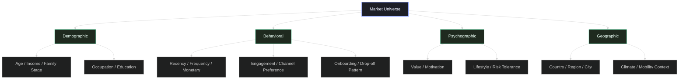
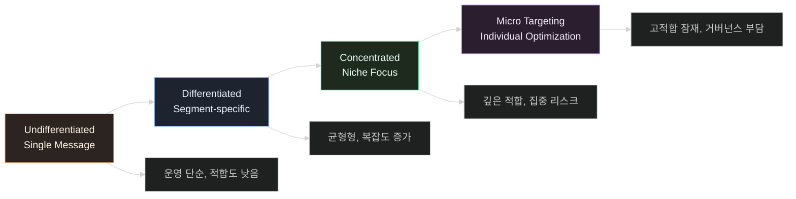
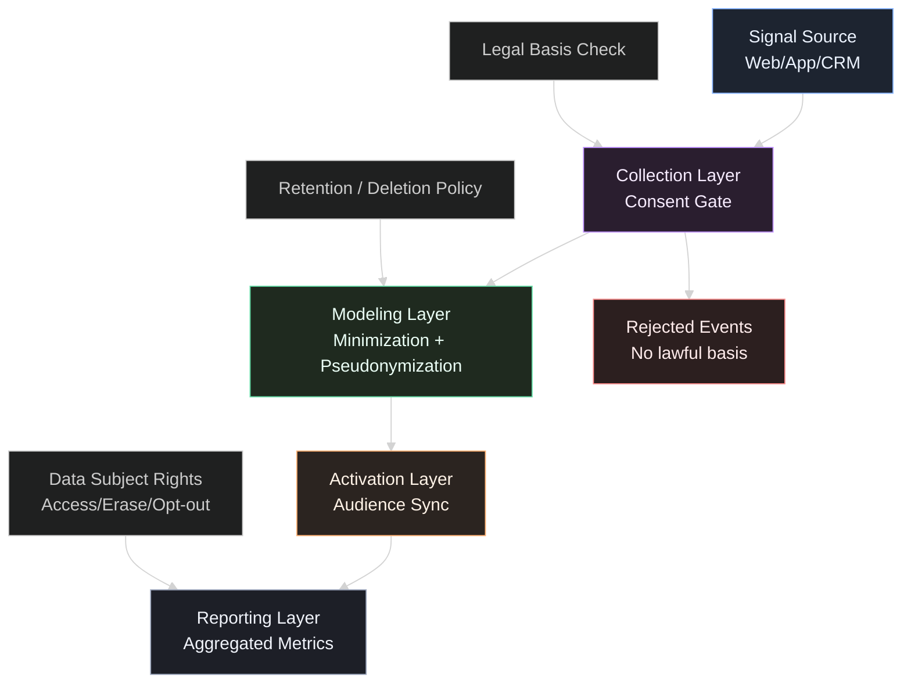
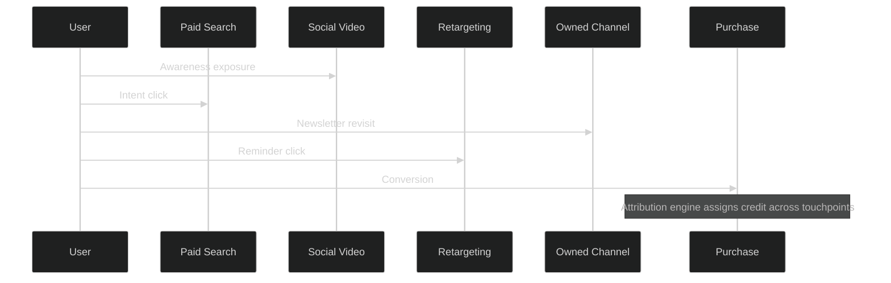

# 고객 세분화 — 시장을 분할하는 파티셔닝 전략
> **한 줄 요약**: 고객 세분화는 이질적인 시장을 동질적인 그룹으로 파티셔닝하는 것이다.

## 면책 조항 (Disclaimer)
> 이 글은 마케팅 실무를 소프트웨어 엔지니어링 관점으로 분석한 시스템 문서입니다.
> 비유는 구조적 이해를 위한 도구이며, 법률 자문이나 규제 해석을 대체하지 않습니다.
> 개인정보 처리와 맞춤형 광고는 반드시 최신 법령, 감독기관 해설, 공식 가이드를 우선 확인하세요.

---

## 이 글을 읽기 전에 — 핵심 개념 매핑
세분화와 타겟팅을 감각의 영역에 두면 재현성이 떨어진다.
세분화와 타겟팅을 시스템 설계로 보면 의사결정이 명시된다.
아래 7개 매핑을 이 글의 기본 인터페이스로 사용한다.

| 마케팅 용어 | 시스템 대응어 | 실무적 의미 |
|---|---|---|
| **세분화 (Segmentation)** | **Partitioning / Sharding** | 시장을 동질 집합으로 분할해 메시지-가치 적합도를 높인다. |
| **타겟팅 (Targeting)** | **Query Routing / Load Balancing** | 제한된 예산과 채널 용량을 우선순위 세그먼트에 라우팅한다. |
| **포지셔닝 (Positioning)** | **Index Strategy** | 고객 검색·비교 경로에서 어떤 축으로 먼저 발견될지 설계한다. |
| **페르소나 (Persona)** | **Type Definition** | 세그먼트 특징을 타입으로 고정해 팀 간 해석 오차를 줄인다. |
| **A/B 테스트** | **Experimentation Platform** | 가설을 통제 조건에서 검증해 인과효과를 분리한다. |
| **코호트 분석 (Cohort)** | **Window Function / Time Bucket** | 유입 시점별 행동 변화를 추적해 단기 노이즈를 제거한다. |
| **어트리뷰션 (Attribution)** | **Trace / Span Correlation** | 구매 결과를 다중 접점 기여도로 분해해 예산 의사결정에 환원한다. |

---

## 시스템 브리프 — 수요 생성 시스템의 핵심 과제
모든 고객에게 같은 메시지를 보내면 아무에게도 도달하지 못한다.
고객 한 명 한 명에게 다른 메시지를 보내면 비용이 폭증한다.
어떻게 적절한 수준에서 고객을 분류하고,
각 그룹에 맞는 전략을 설계할 것인가?

> **설계 문제**: 제한된 예산과 규제 제약 안에서, 메시지 적합도와 운영 효율을 동시에 만족하는 분할·라우팅 구조를 어떻게 설계할 것인가?

마케팅 시스템은 보통 다섯 단계로 동작한다.
1) Partition key 선택,
2) 타겟 라우팅,
3) 컴플라이언스가 내장된 데이터 파이프라인,
4) 실험 검증,
5) 어트리뷰션 환류.

핵심은 "집단 설계"다.
개별 딜의 상태 전이는 세일즈 시스템의 책임으로 분리해야 한다.

---

## §1. 세분화의 기준 — Partition Key 선택
> **설계 문제**: 어떤 기준으로 고객을 나눌 것인가? 잘못된 partition key는 타겟팅 효율과 측정 신뢰도를 동시에 훼손한다.

세분화의 첫 질문은 "누가 중요한가"가 아니다.
"무엇을 기준으로 나눌 때 행동 차이가 재현되는가"다.
현장에서 가장 보편적인 분할 축은 인구통계, 행동, 심리, 지리다.

### Partition Key 품질 체크리스트
1. **구분 가능성**: 세그먼트 간 반응 차이가 통계적으로 분리되는가.
2. **측정 가능성**: 데이터가 안정적으로 수집·갱신되는가.
3. **행동 가능성**: 세그먼트별로 실제 다른 액션을 설계할 수 있는가.
4. **규제 적합성**: 수집 목적과 이용 범위를 법적으로 설명 가능한가.
5. **운영 경제성**: 세그먼트 수가 조직 실행 용량을 넘지 않는가.

### 안티패턴
- 세그먼트를 지나치게 세분해 보고서만 정밀해지고 실행력이 사라진다.
- 모델 변수는 많은데 라우팅 규칙이 없어 캠페인 실행이 동일하다.
- 신선도 낮은 데이터로 고객 상태를 분류해 오분류가 누적된다.
- 제품 포지셔닝·가격 정책과 분리된 세분화로 인해 액션이 비어 있다.

### 실무 기본형
초기 조직은 3단계 분할로 시작하면 실패 확률이 낮다.
1) Broad partition(채널/맥락),
2) Value partition(LTV/재구매 가능성),
3) Needs partition(문제 유형/동기).

이 구조는 복잡도 대비 실행 가능성이 높고,
타겟팅과 실험으로 즉시 연결된다.

---

## §2. 타겟팅 — Query Routing
> **설계 문제**: 분할된 그룹 중 어디에 자원을 집중할 것인가? 모든 세그먼트를 동시에 최적화하면 예산은 분산되고 학습은 느려진다.

세분화가 데이터 모델이라면,
타겟팅은 트래픽 라우팅 정책이다.
같은 예산도 라우팅 규칙에 따라 성과 분산이 크게 달라진다.

### 라우팅 정책 변수
- **Expected Value**: 세그먼트 기대 기여(매출·이익·잔존).
- **Acquisition Cost**: 도달 단가, 전환 단가, 크리에이티브 비용.
- **Capacity Constraint**: 운영·콘텐츠·세일즈 후속 처리 한계.
- **Risk Constraint**: 규제/브랜드 리스크 상한.
- **Learning Budget**: 탐색 실험에 배정할 최소 예산.

### 라우팅 실패 신호
- 고가치 세그먼트 점유율이 하락하는데 예산 조정이 늦다.
- 특정 채널 의존도가 과도해 정책 변화 시 성과가 급락한다.
- 신규 세그먼트 실험이 항상 컷되어 학습 루프가 멈춘다.
- CAC 안정화와 LTV 악화가 동시에 나타난다.

### 마케팅-세일즈 경계
타겟팅은 "집단 라우팅"이다.
세일즈는 "개별 계정/리드 상태 전이"다.
경계를 분리하지 않으면 KPI 책임이 불명확해진다.

마케팅에서 세일즈로 전달해야 할 것은 단순 리드 수가 아니라,
핸드오프 문맥 패킷이다.
예: 유입 채널, 캠페인, 핵심 행동 신호, 동의 상태, 적합도 스코어.

---

## §3. 데이터 수집과 프라이버시 — Data Pipeline with Constraints
> **설계 문제**: 세분화에 필요한 데이터를 수집하되, 개인정보 보호 법령과 맞춤형 광고 규율을 만족하는 파이프라인을 어떻게 설계할 것인가?

세분화는 데이터 집약적 활동이다.
하지만 현재의 제약 조건은 "많이 모으기"가 아니라 "정당하게 처리하기"다.
즉, 성능 요건과 컴플라이언스 요건을 함께 만족해야 한다.

### 법령 기반 제약 조건
`개인정보 보호법`은 목적 명확화, 최소 수집, 보유기간 제한, 안전성 확보, 정보주체 권리를 기본 원칙으로 둔다.[^1]
`정보통신망 이용촉진 및 정보보호 등에 관한 법률`은 온라인 환경의 개인정보 보호 의무와 광고성 정보 전송 관련 요구사항을 포함한다.[^2]
방송통신위원회의 온라인 맞춤형 광고 관련 가이드는 행태정보 처리의 투명성, 선택권 보장, 보호조치를 강조한다.[^3]

핵심 결론은 단순하다.
수집 가능성보다 설명 가능성이 우선한다.
"왜 이 데이터를 수집하고, 얼마 동안, 누구 권한으로, 어떤 목적으로 쓰는가"가 설계 문서에 명시되어야 한다.

### GA4 활용 시 주의점
GA4 공식 문서는 이벤트 기반 모델, 잠재고객 정의, 측정 설정 방법을 제공한다.[^4]
그러나 도구 기능의 존재가 법적 정당성을 보장하지는 않는다.

운영 체크포인트:
1. 이벤트·속성별 처리 목적 매핑.
2. 동의 흐름과 거부 흐름의 명확한 분리.
3. 보유기간·삭제 정책의 자동화.
4. 재식별 가능성 평가와 접근권한 최소화.

### 최소 수집과 성과 사이의 균형
데이터를 과도하게 줄이면 세분화 정확도가 떨어진다.
데이터를 과도하게 늘리면 법·보안 리스크가 증가한다.
따라서 "최소한의 충분 데이터"를 명시적으로 정의해야 한다.

실무 권장:
- 필수 이벤트와 선택 이벤트 분리,
- 식별자 원천 저장소 격리,
- 리포팅 계층 집계 우선,
- 목적 종료 시 즉시 삭제·비식별화.

---

## §4. 실험과 측정 — A/B Testing
> **설계 문제**: 세분화 전략이 실제 성과를 개선했는지, 아니면 외생 변수와 우연에 의한 착시인지 어떻게 검증할 것인가?

세분화 전략은 쉽게 정답처럼 보인다.
실험이 없으면 팀은 성공 사례를 과잉 일반화한다.
따라서 실험 설계는 선택이 아니라 필수 인프라다.

### 실험 단위 설계
세분화 문맥에서 실험 단위는 보통 세 가지다.
1. 메시지(카피·크리에이티브),
2. 오퍼(가격·혜택·번들),
3. 라우팅(예산 배분 규칙).

원인 분리를 위해 한 번에 하나의 레버만 바꾸는 원칙이 필요하다.
레버를 동시에 바꾸면 해석 가능한 결론이 사라진다.

### 코호트 분석 결합
단기 CTR/CPA만 보면 장기 가치가 왜곡된다.
코호트 분석은 세분화의 장기 효과를 읽는 기본 도구다.

권장 관측 창:
- 유입 주차 코호트 유지율,
- 첫 구매 이후 4주/8주 잔존,
- 재구매 전환율,
- 채널별 payback 기간.

### 실험 운영 규율
- 가설, 성공 기준, 중단 조건을 실험 시작 전에 고정한다.
- 표본 수와 실행 기간을 사전에 합의한다.
- 실험 로그와 비즈니스 로그의 키 정합성을 점검한다.
- 결과는 채택/보류/폐기로 명시적 의사결정을 남긴다.

### 흔한 오류
- 동일 사용자가 여러 실험군에 중복 노출된다.
- 마지막 클릭 중심 해석으로 상단 퍼널 기여가 사라진다.
- 실험 종료 직후 데이터만 보고 장기 효과를 놓친다.
- 코호트 특성 차이를 통제하지 않고 단순 평균을 비교한다.

---

## §5. 어트리뷰션 — Distributed Tracing
> **설계 문제**: 고객 구매를 단일 캠페인 성과로 오인하지 않고, 다중 접점 기여를 어떤 규칙으로 배분할 것인가?

고객 여정은 멀티터치다.
검색,
소셜,
리타겟팅,
오운드 채널,
직접 방문이 결합된다.

어트리뷰션은 분산 추적과 유사하다.
접점은 span,
구매는 trace completion으로 간주할 수 있다.

### 모델은 보상 규칙이다
- First-touch: 인지 접점을 강화.
- Last-touch: 전환 직전 접점을 강화.
- Linear: 균등 배분.
- Time-decay: 최근 접점 가중.
- Data-driven: 관측 데이터 기반 추정.

어떤 모델도 보편 정답은 아니다.
모델은 조직의 목표 함수와 보상 철학을 반영한다.

### Observability 선행 조건
고급 모델 이전에 추적 신뢰성을 먼저 확보해야 한다.
1. 공통 캠페인 식별자 체계,
2. 사용자/세션/주문 키 매핑 규칙,
3. 중복 이벤트 제거,
4. 지연 수집 및 시간대 정합 처리.

완벽한 원인 증명보다,
일관되고 재현 가능한 예산 의사결정 근사를 목표로 두는 것이 실무적으로 안전하다.

---

## 조직 내 위치 — 마케팅의 의존성과 인터페이스
마케팅은 수요 생성 control plane 역할을 수행한다.
직접 의존성은 Product, Data, Legal, Finance, Sales로 이어진다.

- **Product**: 가치 제안과 문제-해결 적합도 정의.
- **Data/Engineering**: 이벤트 수집, 식별자 체계, 실험/리포팅 파이프라인.
- **Legal/Privacy**: 동의, 보유기간, 권리 행사 대응 프로세스.
- **Finance**: 예산 한도, CAC/LTV 기준선, 수익성 제약.
- **Sales**: MQL→SQL 핸드오프 인터페이스 운영.

핵심 인터페이스는 `마케팅 → 세일즈 핸드오프`다.
이 인터페이스 품질이 낮으면 세일즈는 노이즈를 처리하고,
마케팅은 양적 지표 착시를 반복한다.

---

## 성숙도 단계 — Startup / Growth / Enterprise

### 1) Startup (직감 기반)
- 창업자 직감 중심의 소수 세그먼트 운영.
- 실험과 로그 체계가 약해 재현성이 낮다.
- 속도는 빠르지만 학습 축적이 어렵다.

### 2) Growth (데이터 기반 세분화)
- 이벤트 스키마와 코호트 분석이 정착된다.
- 세그먼트별 메시지/채널 정책이 분기된다.
- 실험 결과가 예산 정책으로 환류된다.

### 3) Enterprise (AI 개인화)
- 실시간 feature와 예측 모델로 마이크로 타겟팅 수행.
- 프라이버시 거버넌스와 설명가능성이 운영 핵심이 된다.
- 자동화 이득과 규제 리스크가 함께 증가한다.

성숙도 평가는 도구 도입 수가 아니라,
분할-실험-환류 루프의 안정성으로 판단해야 한다.

---

## 변경 이력 — 세분화 시스템의 세 번의 전환

### 전환점 1: 매스 마케팅 시대 (TV/신문)
광범위 도달이 핵심이던 시기다.
세분화 수준은 낮고, 브랜드 인지 점유가 중심 지표였다.

### 전환점 2: 디지털 마케팅 시대 (GA, 타겟 광고)
클릭·세션·전환 데이터가 대규모로 관측되기 시작했다.
세분화와 타겟팅 자동화가 본격화되며 성과 최적화가 가속됐다.

### 전환점 3: 프라이버시 시대 (3rd-party cookie 종료)
행태 추적 기반 광고의 가용성이 줄어들었다.
퍼스트파티 데이터,
컨텍스트 기반 타겟팅,
모델링 측정이 핵심 대안으로 부상했다.

핵심 변화는 기술 교체만이 아니다.
정밀 추적 중심 사고에서,
설명 가능하고 준수 가능한 데이터 운영으로의 전환이다.

---

## 운영 모델 비교 — B2C vs B2B vs DTC
| 모델 | 기본 단위 | 타겟팅 방식 | 주요 KPI | 데이터 리스크 | 강점 | 취약점 |
|---|---|---|---|---|---|---|
| **B2C 대규모 세분화** | 사용자 집단 | 행동·채널 기반 대량 라우팅 | CAC, ROAS, 리텐션 | 동의/추적/재식별 리스크 | 스케일 효율, 빠른 실험 | 메시지 피로, 단기 최적화 편향 |
| **B2B (ABM)** | 계정(Account) | 계정·의사결정단위 집중 공략 | SQL 품질, 파이프라인 기여 | 계정 데이터 정합성 리스크 | 고가치 집중, 세일즈 연동 용이 | 표본 수가 작아 검증 난이도 상승 |
| **DTC** | 고객 라이프사이클 | 자사 채널 중심 개인화 | LTV, 재구매율, 구독 유지 | 퍼스트파티 데이터 거버넌스 | 고객 접점 직접 통제, 빠른 피드백 | 운영·콘텐츠 부하 큼 |

세 모델은 모두 세분화를 사용하지만,
최적 분할 키,
실험 단위,
핸드오프 구조가 다르다.

---

## 이 비유의 한계 (Limits of the Analogy)
| 비유가 작동하는 지점 | 비유가 깨지는 지점 | 왜 한계가 생기는가 |
|---|---|---|
| 세분화를 partitioning으로 보면 자원 배분 문제가 선명해진다. | 고객은 데이터 행이 아니라 맥락과 감정을 가진 주체다. | 행동은 기술 변수만으로 완전 설명되지 않는다. |
| 타겟팅을 routing으로 보면 예산 정책 설계가 쉬워진다. | 라우팅 대상은 윤리와 신뢰가 중요한 사람 집단이다. | 효율 최적화와 공정성 사이 긴장이 존재한다. |
| A/B 테스트 프레임은 인과 검증 습관을 만든다. | 브랜드 축적 효과 같은 장기 변수는 통제가 어렵다. | 실험만으로 전체 효과를 설명할 수 없다. |
| 어트리뷰션을 tracing으로 보면 접점 구조가 정리된다. | 크로스디바이스 단절, 오프라인 영향, 누락 데이터가 크다. | trace 완전성이 낮아 추정 오차가 상수로 남는다. |
| 데이터 파이프라인 비유는 컴플라이언스 구조화를 돕는다. | 법규는 코드처럼 고정 규칙이 아니라 해석과 판례로 진화한다. | 준수 판단에는 법적 해석과 감독 실무가 필요하다. |
| 페르소나 타입 정의는 협업 표준화를 돕는다. | 시장 변화 속도가 문서 갱신 속도보다 빠를 수 있다. | 타입이 현실보다 늦게 갱신되면 의사결정 품질이 떨어진다. |

요약하면,
이 프레임은 구조적 사고를 강화하지만,
마케팅의 인간적·사회적 요소를 대체하지는 못한다.

---

## 출처 (Sources)

### 1순위 — 법령/감독기관
- 국가법령정보센터. **개인정보 보호법**. https://www.law.go.kr/법령/개인정보보호법
- 국가법령정보센터. **정보통신망 이용촉진 및 정보보호 등에 관한 법률**. https://www.law.go.kr/법령/정보통신망이용촉진및정보보호등에관한법률
- 개인정보보호위원회(PIPC). https://www.pipc.go.kr [^5]
- 방송통신위원회. **온라인 맞춤형 광고 관련 가이드라인**(행태정보 보호 포함)

### 2순위 — 공식 기술 문서/정부 통계
- Google Developers. **Google Analytics / GA4 공식 문서**. https://developers.google.com/analytics
- 통계청 국가통계포털(KOSIS). https://kosis.kr [^6]

사용 출처는 위키/개인 블로그를 제외하고,
법령 원문,
공식 기관,
공식 제품 문서,
정부 통계를 기준으로 제한했다.

---

## 각주
[^1]: 개인정보 보호법은 개인정보 처리 원칙(목적 제한, 최소 수집, 보유기간, 안전성 확보, 정보주체 권리)을 규정한다. 실무 적용 시 시행령·고시를 함께 확인해야 한다.
[^2]: 정보통신망 이용촉진 및 정보보호 등에 관한 법률은 정보통신서비스 제공자의 개인정보 보호 의무와 광고성 정보 전송 관련 의무를 포함한다.
[^3]: 방송통신위원회의 온라인 맞춤형 광고 관련 가이드는 행태정보 수집·이용에서 투명성, 선택권, 보호조치의 기준을 제시한다.
[^4]: GA4 공식 문서는 이벤트 기반 측정 모델, 잠재고객 구성, 리포팅 및 구현 지침을 제공한다. 도구 지원과 국내법 준수 판단은 별도다.
[^5]: 개인정보보호위원회는 개인정보 처리 기준, 해설서, 제재 사례를 제공하며 실무 정책 수립의 공적 참고점이다.
[^6]: KOSIS는 인구·가구·소비 관련 공식 통계를 제공하며 세분화 가정의 외부 검증 기준선으로 활용할 수 있다.

---

## 관련 글 (See Also)
- [마케팅 도메인 개요](../README.md)
- [세일즈 도메인 개요](../../sales/README.md)
- [SOP 작성과 표준화](../../operations/system/sop-as-runbook.md)
- [회사 직군 용어 사전](../../glossary.md)

---

<!--
시스템 분석 체크리스트:
- [x] 면책 조항 포함
- [x] 핵심 개념 매핑 7개
- [x] 설계 문제 블록 유지 (§1~§5)
- [x] 메타포 전략 반영 (Partitioning/Query Routing/Data Pipeline/Experimentation/Tracing)
- [x] Mermaid 다이어그램 3개
- [x] 운영 모델 비교 포함 (B2C/B2B/DTC)
- [x] 비유의 한계 표 5행 이상
- [x] 권위 출처 사용 (법령, 감독기관, GA4, 정부통계)
- [x] 마케팅/세일즈 경계 명시
-->
