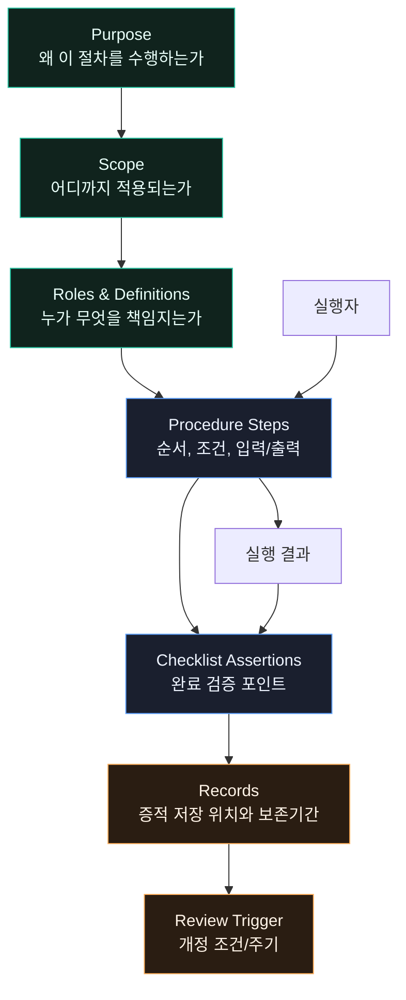
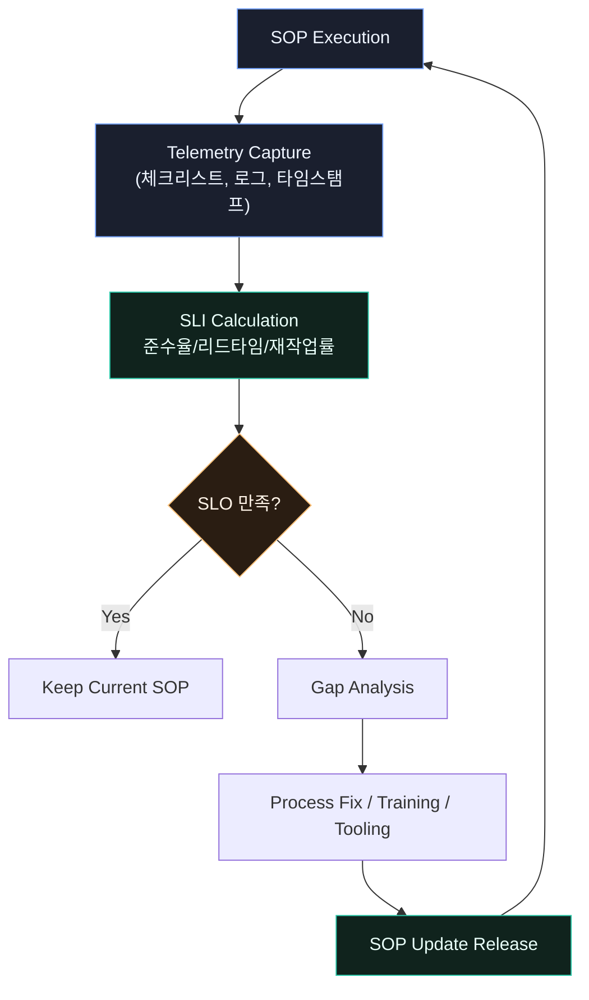
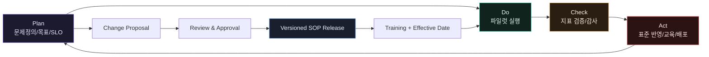

# SOP 작성과 표준화 — 반복 가능한 실행의 설계 문서

> **한 줄 요약**: SOP는 조직의 반복 가능한 프로세스를 코드화한 Runbook이다.

## 면책 조항 (Disclaimer)

> 이 글은 운영 실무를 소프트웨어 엔지니어링 관점으로 재해석한 시스템 분석 문서입니다.
> 비유는 복잡한 현실을 단순화하기 위한 도구이며, 법적 자문이나 인증 컨설팅을 대체하지 않습니다.
> 산업안전, 식품안전, 의약품 품질 영역에서는 반드시 해당 법령과 고시, 심사기관 가이드를 우선 확인하세요.

---

## 이 글을 읽기 전에 — 핵심 개념 매핑

SOP를 운영 문서로만 보면 지루하다.
Runbook으로 보면 갑자기 구조가 보인다.
아래 7개 매핑이 이 글의 인터페이스다.

| 운영 도메인 용어 | 소프트웨어 엔지니어링 대응어 | 실무적 의미 |
|---|---|---|
| **SOP (Standard Operating Procedure)** | **Runbook** | 반복 업무를 실행 가능한 단계로 고정한 문서 |
| **표준화 (Standardization)** | **Idempotent Procedure** | 누가, 몇 번 실행해도 결과 편차를 최소화하는 설계 |
| **프로세스 (Process)** | **Workflow** | 입력-처리-출력이 연결된 작업 그래프 |
| **체크리스트 (Checklist)** | **Assertion** | 단계 완료 조건을 명시해 누락을 탐지하는 검증 포인트 |
| **편차관리 (Deviation Management)** | **Exception Handling** | 표준 경로 밖 사건을 보고, 격리, 조치, 학습하는 체계 |
| **KPI** | **SLI/SLO** | 실제 성능 관측값(SLI)과 허용 목표(SLO)의 분리 |
| **감사 (Audit)** | **Audit Log** | 누가 언제 무엇을 근거로 수행했는지 추적 가능한 기록 |

---

## 시스템 브리프 — 운영팀의 본질적 설계 과제

같은 업무를 다른 사람이 해도 같은 결과가 나와야 한다.
하지만 사람은 기계가 아니다.
컨디션, 맥락 이해, 예외 판단이 모두 다르다.

> **설계 문제**: 어떻게 실행의 일관성을 보장하면서도, 현장의 예외와 변화에 대응할 수 있는 유연성을 함께 보장할 것인가?

이 문제는 소프트웨어의 분산 시스템 문제와 닮았다.
서로 다른 노드(사람)가 동일한 프로토콜(SOP)로 허용 오차 내 동일 상태를 만들어야 한다.

운영팀의 실패는 대개 두 형태다.
첫째, 표준이 없어 개인 경험에 의존한다.
둘째, 표준은 있는데 현실을 반영하지 못한다.

전자는 재현성이 없고 후자는 준수율이 떨어진다.
SOP 관리의 핵심은 문서 작성이 아니라 문서-실행-측정-개선의 폐루프(closed loop)를 만드는 일이다.

---

## §1. SOP의 구조 — Runbook Anatomy

> **설계 문제**: 절차를 어떻게 문서화하면, 숙련도와 역할이 다른 구성원도 안전하게 같은 작업을 실행할 수 있는가?

좋은 SOP는 설명문이 아니라 실행기다.
읽는 순간,
행동 순서,
판단 기준,
기록 위치,
중단 조건이 드러나야 한다.

### SOP 최소 구성 요소

1. **목적 (Purpose)**
2. **적용 범위 (Scope)**
3. **용어 및 책임 (Definitions & Roles)**
4. **절차 (Procedure)**
5. **기록 및 증적 (Records)**
6. **참고 기준 (References)**

문서 템플릿 자체가 조직의 제어면(control plane)이다.
누가 문서를 보더라도
동일한 슬롯에 동일한 타입의 정보가 있어야
실행 오류가 줄어든다.

### 실행 가능한 문장 규칙

- "확인한다"보다 "`ERP > 구매 > 발주현황` 화면에서 `승인대기` 건수 확인"처럼 위치와 조건을 함께 쓴다.
- 단계마다 완료 상태를 binary로 판정 가능하게 작성한다.
- 한 단계에 의사결정이 있으면 분기 조건을 명시한다.
- 분기 후 경로는 다시 합류 지점을 가진다.
- 사람 기억에 의존하는 표현("적절히", "필요시")은 근거 조건을 함께 둔다.

### 사례 1: 공장 설비 점검 SOP

공장 라인의 일일 점검은 보통 15~40개 항목을 가진다.
여기서 SOP는 단순 체크리스트 이상이어야 한다.

- 점검 순서가 바뀌면 안 되는 단계(락아웃/태깅 전원 차단)를 먼저 고정한다.
- 허용 범위를 벗어난 계측값은 즉시 편차 보고로 연결한다.
- 근무조 교대 시 미완료 항목이 자동 인계되도록 기록 위치를 표준화한다.

결국 SOP 구조는 문서 구조이자
사고 예방 구조다.

---

## §2. 멱등성 — Idempotent Procedure

> **설계 문제**: 같은 절차를 여러 번 수행해도, 왜 결과가 달라지는가? 그리고 그 편차를 어떻게 설계적으로 줄일 것인가?

운영에서 멱등성은 수학적 완전 일치가 아니다.
현실에서는
허용 오차 내 결과 일치,
혹은 동일한 품질 수준 보장을 의미한다.

소프트웨어에서 `PUT`이 멱등한 이유는
목표 상태가 정의되어 있기 때문이다.
SOP도 동일하다.
행동이 아니라 목표 상태를 정의해야 한다.

### SOP 멱등성 설계 패턴

1. **사전조건 고정**
   - 필요한 도구, 환경, 권한을 실행 전 확인한다.
2. **입력 정규화**
   - 자유입력 대신 코드/등급/카테고리를 사용한다.
3. **단계별 검증 포인트 삽입**
   - 중간 상태를 체크해 후속 단계 오염을 막는다.
4. **종료 상태 명시**
   - "완료"가 아니라 "시스템 상태값 X, 문서 상태값 Y"를 요구한다.
5. **재실행 규칙 정의**
   - 실패 후 재시도 시 건너뛰기/되돌리기 기준을 둔다.

### 사례 2: 레스토랑 오픈 체크 SOP

프랜차이즈 매장에서
오픈 담당자가 매일 달라도
품질이 일정해야 한다.

- 냉장고 온도 기록은 "기록"보다 "허용 범위 벗어나면 출고 금지"와 연결되어야 한다.
- 소스 준비는 "정량 계량"으로 개인 감각 편차를 줄인다.
- 점검 완료 후 POS 시스템 오픈 여부를 최종 상태로 기록한다.

이 구조가 있어야
재실행 시에도 상태가 무너지지 않는다.

### 멱등성을 깨는 전형적 안티패턴

- 동일 단계에 두 가지 목적(품질 확인 + 재고 집계)을 섞는다.
- 판단 기준이 문서 밖(팀장 구두 지시)에 있다.
- 예외 상황에서 임시 처리 후 기록을 남기지 않는다.
- 성과 압박 때문에 검증 단계를 생략한다.

SOP는 문서가 아니라 상태머신이다.
멱등성은 문장력보다
상태 정의 품질에서 결정된다.

---

## §3. 편차 관리 — Exception Handling

> **설계 문제**: 표준 절차로 처리되지 않는 사건이 발생했을 때, 운영 시스템은 어떻게 실패를 국소화하고 재발을 줄일 것인가?

표준화가 강할수록
예외는 더 빨리 드러난다.
좋은 조직은 예외를 숨기지 않고,
표준 체계로 되돌린다.

편차(Deviation)는 실패의 증거가 아니라
학습의 입력이다.
문제는 편차 자체가 아니라
편차를 비가시화하는 문화다.

### CAPA와 편차 보고서

- **Deviation Report**: 무엇이 표준에서 벗어났는지 사실 기록
- **Impact Assessment**: 품질/안전/규제 영향도 평가
- **Containment**: 즉시 위험 차단 조치
- **Root Cause Analysis**: 원인 분석(사람 비난이 아닌 시스템 원인 중심)
- **CAPA**: 시정조치(Corrective) + 예방조치(Preventive)
- **Effectiveness Check**: 조치 효과 검증

### 사례 3: SRE 장애 Runbook와의 연결

서비스 장애 대응에서
runbook대로 했는데도 복구 실패가 나올 수 있다.
이때 중요한 것은 "누가 실수했나"보다
"왜 이 runbook이 해당 장애 타입을 덮지 못했나"다.

- 장애 유형 분류가 부정확하면 runbook 탐색이 느려진다.
- 관측 지표가 부족하면 올바른 분기를 못 탄다.
- 복구 후 RCA를 SOP 개정과 연결하지 않으면 같은 장애가 반복된다.

운영 도메인의 편차관리와
SRE incident management는
같은 패턴을 공유한다.
둘 다 exception을
지식 자산으로 환류해야 성숙해진다.

---

## §4. 모니터링과 KPI — SLO/SLI 관점

> **설계 문제**: SOP가 존재한다는 사실과, SOP가 실제로 작동한다는 사실은 다르다. 무엇을 측정해야 운영 품질을 신뢰할 수 있는가?

운영에서 KPI는 종종 결과 지표에 치우친다.
예: 월 생산량,
매출,
클레임 건수.

하지만 SOP 관리에는
과정 지표가 반드시 필요하다.
소프트웨어식으로 분리하면 이해가 쉽다.

- **SLI (관측값)**: 실제 준수율, 평균 처리시간, 오류율, 재작업률
- **SLO (목표값)**: SLI가 만족해야 하는 목표 임계치

예시:

- SLI: "출고 전 이중 검수 완료율"
- SLO: "월 기준 99.5% 이상"

### KPI 설계 시 주의점

- 측정 편의성 때문에 본질과 무관한 지표를 선택하지 않는다.
- 결과 지표만 보면 "왜 나빠졌는지"를 모른다.
- 준수율만 보면 "형식 준수"가 증가하고 실질 품질이 떨어질 수 있다.
- 운영 현장에 피드백 주기가 너무 길면 조정 비용이 급증한다.

관측 가능성(Observability)은
대시보드가 아니라
질문에 답할 수 있는 데이터 구조다.

---

## §5. 지속적 개선 — Continuous Improvement

> **설계 문제**: SOP는 고정 문서가 아니라 살아 있는 실행 규약이다. 현실과 문서가 어긋날 때, 어떻게 빠르게 안전하게 동기화할 것인가?

현장의 변화 속도는 빠르다.
공정이 바뀌고,
고객 요구가 바뀌고,
도구가 바뀐다.

SOP를 연 1회 정기 개정만으로 관리하면
실제 운영은 이미 다른 프로토콜로 움직인다.
따라서 PDCA는 운영 분야의 CI/CD 파이프라인으로 볼 수 있다.

### 버전 관리 원칙

- SOP에도 semantic versioning 유사 규칙을 둘 수 있다.
- 중대한 규제 변경은 major,
  절차 분기 추가는 minor,
  오탈자/표현 명확화는 patch로 분류한다.
- 유효일(Effective Date)을 명확히 두어 전환 시점을 통제한다.
- 폐기된 버전도 감사 대응을 위해 보존한다.

### 자동화 경계

RPA, workflow engine, form automation은 SOP 집행력을 높인다.
그러나 자동화가 표준을 대체하지는 못한다.

자동화 이전에 표준 입력, 분기 규칙, 예외 처리, 로그 스키마가 먼저 정의되어야 한다.
그렇지 않으면 사람의 임의성이 코드의 임의성으로 옮겨갈 뿐이다.

---

## 조직 내 위치 — Operations as Control Plane

운영팀은 백오피스가 아니라
조직 실행의 control plane에 가깝다.
아래 의존성이 명확하다.

- **HR**: 역할 정의, 교육 체계, 자격 부여/회수
- **Finance**: 비용 기준, 승인 권한, 통제 증적
- **Legal/Compliance**: 법령 적합성, 문서 보존 정책
- **IT/Engineering**: 도구화, 로그 수집, 워크플로 자동화
- **Quality/EHS**: 품질/안전 기준과 감사 대응

SOP가 부실하면
각 도메인이 자기 방식으로 우회한다.
그 결과,
조직은 빠르게 분화되고
학습은 느려진다.

---

## 성숙도 단계 — 구두 전승에서 운영 플랫폼으로

### 1) Startup 단계: 구두 전달 중심

- 핵심 인력이 절차를 머릿속에 보관한다.
- 속도는 빠르지만 재현성은 낮다.
- 인력 교체 시 품질이 급락한다.

### 2) Growth 단계: 문서화 시작

- SOP 템플릿이 생기고 교육 체계가 생긴다.
- 그러나 부서별 포맷이 달라 통합 관측이 어렵다.
- 편차 보고는 늘지만 CAPA 환류가 약하다.

### 3) Enterprise 단계: 표준 + 감사 + 자동화

- ISO 9001 기반 문서 체계와 내부심사가 정착된다.[^1]
- 법령/규격 기반 증적 관리가 자동화된다.
- KPI가 SLI/SLO 구조로 연결되어 운영 품질을 예측한다.
- SOP가 지식 저장소가 아니라 실행 플랫폼으로 동작한다.

성숙도는 문서 수가 아니라
재현성과 학습 속도로 판단해야 한다.

---

## 변경 이력 — SOP 시스템의 세 번의 전환점

### 전환점 1: 수기 매뉴얼 시대 (Taylor 이후 산업 표준화)

초기 공장 운영은
작업 분업과 시간-동작 연구를 기반으로
작업 기준서를 만들어 대량생산 효율을 높였다.
핵심은 개인 숙련 의존을 줄이는 것이었다.

### 전환점 2: 품질경영 체계화 (ISO 9001)

문서가 "있다"에서
문서가 "관리된다"로 이동했다.
문서 승인,
개정,
배포,
폐기,
기록 보존이 하나의 시스템으로 묶였다.[^1]

### 전환점 3: 디지털 SOP/자동화 시대

워크플로 엔진,
모바일 체크리스트,
전자서명,
실시간 대시보드가 결합되면서
SOP는 정적 문서에서 실행 소프트웨어로 변환되었다.

이 전환의 핵심은
"자동화"가 아니라
"추적 가능성"의 고도화다.

---

## 운영 모델 비교 — 산업별 Runbook 패턴

| 모델 | 핵심 목표 | 표준 문서 특징 | 대표 규제/프레임 | 엔지니어링 유사점 |
|---|---|---|---|---|
| **제조업 (GMP/cGMP)** | 일관된 품질과 오염/혼입 방지 | 배치기록, 변경관리, 이탈관리 중심 | 의약품등의안전에관한규칙(GMP) | 배포 전 검증 + 강한 traceability |
| **IT 운영 (SRE Runbook)** | 장애 복구 시간 최소화, 가용성 유지 | 알람별 대응 절차, 롤백/완화 단계 | SRE 운영 원칙, 내부 통제 기준 | incident response playbook |
| **서비스업 (프랜차이즈)** | 지점 간 고객경험 균질화 | 오픈/마감 체크, 위생/응대 표준 | 식품위생법, 가맹 운영 기준 | 표준 UI/UX 컴포넌트 운영 |
| **규제산업 (HACCP)** | 위해요소 예방 중심 통제 | CCP 모니터링, 한계기준, 시정조치 | 식품위생법 및 HACCP 체계 | safety-critical 제어 루프 |

핵심 차이는 문서 양식이 아니다.
리스크 모델이 다르기 때문에
표준의 강도와 감사 깊이가 달라진다.

---

## 이 비유의 한계 (Limits of the Analogy)

SOP를 runbook으로 보는 관점은 강력하다.
하지만 완전하지 않다.
아래 한계를 명시적으로 기억해야
비유가 오용되지 않는다.

| 비유가 작동하는 지점 | 비유가 깨지는 지점 | 왜 한계가 생기는가 |
|---|---|---|
| SOP 단계 구조는 runbook step과 유사하다. | 사람은 문장을 해석하며 실행하므로 기계처럼 결정적이지 않다. | 자연어 지시의 모호성과 숙련도 차이 때문이다. |
| 체크리스트는 assertion처럼 누락을 탐지한다. | 체크했다고 품질이 보장되지는 않는다. | 측정 자체가 형식화될 수 있고, 측정 방법이 틀릴 수 있다. |
| 편차관리는 exception handling과 구조가 같다. | 현장에서는 보고 회피, 책임 전가 같은 사회적 요인이 개입한다. | 조직 문화는 코드처럼 강제 컴파일되지 않는다. |
| KPI를 SLI/SLO로 쪼개면 개선 루프가 선명해진다. | 지표가 목표가 되면 실제 운영 품질이 왜곡될 수 있다. | Goodhart의 법칙: 측정값이 목적이 되면 체계가 오염된다. |
| PDCA는 CI/CD 파이프라인과 닮았다. | 프로세스 개정은 교육, 노사, 규제 승인 등 비기술 요소에 묶인다. | 배포 버튼 한 번으로 전환되지 않는 사회기술 시스템이다. |
| 감사로그는 운영 이력을 재구성한다. | 로그가 있어도 사실과 책임이 자동 확정되지는 않는다. | 법적 판단과 맥락 해석이 필요하다. |

요약하면,
이 비유는 구조를 이해하는 데는 탁월하지만
권한,
문화,
법적 책임이 얽힌 현실을 완전히 대체하지는 못한다.

---

## 출처 (Sources)

### 1순위 — 표준/법령 원문

- ISO. **ISO 9001:2015 Quality management systems — Requirements**. https://www.iso.org/standard/62085.html
- 국가법령정보센터. **산업안전보건법**. https://www.law.go.kr/법령/산업안전보건법
- 국가법령정보센터. **식품위생법**. https://www.law.go.kr/법령/식품위생법
- 국가법령정보센터. **의약품등의안전에관한규칙**(GMP 관련 조항 포함). https://www.law.go.kr/법령/의약품등의안전에관한규칙

### 2순위 — 공공/공식 기관 및 전문서

- 한국표준협회(KSA). 품질경영 및 표준화 안내. https://www.ksa.or.kr
- Google. **Site Reliability Engineering Book** (Runbook/운영 비교 참고). https://sre.google/sre-book/table-of-contents/

위 출처는 위키/개인 블로그를 제외하고,
표준,
법령,
공식기관,
전문서로 제한했다.

---

## 각주

[^1]: ISO 9001:2015는 품질경영시스템의 문서화 정보, 운영 통제, 성과평가, 개선 요구사항을 정의한다. 조직이 SOP를 문서로만 두지 않고 관리 체계로 운영하도록 요구한다.
[^2]: 산업안전보건법은 사업주의 안전보건조치와 관리 책임을 규정한다. SOP는 법적 의무 이행의 실행 단위가 된다.
[^3]: 식품위생법 및 HACCP 체계는 위해요소 분석과 중요관리점 통제를 통해 예방 중심 운영을 요구한다.
[^4]: 의약품 제조 품질관리(GMP) 영역에서는 변경관리, 일탈관리, 문서관리, 기록보존이 핵심 통제 요소다.
[^5]: KSA는 국내 산업 표준화 및 품질경영 확산을 위한 공신력 있는 기관으로, 조직의 표준 운영 체계 정립 시 참조 기반을 제공한다.
[^6]: SRE Book의 운영 원칙은 IT 분야 runbook 설계, 알림 대응, 사후분석 문화를 체계화하여 운영 도메인 SOP와 비교 가능한 프레임을 제공한다.
[^7]: CAPA는 규제산업에서 재발 방지의 핵심 메커니즘으로, 단기 시정조치와 장기 예방조치를 구분해 관리한다.
[^8]: 멱등성은 현실 업무에서 "완전 동일 결과"보다 "허용 편차 내 재현 가능한 결과"로 해석하는 것이 실무적으로 타당하다.

---

## 관련 글 (See Also)

- [온보딩과 교육 — 조직 실행 프로토콜의 부트스트랩](../../hr/system/onboarding-as-bootstrapping.md) *(예정)*
- [내부통제와 감사 — Evidence Pipeline 설계](../../finance/system/internal-control-as-evidence-pipeline.md) *(예정)*
- [품질보증 — Verification Layer로서의 QA](../../design/system/quality-assurance-as-verification-layer.md) *(예정)*
- [서비스 장애 대응 — Incident Command System](../../operations/cases/incident-command-pattern.md) *(예정)*

---
