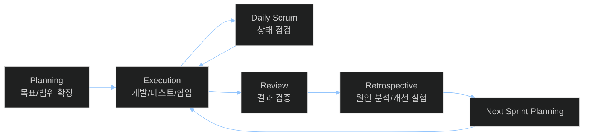
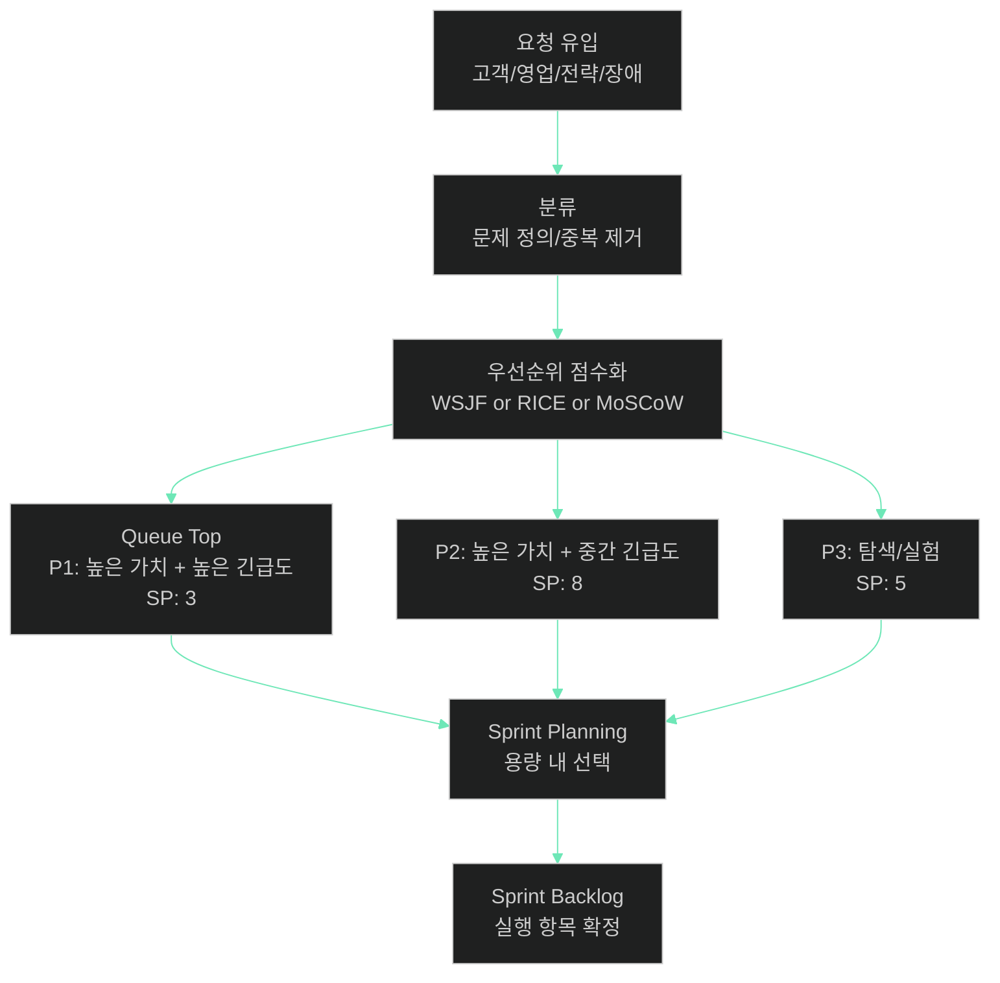
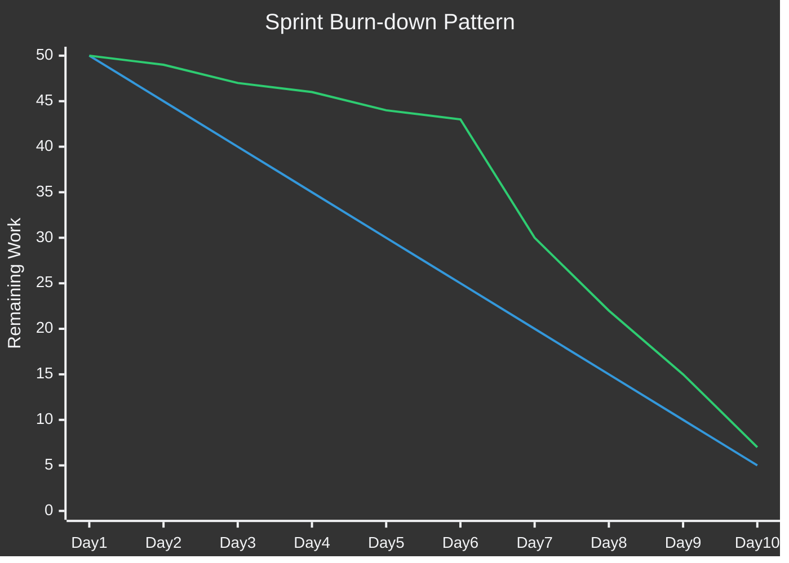

# 스프린트 주기 — 반복 실행 최적화의 설계 문서

> **한 줄 요약**: 스프린트는 불확실성을 관리하기 위해 실행을 짧은 주기로 분할하는 설계 패턴이다.

## 면책 조항 (Disclaimer)

> 이 글은 PM 운영 체계를 소프트웨어 시스템 설계 관점으로 분석한 문서다.
> 특정 프레임워크를 신념으로 옹호하지 않으며, 팀 맥락에 따라 다른 결론이 나올 수 있다.
> 실제 적용 시에는 계약 구조, 규제 요구, 조직 성숙도, 인력 구성, 제품 위험도를 함께 검토해야 한다.

---

## 이 글을 읽기 전에 — 핵심 개념 매핑

아래 매핑은 본문 전체에서 반복적으로 사용되는 용어 정의다.
엔지니어 독자를 기준으로 의미를 정렬했다.

| PM 용어 | 시스템 비유 | 이 문서에서의 의미 |
|---|---|---|
| **스프린트 (Sprint)** | **Iteration Cycle** | 고정된 길이의 실행 루프. 계획, 실행, 검토, 개선을 한 묶음으로 처리한다. |
| **제품 백로그 (Product Backlog)** | **Priority Queue** | 가치/리스크/의존성을 기준으로 우선순위가 지속 재정렬되는 작업 대기열이다. |
| **스토리 포인트 (Story Point)** | **Estimation Unit** | 시간 자체가 아닌 상대적 복잡도/불확실성/노력량의 단위다. |
| **번다운 (Burn-down)** | **Burn-down Monitoring** | 시간 경과 대비 잔여 작업 감소 패턴을 시각화하는 관측 도구다. |
| **회고 (Retrospective)** | **Post-mortem** | 장애가 없어도 매 반복 종료 시 시스템적 원인과 개선 실험을 기록한다. |
| **WIP 제한 (Work In Progress Limit)** | **Concurrency Limit** | 동시에 처리하는 작업 수 상한. 멀티태스킹 비용과 대기열 폭증을 억제한다. |
| **데일리 스크럼 (Daily Scrum)** | **Health Check** | 계획 대비 편차와 블로커를 조기에 감지하는 짧은 상태 동기화 루틴이다. |

---

## 시스템 브리프 — PM 시스템이 풀어야 하는 근본 문제

제품을 만들어야 하지만 요구사항은 계속 바뀌고, 완성까지 얼마나 걸릴지도 모른다.
초기 계획은 빠르게 낡고, 계획 없이 달리면 팀은 방향을 잃는다.

> **설계 문제**: "제품을 만들어야 하는데, 요구사항은 계속 바뀌고, 완성까지 얼마나 걸릴지 모른다. 큰 계획을 세워도 현실과 맞지 않고, 계획 없이 만들면 방향을 잃는다. 어떻게 불확실성 속에서 지속 가능하게 제품을 전진시킬 것인가?"

이 문제는 PM 도메인의 런타임 문제다.
사전에 완벽한 설계로 해결되지 않는다.
실행-피드백-재설계를 반복하는 운영 구조가 필요하다.
스프린트는 그 구조를 표준화한 한 가지 구현이다.[^1]

핵심은 속도가 아니라 제어 가능성이다.
짧은 주기는 작은 실패를 허용하고, 작은 실패는 학습 비용과 방향 전환 지연을 줄인다.

이 문서는 다음 질문에 답한다.
스프린트 길이는 어떻게 결정하는가, 백로그는 어떤 알고리즘으로 정렬하는가, 추정과 약속은 어떻게 분리하는가.
또한 WIP를 어떻게 제어하고 회고를 실질적 학습 루프로 바꾸는지도 다룬다.

---

## §1. 주기의 설계 — Iteration Length

> **설계 문제**: 실행 주기를 얼마나 짧게 또는 길게 잡아야 하는가?

스프린트 길이는 배치 크기(batch size)를 정의한다.
배치가 크면 컨텍스트 전환이 줄어 효율이 오른다.
대신 피드백 주기가 길어져 잘못된 방향이 오래 유지된다.
배치가 작으면 피드백이 빠르다.
대신 계획/회의/전환 오버헤드 비율이 증가한다.

Scrum Guide는 스프린트를 한 달 이하로 제한한다.[^1]
이는 피드백 최대 지연을 구조적으로 제한하는 제약이다.
한 달보다 길면 검증 지연이 너무 커진다는 가정이 깔려 있다.

실무에서는 1주, 2주, 3주, 4주가 주류다.
2주가 자주 선택되는 이유는 균형점 때문이다.
오버헤드가 폭증하지 않으면서도 변동성에 반응 가능한 길이다.
그러나 균형점은 팀과 도메인마다 달라진다.

아래는 스프린트 사이클의 최소 구성이다.

### 길이 선택의 정량 프레임

길이 선택은 취향 문제가 아니다.
팀의 제약식으로 계산해야 한다.

- 피드백 지연 비용: 잘못된 가설을 유지한 시간 x 영향 범위
- 전환 오버헤드 비용: 계획+리뷰+회고+재정렬에 쓰인 시간
- 통합 위험 비용: 미완료 작업이 누적될수록 증가하는 재작업
- 예측 오차 비용: 외부 커뮤니케이션 약속과 실제 차이

개념적으로는 다음 최적화 문제로 볼 수 있다.

`총비용 = 피드백 지연 비용 + 운영 오버헤드 비용 + 재작업 위험 비용`

스프린트 길이는 총비용이 최소가 되는 지점에서 선택한다.
이 값은 고정 상수가 아니다.
팀 성숙도와 제품 단계에 따라 이동한다.

### 2주 스프린트 vs 6주 사이클 예시

초기 스타트업은 가설 검증 주기가 핵심이다.
잘못된 문제를 풀 확률이 높다.
2주 또는 1주 주기가 유리하다.
실패를 빠르게 수면 위로 끌어올린다.

반면 대기업 플랫폼팀은 릴리스/보안/규정 절차가 길다.
검증 체인이 복잡하고 의존 부서가 많다.
4주 또는 Shape Up의 6주 박스가 운영상 유리할 수 있다.[^5]
핵심은 절대 길이가 아니라 시스템 지연에 맞춘 동기화다.

### 주기 길이 결정 체크리스트

- 외부 피드백(고객 데이터, 영업, CS)이 최소 몇 주 단위로 유의미하게 들어오는가
- 의사결정자(PO, 리더십)가 우선순위를 갱신할 수 있는 실제 주기와 일치하는가
- 팀의 CI/CD 성숙도가 짧은 배치를 흡수할 수 있는가
- 품질 게이트(보안, 법무, 규제)가 주기를 인위적으로 늘리는가
- 실패 비용이 높은 기능에서 검증 지연을 감수할 수 있는가

---

## §2. 백로그와 우선순위 — Priority Queue Management

> **설계 문제**: 할 일은 무한한데 시간은 유한하다. 무엇을 먼저 처리할 것인가?

백로그는 할 일 목록이 아니다.
우선순위 큐다.
큐 운영 정책이 없으면 가장 시끄러운 요청이 우선된다.
그 결과 전략과 실행이 분리된다.

좋은 백로그 운영은 두 가지를 동시에 만족해야 한다.
첫째, 가치가 큰 항목이 먼저 처리되어야 한다.
둘째, 불확실성이 큰 항목은 조기 학습을 위해 앞당겨야 한다.

### 스케줄링 알고리즘으로서의 우선순위 기법

- **WSJF**: `(Business Value + Time Criticality + Risk Reduction) / Job Size` 형태로 지연 비용 대비 크기를 비교한다.[^6]
- **MoSCoW**: Must/Should/Could/Won't로 최소 생존 범위를 정의한다.
- **RICE**: Reach x Impact x Confidence / Effort로 기대 효용을 계산한다.

이 기법들은 정답기가 아니다.
팀이 우선순위 결정 논리를 외부화하는 인터페이스다.
핵심은 "왜 이 순서인가"를 재현 가능하게 만드는 것이다.

아래 다이어그램은 백로그 큐가 추정 단위와 함께 정렬되는 흐름을 보여준다.

### 큐 왜곡을 만드는 대표 안티패턴

- 고정 우선순위: 분기 초에 정한 순서를 분기 말까지 유지
- 직급 기반 삽입: 운영 정책 없이 임원 요청이 상단 점프
- 추정 없는 집행: 크기를 모른 채 "일단 시작"
- 의존성 미표기: 선행 작업 누락으로 실행 중 블로킹
- 완료 정의 불명확: Done 기준이 없어서 체류 시간이 증가

### 스타트업과 엔터프라이즈의 차이

스타트업은 불확실성이 높아 "학습 가치" 가중치가 커야 한다.
즉시 매출과 무관해도 리스크 제거 항목을 상단에 둔다.

엔터프라이즈는 상호 의존성과 컴플라이언스가 커서 "연쇄 비용" 가중치가 커진다.
작은 개선보다 대규모 변경의 파급을 먼저 계산해야 한다.

---

## §3. 추정과 약속 — Estimation vs Commitment

> **설계 문제**: "이거 얼마나 걸려?"라는 질문에 어떻게 답할 것인가?

대부분의 팀이 이 지점에서 충돌한다.
추정(estimation)은 불확실성을 표현하는 행위다.
약속(commitment)은 이해관계자와의 계약 행위다.
둘을 섞으면 숫자는 남고 신뢰는 사라진다.

스토리 포인트는 시간 단위가 아니다.
상대적 복잡도와 불확실성을 비교하는 단위다.
Velocity는 팀의 처리량 추세다.
개별 스프린트 성과 점수가 아니다.[^1]

PMI 표준도 예측은 점진적 정교화가 필요하다고 본다.[^2]
즉, 초기 숫자는 사실이 아니라 가설이다.
가설을 계약처럼 다루면 위험이 가려진다.

아래 번다운 패턴은 예측과 실제의 관계를 시각화한다.

이 차트의 핵심은 선형 하강 여부가 아니다.
편차가 언제 발생했고 왜 발생했는지다.
중반 급감은 범위 축소인지 실제 생산성 상승인지 분해해야 한다.
후반 급락이 반복되면 테스트/통합이 끝으로 밀리는 구조 신호다.

### 추정 품질을 높이는 운영 규칙

- 기준 스토리(anchor story)를 유지해 상대 비교 기준을 안정화한다.
- 불확실성 높은 항목은 스파이크로 분리해 학습을 먼저 수행한다.
- 외부 의존성이 큰 항목은 버퍼가 아니라 별도 위험 항목으로 추적한다.
- 약속은 범위-일정-품질의 삼각 제약을 명시한 뒤 확정한다.

### "언제 끝나나요"에 대한 실무 답변 구조

좋은 답은 단일 날짜가 아니다.
범위를 포함한 시나리오다.

- 시나리오 A: 핵심 범위만 포함하면 N주
- 시나리오 B: 확장 범위 포함 시 N+2주
- 시나리오 C: 외부 API 지연 발생 시 N+4주

이 구조는 정치적 방어가 아니다.
시스템의 불확실성 모델을 투명하게 공유하는 방식이다.

---

## §4. WIP 제한 — Concurrency Control

> **설계 문제**: 동시에 여러 일을 하면 왜 모든 일이 느려지는가, 그리고 어떻게 막을 것인가?

WIP 제한은 칸반에서 강조되지만 Scrum 팀에도 적용 가능하다.[^3]
핵심 가정은 간단하다.
사람도 스레드처럼 컨텍스트 스위칭 비용을 낸다.
동시 작업 수가 늘수록 대기열과 재개 비용이 늘어난다.

WIP limit는 thread pool 크기와 유사하다.
풀을 무한대로 열면 처리량이 늘 것 같지만 실제로는 잠금 경합과 캐시 미스가 증가한다.
팀도 동일하다.
동시에 시작만 많아지고 완료는 늦어진다.

### 실무 적용 패턴

- 분석/개발/리뷰/테스트 단계별 WIP를 별도로 둔다.
- "시작 금지, 완료 우선" 규칙을 운영한다.
- 막힌 작업은 WIP를 차지한 채 시각화한다.
- 긴급 작업 투입 시 기존 항목을 명시적으로 내린다.

### 왜 Scrum 팀에서 특히 중요한가

스프린트 말에 미완료 항목이 쌓이면 예측 신뢰가 붕괴한다.
원인은 대개 중간 단계 체류다.
WIP 제한은 체류 시간을 줄여 흐름을 복원한다.

### 2주 스프린트 팀의 간단한 규칙 예시

- In Progress 최대 4개
- Code Review 대기 최대 3개
- QA 대기 최대 2개
- 긴급 장애 슬롯 1개(항상 비워 둠)

이 규칙은 생산성 미신이 아니다.
병목이 어디서 생기는지 강제로 드러내는 관측 장치다.

---

## §5. 회고 — Post-mortem as Feedback Loop

> **설계 문제**: 같은 실수를 반복하지 않으려면 무엇을 기록하고 무엇을 바꿔야 하는가?

회고는 감정 배출 세션이 아니다.
프로세스 디버깅 세션이다.
사람 비난이 아니라 시스템 원인 분석에 집중해야 한다.

"사건이 없는데 무슨 포스트모템인가"라는 질문이 자주 나온다.
스프린트 회고의 의미는 바로 여기에 있다.
대형 사고가 나기 전에 작은 편차를 누적 학습으로 전환한다.
즉 incident post-mortem을 평시 루틴으로 당겨온 구조다.

### 회고를 실패시키는 흔한 패턴

- 관찰 없는 의견: 데이터 없이 체감만 교환
- 실행 없는 교훈: 액션 아이템 담당자/기한 없음
- 추적 없는 약속: 다음 회고에서 결과 검증 없음
- 구조 없는 대화: 동일 주제가 반복되고 진전 없음

### 유효한 회고 템플릿

1. 사실: 이번 스프린트에서 실제로 일어난 사건(리드타임, 누락, 장애)
2. 원인: 개인 실수보다 시스템 조건(역할 충돌, 기준 부재, 의존성)
3. 실험: 다음 스프린트에서 시도할 작고 측정 가능한 변경
4. 검증: 다음 회고에서 실험 효과를 지표로 확인

### 회고 액션의 좋은 예

- "리뷰 지연" 문제를 해결하기 위해 리뷰어 로테이션 도입
- "요구 변경 급증" 문제를 줄이기 위해 중간 리파인먼트 슬롯 추가
- "테스트 밀림" 문제를 줄이기 위해 Done에 자동화 테스트 기준 추가

회고의 산출물은 문서가 아니다.
다음 스프린트의 운영 규칙 변경이다.
규칙이 바뀌지 않으면 회고는 이벤트로 끝난다.

---

## 조직 내 위치 — PM의 인터페이스와 의존성

> **설계 문제**: PM은 조직에서 어떤 계층 사이를 연결하고, 어디서 병목이 생기는가?

PM은 단독 실행자가 아니다.
의사결정 인터페이스 계층이다.
위로는 경영진 전략과 자원 제약을 받는다.
아래로는 엔지니어링/디자인/데이터 조직과 실행 계약을 맺는다.

핵심 연결은 세 가지다.

- **경영진 ↔ PM**: 전략 우선순위, 성과 정의, 투자 기간
- **PM ↔ 엔지니어링**: 범위, 기술 제약, 품질/속도 트레이드오프
- **PM ↔ 디자인/리서치**: 문제 정의, 사용자 검증, 실험 설계

스프린트 시스템은 이 인터페이스를 시간 단위로 동기화한다.
동기화가 깨지면 백로그는 로드맵과 분리된다.
결국 팀은 바쁜데 진척이 없는 상태로 들어간다.

---

## 성숙도 단계 — Sprint Operating Model의 진화

> **설계 문제**: 조직 규모와 복잡도가 증가할 때 스프린트 운영 모델은 어떻게 진화해야 하는가?

### Startup 단계

CEO가 사실상 PM 역할을 수행한다.
문제 탐색과 생존 지표가 최우선이다.
공식 Scrum 이벤트보다 빠른 학습 루프가 중요하다.
주기는 짧고 역할은 겹친다.

### Growth 단계

전담 PM이 도입된다.
Scrum 이벤트가 형식화된다.
백로그 정책과 추정 기준이 팀 자산으로 정리된다.
2주 스프린트가 기본값이 되는 경우가 많다.

### Enterprise 단계

PM 조직이 계층화된다.
팀 간 의존성 관리가 핵심 문제가 된다.
단일 팀 최적화보다 포트폴리오 동기화가 중요해진다.
스케일드 프레임워크(SAFe 등)나 혼합 모델이 등장한다.[^7]

성숙도 상승은 Scrum 충실도 상승과 동일하지 않다.
핵심은 불확실성 관리 비용을 조직 단위에서 최소화하는 것이다.

---

## 변경 이력 — 반복 실행 시스템의 세 번의 전환점

> **설계 문제**: PM 실행 체계는 왜 Waterfall에서 Agile로, 다시 혼합 모델로 이동했는가?

### 전환점 1: Waterfall 중심 운영

대형 프로젝트와 공공 조달 중심 환경에서는 예측 가능성이 최우선이었다.
PMBOK 전통은 범위-일정-비용 통제를 체계화했다.[^2]
그러나 요구 변동성이 높은 디지털 제품에서는 변경 비용이 폭증했다.

### 전환점 2: Agile/Scrum 확산

2010년대에 Scrum이 표준 실무로 빠르게 퍼졌다.
짧은 주기, 고객 피드백, 팀 자율성이라는 장점이 컸다.[^1]
하지만 의식(event) 준수가 성과를 자동 보장하지는 않았다.

### 전환점 3: 혼합 모델의 정착

최근 조직들은 문제 성격별로 모델을 섞는다.
탐색은 짧은 실험 루프를 사용한다.
플랫폼/규제 영역은 긴 계획 주기를 유지한다.
Shape Up, Kanban, Scrum, SAFe가 공존하는 이유다.[^3][^5][^7]

핵심 변화는 역할 분리다.
PM은 반드시 Scrum Master와 동일 인물이 아니다.
조직은 진행 촉진과 문제 정의를 분리하는 쪽으로 이동한다.

---

## 운영 모델 비교 — Time-boxed vs Flow-based vs Appetite-boxed vs Scaled

> **설계 문제**: 어떤 운영 모델이 어떤 문제 유형에 더 적합한가?

| 모델 | 기본 단위 | 강점 | 취약점 | 적합한 맥락 |
|---|---|---|---|---|
| **Scrum** | 고정 시간 박스(보통 1~4주) | 예측 가능한 리듬, 정기적 피드백 | 이벤트 형식주의 위험, 스프린트 말 압축 | 제품 팀 단위 실행, 명확한 목표 반복 |
| **Kanban** | 흐름 기반 연속 처리 | 리드타임 최적화, 우선순위 변경 유연 | 장기 목표 동기화 약화 가능 | 운영/플랫폼/지원성 업무 혼합 팀 |
| **Shape Up** | 6주 빌드 + 2주 쿨다운 | 집중도 높은 큰 배치, 범위 재협상 명확 | 피드백 주기 길어질 수 있음 | 제품 컨셉 단위 전달, 자율성 높은 팀 |
| **SAFe** | 팀 스프린트 + 프로그램 인크리먼트 | 대규모 조직 정렬, 의존성 가시화 | 프로세스 무게 증가, 도입 비용 큼 | 다수 팀/다수 제품의 엔터프라이즈 |

모델 선택은 신념 문제가 아니다.
업무 도착 패턴과 조직 제약에 맞춰야 한다.
시간 박스가 유리한 문제와 흐름 최적화가 유리한 문제를 구분해야 한다.

---

## 이 비유의 한계 (Limits of the Analogy)

PM을 시스템 비유로 읽으면 구조가 선명해진다.
동시에 중요한 왜곡도 생긴다.
아래 표는 비유가 작동하는 지점과 깨지는 지점을 분리한다.

| 비유가 작동하는 지점 | 비유가 깨지는 지점 | 이유 | 실무 보완 |
|---|---|---|---|
| 스프린트를 배치 크기로 보면 피드백 지연을 계산하기 쉽다. | 사람의 학습과 동기는 배치 모델로 완전히 환원되지 않는다. | 인간 시스템은 심리적 안전과 문화 영향을 크게 받는다. | 정량 지표와 1:1 인터뷰를 함께 운영한다. |
| 백로그를 우선순위 큐로 보면 의사결정 로직이 명시된다. | 조직 정치와 권한 구조는 알고리즘 입력으로 완전 모델링되지 않는다. | 영향력은 비선형이며 공식 점수 밖에서 작동한다. | 의사결정 로그와 예외 처리 규칙을 문서화한다. |
| 스토리 포인트를 추정 단위로 보면 시간 집착을 줄일 수 있다. | 포인트가 성과 지표로 변질되면 게임화된다. | 측정이 보상과 결합되면 지표가 목적을 대체한다. | 포인트를 인사/평가 지표에서 분리한다. |
| WIP 제한은 병목을 드러내고 리드타임을 안정화한다. | 긴급 장애가 잦은 환경에서는 고정 WIP가 자주 깨진다. | 운영 현실이 계획 모델을 주기적으로 중단시킨다. | 긴급 슬롯과 명시적 교체 정책을 둔다. |
| 회고를 포스트모템으로 보면 학습 루프가 구조화된다. | 신뢰가 낮은 팀에서는 회고가 책임 추궁 자리로 변한다. | 문화가 안전하지 않으면 원인 분석이 불가능하다. | 퍼실리테이션과 비난 금지 규칙을 먼저 구축한다. |
| 운영 모델 비교는 선택의 기준을 명확히 한다. | 실제 조직은 혼합형이라 단일 프레임으로 분류되지 않는다. | 팀별 도착 패턴과 제약이 다르다. | 제품군별로 다른 운영 정책을 허용한다. |

요약하면, 비유는 구조를 설명하는 데 유용하다.
하지만 인간 협업 시스템의 정치, 문화, 심리까지 대체하지는 못한다.

---

## 출처 (Sources)

### 핵심 표준

- Scrum.org and Scrum Inc. `The Scrum Guide` (2020). https://scrumguides.org/scrum-guide.html
- Project Management Institute. `A Guide to the Project Management Body of Knowledge (PMBOK Guide)` and PMI Standards portal. https://www.pmi.org/pmbok-guide-standards
- ISO. `ISO 21502:2020 Project, programme and portfolio management — Guidance on project management`. https://www.iso.org/standard/74947.html
- Scrum.org. `Kanban Guide for Scrum Teams`. https://www.scrum.org/resources/kanban-guide-scrum-teams

### 보조 자료

- Basecamp. `Shape Up: Stop Running in Circles and Ship Work that Matters`. https://basecamp.com/shapeup
- Scaled Agile. `SAFe Framework`. https://scaledagileframework.com

---

## 각주

[^1]: Scrum Guide (2020). 스프린트는 한 달 이하의 고정 길이 이벤트이며, 계획-검토-회고를 포함하는 경험주의 루프를 구성한다.
[^2]: PMI PMBOK Guide 및 PMI Standards. 프로젝트 예측은 점진적으로 정교화되며, 불확실성 기반 계획 조정이 필요하다고 규정한다.
[^3]: Kanban Guide for Scrum Teams. WIP 제한, 워크플로 시각화, 활성 작업 관리가 흐름 최적화 핵심 요소로 제시된다.
[^4]: ISO 21502:2020. 프로젝트 거버넌스, 단계별 검토, 리스크 기반 의사결정, 이해관계자 정렬을 강조한다.
[^5]: Shape Up. 6주 빌드 사이클과 고정된 appetite(투자 한도) 기반 범위 설계를 제안한다.
[^6]: WSJF(Weighted Shortest Job First)는 SAFe 실무에서 널리 사용하는 우선순위 계산 방식이며, 지연 비용 대비 작업 크기 관점의 순서를 제공한다.
[^7]: SAFe는 대규모 조직에서 팀 단위 반복과 프로그램 단위 동기화를 결합해 의존성 관리를 시도한다.
## 관련 글 (See Also)
- [제품 로드맵 — Strategy to Execution Contract](../system/product-roadmap-as-contract.md) *(예정)*
- [요구사항 리파인먼트 — Ambiguity Compression Pipeline](../system/requirement-refinement-pipeline.md) *(예정)*
- [우선순위 의사결정 — Cost of Delay Operating Model](../system/cost-of-delay-prioritization.md) *(예정)*
- [엔지니어링 매니저 — Delivery System Control Plane](../../engineering/management/system/engineering-manager-as-control-plane.md) *(예정)*
