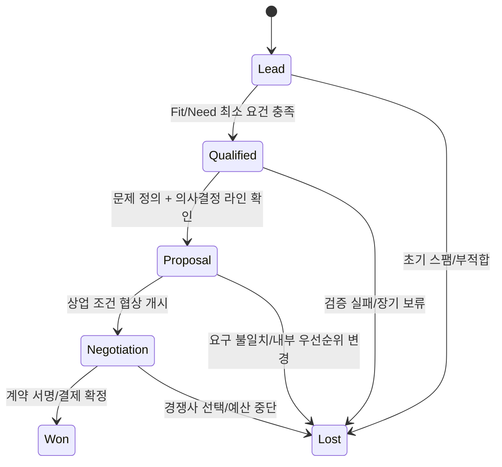
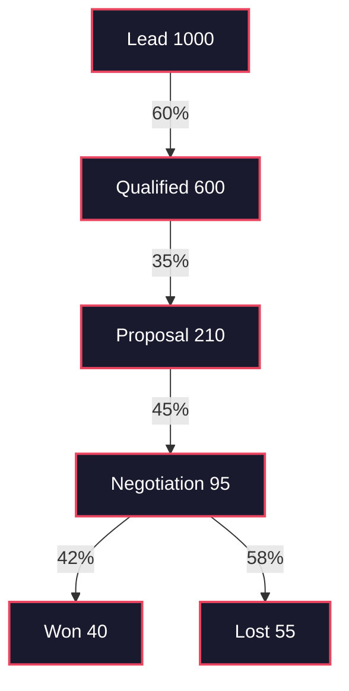

# 영업 파이프라인 — 고객 상태 전이의 설계 문서
> **한 줄 요약**: 영업 파이프라인은 잠재 고객의 상태를 추적하는 State Machine이다.
## 면책 조항 (Disclaimer)
> 이 글은 영업 운영을 시스템 설계 관점으로 해석한 분석 문서다.
> 비유는 구조를 이해하기 위한 도구이며, 산업별 법규와 내부 통제를 대체하지 않는다.
> 실제 의사결정에는 법령 원문, 공시 문서, 회사의 공식 정책을 우선 적용해야 한다.
---
## 이 글을 읽기 전에 — 핵심 개념 매핑
아래 용어 7개를 먼저 고정하면,
영업 조직의 데이터,
회의,
예측,
성과 지표를
하나의 모델로 읽을 수 있다.
| 개념 | 시스템 관점의 대응 |
|---|---|
| **리드 (Lead)** | 파이프라인에 유입되는 원시 입력 이벤트(Input Event). 아직 검증되지 않은 후보 객체다.[^1] |
| **파이프라인 (Pipeline)** | 리드/딜 객체가 상태를 따라 이동하는 상태 기계(State Machine)다.[^2] |
| **스테이지 (Stage)** | 딜의 현재 상태(State). 상태마다 책임자, 기대 행동, 승인 조건이 다르다. |
| **전환 (Transition)** | 상태 이동 조건(State Transition). 증거 없는 전환은 데이터 오염으로 간주한다. |
| **성약/클로징 (Won/Lost)** | 종료 상태(Terminal State). 상위 상태로 더 이상 진행하지 않는다. |
| **예측 (Forecast/Commit)** | 확률 추정(Forecast)과 책임 확정(Commit)을 분리한 계획 레이어다.[^3] |
| **이탈 (Drop-off/Dead Letter)** | 지정 시간/조건 미충족으로 처리 중단된 딜. 재진입 규칙이 필요하다. |
---
## 시스템 브리프 — 영업 시스템이 풀어야 하는 설계 과제
잠재 고객은 많고,
영업 자원은 제한되어 있으며,
분기 매출은 고정된 시간 안에 만들어야 한다.
따라서 설계 질문은 다음으로 수렴한다.
**"어떤 고객에게 집중해야 하는지,
각 고객이 지금 어떤 상태인지,
언제 다음 행동을 해야 하는지를
어떻게 관리할 것인가?"**
이 문제를 사람의 감각만으로 운영하면
초기에는 빠르지만,
조직이 커질수록
재현성과 통제가 무너진다.
반대로,
상태 정의,
전환 조건,
검증 필드,
로그 구조,
예측 규칙을 명시하면
딜의 수가 늘어나도
운영 품질을 유지할 수 있다.
---
## §1. 파이프라인의 구조 — State Machine Definition
> **설계 문제**: 고객의 상태를 어떻게 정의하고 추적할 것인가?
### 1.1 상태 모델이 없는 조직의 실패 패턴
상태 모델이 없으면,
"거의 성사",
"협의 중",
"진행 예정" 같은 문장이
데이터 필드를 대신한다.
이때 발생하는 문제는 세 가지다.
첫째,
담당자마다 같은 단어의 의미가 다르다.
둘째,
분기 예측이 개인 낙관도에 종속된다.
셋째,
병목을 분석할 기준점이 사라진다.
### 1.2 최소 상태 집합과 종료 상태
실무 명칭은 다양하지만,
많은 조직은 아래 형태로 수렴한다.
- `Lead`: 입력 유입 직후. 적합성 미검증.
- `Qualified`: 문제/예산/권한 등 기본 조건 일부 확인.
- `Proposal`: 제안서, 견적, 상업 조건 전달.
- `Negotiation`: 가격/법무/구매 협의.
- `Won`: 계약 체결 또는 결제 확정.
- `Lost`: 경쟁사 선택, 예산 중단, 우선순위 이탈.
이 모델의 핵심은
스테이지 이름이 아니라
전환 가드(guard)다.
### 1.3 상태 전이 다이어그램

### 1.4 전환 가드 예시
- `Lead -> Qualified`: ICP 적합 여부, 연락 가능성, 최소 니즈 확인.
- `Qualified -> Proposal`: 문제 정의 기록, 이해관계자 맵, 일정 합의.
- `Proposal -> Negotiation`: 제안 수신 확인, 가격/조건 질의 발생.
- `Negotiation -> Won`: 계약서 서명 또는 주문/결제 이벤트 확정.
가드 없는 전환은
단기적으로 숫자를 예쁘게 만들 수 있지만,
다음 분기부터 예측 오차를 키운다.
### 1.5 산업별 짧은 사례
`SaaS B2B`:
POC 결과 문서 없이
`Negotiation`으로 넘기면
법무 단계에서 반복 역류가 발생한다.
`보험 영업`:
청약 전 설명 의무 기록이 불완전하면
체결 건수는 높아 보여도
유지율/민원 비용에서 손실이 난다.
`자동차 딜러`:
시승 완료,
트림 확정,
금융 가능성 확인이 없으면
`Commit` 정확도가 급격히 낮아진다.
---
## §2. 리드 자격 심사 — Input Validation
> **설계 문제**: 모든 리드를 동일하게 처리하면 자원이 낭비된다. 어떤 입력을 파이프라인에 넣을 것인가?
### 2.1 왜 자격 심사가 파이프라인의 시작점인가
리드는 많아도,
영업 담당자의 시간은 적다.
모든 리드를 같은 우선순위로 처리하면
고가치 딜이 큐에서 밀리고,
저가치 딜에 인력이 고정된다.
자격 심사는
영업팀의 CPU 스케줄러다.
### 2.2 BANT와 MEDDIC을 스키마로 해석하기
BANT와 MEDDIC은
"잘 팔기 기술"이라기보다
입력 검증 스키마로 보는 편이
운영에 유리하다.
- `BANT`: Budget, Authority, Need, Timing
- `MEDDIC`: Metrics, Economic buyer, Decision criteria, Decision process, Identify pain, Champion
두 프레임은 경쟁이 아니라 레이어다.
초기 필터는 BANT,
엔터프라이즈 딜 심화 검증은 MEDDIC으로
분할 운영하는 방식이 흔하다.
### 2.3 검증 필드 설계 예시
| 검증 필드 | 최소 충족 기준 | 실패 시 처리 |
|---|---|---|
| Budget | 예산 범위 또는 집행 프로세스 식별 | `Lead` 유지 또는 nurture 큐 이동 |
| Authority | 의사결정자/영향자 최소 1인 식별 | `Qualified` 승격 보류 |
| Need | 현재 문제와 KPI 손실의 명시 | 재진단 미팅 전 전환 금지 |
| Timing | 도입 시점/구매 캘린더 확인 | 장기 파이프라인으로 분리 |
| Compliance | 업종 규제/약관/개인정보 적합성 | 법무 검토 완료 전 진행 금지 |
### 2.4 법령이 입력 단계에서 중요한 이유
B2C와 방문 판매 성격의 영업에서는
설명 의무,
계약서 교부,
청약철회 고지 누락이
후행 취소와 분쟁 비용으로 이어진다.[^4][^5]
즉,
컴플라이언스는
딜 종료 후 점검 항목이 아니라
리드 처리 초기에 포함되어야 할
입력 유효성 검증이다.
### 2.5 사례
`보험 영업`:
상품 설명 기록 누락 상태에서
계약 수만 늘리면
해지율이 높은 파이프라인이 된다.
`자동차 딜러`:
금융 조건 안내 불일치는
단기 계약률보다
클레임 비용에서 크게 반영된다.
---
## §3. 전환율과 병목 — Throughput Analysis
> **설계 문제**: 어디에서 고객이 가장 많이 이탈하는가? 스테이지별 전환율을 어떻게 해석할 것인가?
### 3.1 파이프라인은 재고가 아니라 흐름이다
많은 팀이
"이번 달 리드 수"를 먼저 본다.
하지만 매출은
리드 수가 아니라
상태 전이의 처리량에서 나온다.
따라서 핵심 지표는
전환율,
체류 시간,
동시 진행량(WIP),
이탈 사유 분포다.
### 3.2 퍼널 다이어그램

이 예시에서 가장 큰 병목은
`Qualified -> Proposal` 구간이다.
즉,
리드 유입 부족보다
요구 정의와 가치 제안 품질이
핵심 문제일 가능성이 높다.
### 3.3 계산식과 해석 규칙
`Conversion(i) = Out(i->i+1) / In(i)`
`DropOff(i) = 1 - Conversion(i)`
`Pipeline Velocity = (Deals * WinRate * ACV) / CycleTime`
해석 규칙은 단순하다.
- 전환율 단독 해석 금지.
- 체류 시간과 함께 봐야 한다.
- 채널/산업/상품 세그먼트로 분해해야 한다.
- 캠페인 할인과 계절성은 별도 변수로 분리해야 한다.
### 3.4 사례
`SaaS B2B`:
`Proposal -> Negotiation` 전환은 높아도
법무 체류가 길면
분기 인식 매출이 하락한다.
`보험 영업`:
상담량은 증가했는데
청약 단계 이탈이 늘면
초기 자격 심사 품질 문제가 의심된다.
`자동차 딜러`:
시승 전환은 높고
최종 계약 전환이 낮다면
금융 심사와 인도 일정이 병목일 수 있다.
---
## §4. 예측 — Commit vs Forecast
> **설계 문제**: 이번 분기 매출을 어떻게 예측할 것인가? Commit과 Forecast를 왜 분리해야 하는가?
### 4.1 Forecast와 Commit의 목적 분리
`Forecast`는 확률 분포를 다루는 숫자다.
경영 의사결정의 범위를 제시한다.
`Commit`은 조직이 책임지는 숫자다.
보수적 근거와 승인 절차를 요구한다.
두 숫자를 하나로 합치면
조직은 항상 낙관 혹은 과보수로 흔들린다.
### 4.2 deterministic vs probabilistic
`Commit`은
법무 승인,
구매 승인,
서명 이벤트처럼
상대적으로 결정적인 조건에 의존한다.
`Forecast`는
히스토리,
스테이지,
딜 규모,
시장 변수,
담당자 편향이 섞인
확률 모델이다.[^3][^6]
### 4.3 운영 가이드
- `Negotiation` 상태라도 서명 전은 확률값으로 둔다.
- Commit 승격에는 "반드시 충족" 조건을 둔다.
- `Best Case`, `Most Likely`, `Commit`을 병행 보고한다.
- 분기 말 가격 정책 변경은 시나리오 변수로 분리한다.
### 4.4 사례
`SaaS B2B 10억 딜`:
기술 검증은 통과했지만
법무 redline 미해결이면
forecast 상위구간이지 commit은 아니다.
`자동차 딜러`:
출고 슬롯이 고정되지 않은 계약 의향은
forecast에는 반영 가능하지만
commit 대수에는 보수적으로 반영한다.
---
## §5. CRM — 파이프라인의 Runtime
> **설계 문제**: 상태 추적을 사람 기억에 의존하면 스케일하지 않는다. 어떤 런타임과 저장 구조가 필요한가?
### 5.1 CRM의 본질적 역할
CRM은 주소록이 아니다.
상태 기계를 실행하고,
이벤트를 저장하며,
변경 이력을 추적하고,
예측을 집계하는
런타임/영속성 계층이다.[^2][^7]
### 5.2 최소 기능 세트
- 상태 필드와 전환 히스토리.
- 활동 로그(콜, 메일, 미팅, 문서).
- 소유자/승인 체계.
- forecast category와 확률 관리.
- 감사 로그와 접근 권한 통제.
### 5.3 데이터 품질 통제
- 필수 필드 누락 시 단계 이동 차단.
- `Lost Reason` 표준 코드 강제.
- `Next Step Date` 없는 딜 자동 경고.
- 장기 무활동 딜 자동 분류.
- 수동 확률 변경 시 근거 메모 필수.
### 5.4 초기 조직에서 자주 생기는 오해
"아직 팀이 작아서 CRM이 이르다"는 판단은
보통 반대로 작동한다.
팀이 작을 때 표준을 만들지 않으면
팀이 커진 뒤에는
더 높은 마이그레이션 비용을 낸다.
### 5.5 도구 문서와 운영 연계
Salesforce의 Opportunity/Forecast 모델과
HubSpot의 Deal Pipeline/Forecast 도구는
기능은 달라도
상태 전이 런타임이라는 점에서 동일하다.[^2][^7]
---
## 조직 내 위치 — 세일즈의 상위/하위/수평 의존성
> **설계 문제**: 세일즈 시스템은 조직 전체 가치사슬에서 어디에 위치하는가?
세일즈의 상위 입력은
마케팅의 수요 생성,
제품의 가치 전달력,
가격 정책의 신호다.
세일즈의 하위 출력은
계약 체결 자체가 아니라
온보딩,
활성화,
유지,
확장으로 이어지는 고객 생애 흐름이다.

세일즈와 마케팅이 자주 혼동되지만,
객체가 다르다.
마케팅의 기본 객체는
세그먼트/캠페인이고,
세일즈의 기본 객체는
개별 딜의 상태 전이다.
---
## 성숙도 단계 — 운영 모델의 진화
> **설계 문제**: 조직이 성장할 때 파이프라인 통제는 어떻게 고도화되어야 하는가?
### Startup
- 대표 또는 소수 인원이 직접 영업.
- 비공식 메모/메신저 의존.
- 장점: 속도.
- 한계: 재현 불가, 인수인계 불가.
### Growth
- 세일즈팀 확장과 역할 분리 시작.
- CRM 필드 표준화와 forecast cadence 도입.
- 장점: 가시성 향상.
- 한계: 데이터 입력 피로와 누락.
### Enterprise
- SDR/AE/AM/RevOps 분업 고도화.
- 리전/산업/제품별 다중 파이프라인 운영.
- 장점: 규모 대응.
- 한계: 복잡도와 현장 저항.
성숙도의 기준은
툴의 개수가 아니라
전환 규칙의 일관성과
회고 피드백 속도다.
---
## 변경 이력 — 세 번의 전환점
> **설계 문제**: 영업 운영은 어떤 기술/환경 변화로 재설계되어 왔는가?
### 전환점 1: 관계 기반 영업
초기 영업은
개인 네트워크,
대면 접촉,
비정형 정보에 의존했다.
강점은 신뢰 형성 속도,
약점은 확장성과 감사 가능성이다.
### 전환점 2: CRM/데이터 기반 영업
CRM 보급 이후,
영업 활동은
객체,
필드,
로그,
리포트 단위로 표준화됐다.
의사결정은
"누가 감이 좋은가"에서
"어떤 시스템이 반복 가능한가"로 이동했다.
### 전환점 3: AI/자동화 영업
intent data,
예측 스코어링,
다음 행동 추천 자동화가
리드 우선순위를 실시간 재배열한다.
동시에
편향,
설명 가능성,
규제 적합성 검증이
핵심 통제 과제로 올라왔다.
---
## 운영 모델 비교 — B2B, B2C, PLG
> **설계 문제**: 비즈니스 모델이 다르면 상태 전이 규칙은 어떻게 달라지는가?
| 모델 | 주요 객체 | 평균 사이클 | 병목 지점 | 예측 난점 | 운영 포인트 |
|---|---|---|---|---|---|
| **B2B Enterprise** | 계정 + 다중 이해관계자 딜 | 길다(수개월~1년+) | 법무/구매/보안 승인 | 대형 딜 시점 편차 | 멀티스레드 관계관리, 위원회 구조 파악 |
| **B2C Volume** | 개인 고객 대량 딜 | 짧다(당일~수주) | 응대 속도/설명 품질 | 캠페인 변동성 | 스크립트 표준화, 고지 자동 검증 |
| **PLG** | 제품 사용 이벤트 기반 계정 | 짧거나 비동기 | 활성화-유료 전환 | 세일즈 개입 시점 결정 | 제품 이벤트와 CRM 상태 동기화 |
B2B는
상태 수보다
전환 조건의 깊이가 문제다.
B2C는
조건보다
처리량과 규제 통제가 핵심이다.
PLG는
미팅 이벤트보다
제품 행동 이벤트가
전환 트리거가 된다.
---
## 이 비유의 한계 (Limits of the Analogy)
> **설계 문제**: State Machine 비유는 어디까지 유효하며, 무엇을 설명하지 못하는가?
| 비유가 유효한 지점 | 비유가 깨지는 지점 | 한계의 이유 |
|---|---|---|
| 상태와 전환을 정의하면 파이프라인 품질이 높아진다. | 실제 구매는 조직 정치와 개인 신뢰에 크게 좌우된다. | 인간 의사결정은 완전한 상태 모델로 환원되지 않는다. |
| 전환율 분석은 병목 구간을 빠르게 찾는다. | 숫자 개선이 고객 가치 개선을 보장하지는 않는다. | KPI는 대리 지표이며, 질적 요인을 누락한다. |
| Commit/Forecast 분리는 책임과 확률을 구분한다. | 분기말 가격 정책 변화는 모델 가정을 크게 흔든다. | 정책 충격은 과거 분포를 무력화한다. |
| CRM 로그는 운영 재현성을 높인다. | 입력 품질이 낮으면 고급 리포트도 왜곡된다. | "기록됨"은 "정확함"이 아니다. |
| Input Validation은 자원 낭비를 줄인다. | 과도한 필터링은 미래 고가치 고객을 배제한다. | 단기 효율 최적화가 장기 기회를 손상할 수 있다. |
| 자동화 추천은 우선순위 결정을 가속한다. | 편향 데이터는 특정 고객군 누락을 강화한다. | 모델은 과거 구조를 증폭한다. |
핵심은 단순하다.
State Machine은
운영 통제에는 강력하지만,
시장과 사람의 비선형성을
완전히 대체하지 않는다.
---
## 실무 통제 항목 — 분기 운영 점검 리스트
> **설계 문제**: 모델을 문서로만 두지 않고 운영 제어로 내리려면 무엇을 점검해야 하는가?
1. 스테이지별 exit criteria가 문서화되어 있는가.
2. 필수 필드 누락 시 단계 이동이 실제로 차단되는가.
3. `Lost Reason` 코드가 80% 이상 기록되는가.
4. 14일 이상 무활동 딜이 자동 경고되는가.
5. Commit 승격 조건에 법무/구매 상태가 포함되는가.
6. 리드 소스별 전환율과 CAC가 함께 조회되는가.
7. 규제 고지 누락 시 영업 진행이 차단되는가.
---
## 출처 (Sources)
### 법령
- 방문판매 등에 관한 법률. 국가법령정보센터. https://www.law.go.kr/법령/방문판매등에관한법률
- 전자상거래 등에서의 소비자보호에 관한 법률. 국가법령정보센터. https://www.law.go.kr/법령/전자상거래등에서의소비자보호에관한법률
### 공시
- 금융감독원 전자공시시스템(DART). 정기/수시 보고서 검색. https://dart.fss.or.kr
- 현대자동차 사업보고서(최근 연도). DART 공시 문서군.
- 삼성화재해상보험 사업보고서(최근 연도). DART 공시 문서군.
### CRM 공식 문서
- Salesforce Help. Opportunities, stages, forecast categories, pipeline reporting. https://help.salesforce.com
- HubSpot Knowledge Base. Deal pipelines, deal stages, forecasting tool. https://knowledge.hubspot.com
### 출처 제외 원칙
위키,
개인 블로그,
비공식 강의 자료는
근거 출처에서 제외했다.
---
## 각주
[^1]: HubSpot Knowledge Base, deal pipeline/deal stage 설정 문서군. https://knowledge.hubspot.com
[^2]: Salesforce Help, opportunity stage와 pipeline 관리 문서군. https://help.salesforce.com
[^3]: Salesforce Help, forecast categories와 commit 운영 문서군. https://help.salesforce.com
[^4]: 방문판매 등에 관한 법률, 청약철회/계약서 교부/금지행위 조항. https://www.law.go.kr/법령/방문판매등에관한법률
[^5]: 전자상거래 등에서의 소비자보호에 관한 법률, 고지/철회/분쟁 처리 조항. https://www.law.go.kr/법령/전자상거래등에서의소비자보호에관한법률
[^6]: DART 공시의 분기 실적과 전망치 간 편차는 확률 예측의 구조적 불확실성을 보여준다. 원자료: https://dart.fss.or.kr
[^7]: HubSpot Knowledge Base, forecast 도구 및 deal probability 운영 문서군. https://knowledge.hubspot.com
[^8]: DART 사업보고서의 판매 채널/매출 인식/리스크 공시는 파이프라인 설계 해석의 실증 근거를 제공한다. https://dart.fss.or.kr
---
## 관련 글 (See Also)
- [마케팅 퍼널 — 수요 생성 시스템](../../marketing/system/marketing-funnel-as-demand-generation-system.md) *(예정)*
- [고객 성공 — 계약 이후 상태 기계](../../sales/system/customer-success-as-retention-state-machine.md) *(예정)*
- [재무 계획 — 매출 가이던스 제어](../../finance/system/revenue-forecasting-as-control-system.md) *(예정)*
---
<!--
system-analysis checklist
- [x] title + one line summary
- [x] disclaimer
- [x] 5-7 terminology mappings (7)
- [x] system brief
- [x] §1~§5 with design problem blockquote
- [x] metaphor strategy reflected by section
- [x] 3 mermaid diagrams with dark style
- [x] limits table 5+ rows (6)
- [x] legal + DART + CRM official sources only
- [x] footnotes
- [x] related posts
-->
