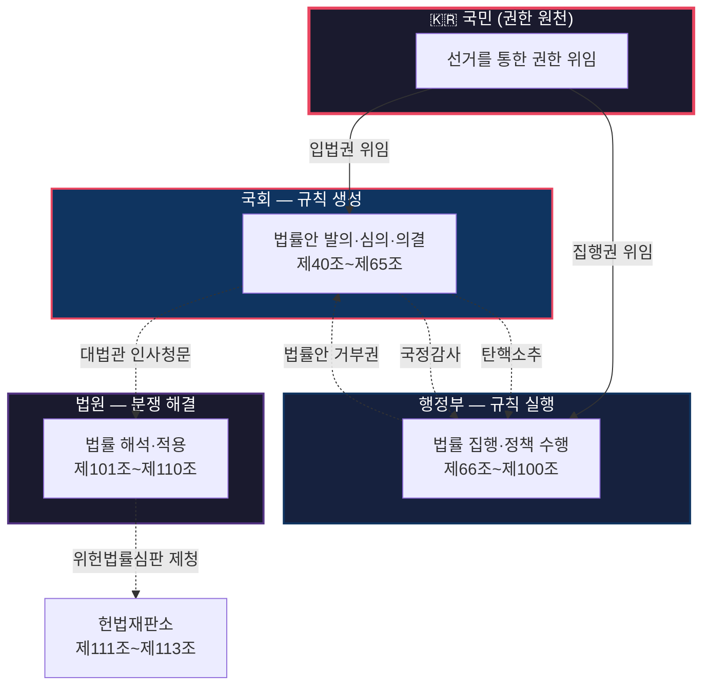
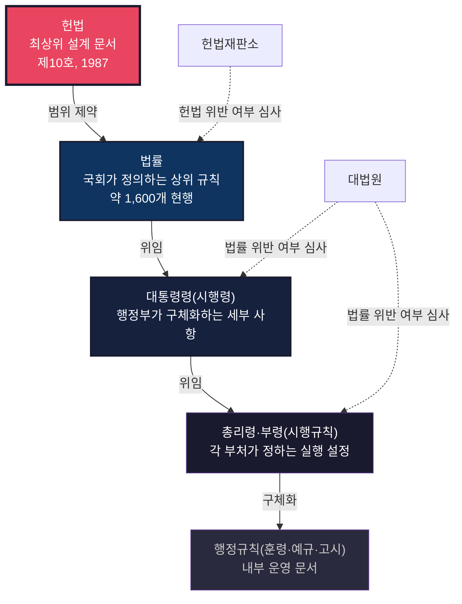
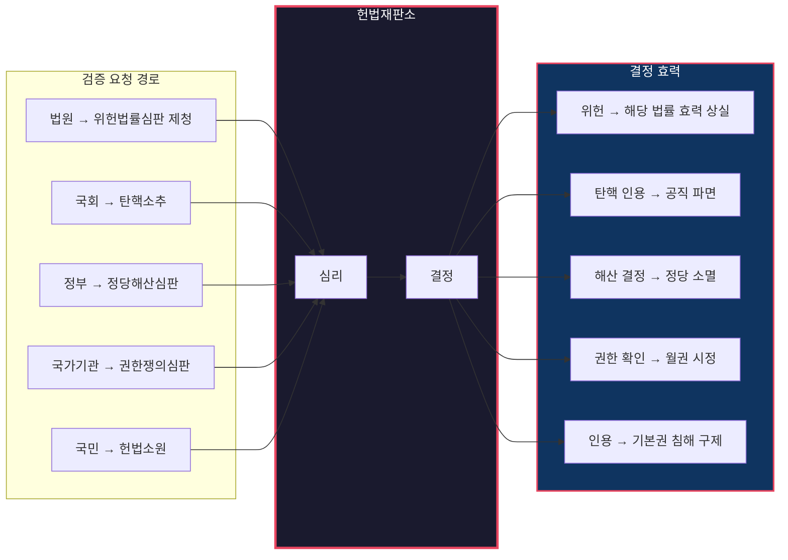
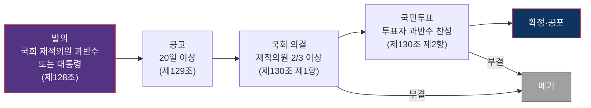

# 대한민국 헌법 — 국가 시스템의 설계 문서

> **한 줄 요약**: 대한민국 헌법은 "권력을 만들면서도 그 권력이 폭주하지 못하게 막는" 설계 문서다. 이 글은 헌법이 풀어야 했던 설계 문제들을 엔지니어의 눈으로 읽는다.

## 면책 조항 (Disclaimer)

> 이 글은 정치 제도를 소프트웨어 엔지니어링의 관점으로 분석한 것입니다.
> 비유는 이해를 돕기 위한 도구이며, 현실을 완벽하게 설명하지 않습니다.
> 정확한 정보는 반드시 공식 자료를 확인하세요.

---

## 이 글을 읽기 전에 — 핵심 개념 매핑

이 글은 헌법의 구조를 엔지니어의 언어로 분석합니다. 아래 6개 개념만 알면 글 전체가 읽힙니다.

| 개념 | 이 시스템에서의 의미 |
|------|---------------------|
| **주권** | 이 시스템의 모든 권한이 최종적으로 어디서 오는가 — 국민이다.[^1] |
| **권력분립** | 한 기관의 실패가 전체 장악으로 번지지 않게 하는 격리 설계.[^2] |
| **기본권** | 시스템이 어떤 이유로도 넘지 못하도록 박아 둔 경계.[^3] |
| **위헌심사** | 하위 규칙이 상위 설계 원칙에 어긋나는지 검증하는 절차.[^4] |
| **헌법개정** | 최상위 설계 문서를 수정하는 절차. 의도적으로 극도로 어렵게 만들어져 있다.[^5] |
| **계엄** | 비상시 정상 프로세스를 일시 우회하는 메커니즘. 남용 방지 장치가 함께 설계되어 있다.[^6] |

---

## 시스템 브리프 — 국가라는 시스템이 풀어야 하는 설계 과제

국가 시스템을 설계한다고 가정해보자. 가장 먼저 부딪히는 문제는 이것이다:

**"권력을 만들어야 하는데, 그 권력이 스스로를 무한 증식하지 못하게 막아야 한다."**

이것은 소프트웨어 시스템에서 "관리자 권한은 필요하지만, 관리자가 시스템 자체를 장악하면 안 된다"는 문제와 구조적으로 동일하다. 대한민국 헌법은 이 근본 문제를 풀기 위해 1948년에 처음 배포되었고, 9차례 재설계를 거쳐 1987년의 현행 버전에 이르렀다.[^7]

헌법이 풀어야 했던 설계 과제를 정리하면 다음과 같다:

1. **권력 생성과 격리** — 누가 권한을 갖고, 어떻게 한 곳에 집중되지 않게 하는가
2. **규칙의 계층 구조** — 수만 개의 세부 규칙이 서로 충돌하지 않게 하려면
3. **사용자 권리 보장** — 시스템이 아무리 효율적이어도 침범할 수 없는 영역
4. **규칙 검증** — 잘못된 규칙이 만들어졌을 때 어떻게 잡아내는가
5. **설계 변경 관리** — 최상위 설계 문서를 수정해야 할 때의 프로토콜
6. **비상 모드** — 정상 프로세스가 작동하지 않는 극단적 상황에서의 우회

이제 각 과제를 헌법이 어떻게 풀었는지 보자.

---

## §1. 권력의 생성과 격리 — Fault Isolation 설계

> **설계 문제**: 국가를 운영하려면 강한 권한이 필요하다. 그런데 그 권한이 한 곳에 집중되면 시스템 전체가 위험해진다. 어떻게 권한을 분산시키면서도 시스템이 작동하게 할 것인가?

### 권한의 원천

이 시스템에서 정당성은 위에서 내려오지 않는다. 아래에서 올라온다.

헌법 제1조 제2항은 "대한민국의 주권은 국민에게 있고, 모든 권력은 국민으로부터 나온다"고 선언한다.[^1] 이것은 단순한 이념 선언이 아니라 **시스템의 권한 원천을 정의하는 것**이다. 국회의원이 법을 만들 수 있는 이유, 대통령이 집행할 수 있는 이유, 법원이 판결할 수 있는 이유 — 모두 이 조항에서 권한이 위임된 것이다.

소프트웨어로 비유하면, 국민은 '사용자'가 아니다. **시스템이 합법적으로 동작할 수 있게 하는 유일한 권한 원천**이다. 이 원천이 무력화되면(예: 선거가 조작되면) 시스템 전체의 정당성이 무너진다.

### 삼권분립 — 왜 하나가 아닌 셋인가

헌법은 국가 권력을 세 개의 독립된 기관에 나눈다:

**이 설계의 핵심은 효율이 아니라 안전이다.** 하나의 기관이 규칙을 만들고, 실행하고, 심판까지 한다면 시스템은 매우 빠르게 돌아갈 것이다. 하지만 그 기관이 오작동하면 전체 시스템이 한꺼번에 무너진다.

삼권분립의 설계 의도는 소프트웨어의 Fault Isolation과 같다: **한 컴포넌트의 장애가 다른 컴포넌트로 전파되지 않도록** 격리하는 것. 국회가 잘못된 법을 만들면 헌법재판소가 무효화할 수 있고(제111조)[^4], 대통령이 중대한 위법을 저지르면 국회가 탄핵소추할 수 있다(제65조).[^8]

다만 이 격리는 완벽하지 않다. 여당이 국회와 행정부를 동시에 장악하면, 설계상의 분리가 실질적으로 약화될 수 있다. 이것은 "이 비유의 한계" 섹션에서 다룬다.

### 주기적 교체 — 영구 권한은 없다

권력 격리만으로는 부족하다. 헌법은 **시간 제한**도 걸어둔다. 대통령은 5년 단임(제70조)[^9], 국회의원은 4년 임기(제42조)[^10]. 이것은 시스템 설계에서 세션 타임아웃이나 키 로테이션과 비슷한 원리다 — 아무리 정당하게 부여된 권한이라도 무기한으로 유지되면 위험하므로, 주기적으로 갱신을 강제한다.

특히 대통령의 **단임제**(연임 불가)는 의미심장하다. 이것은 이전 버전들에서 대통령이 임기를 연장하려 헌법을 바꾼 경험(1952년 발췌개헌, 1969년 3선개헌, 1972년 유신헌법) 때문에 추가된 **방어적 설계**다.

---

## §2. 규칙의 계층 구조 — Layered Architecture

> **설계 문제**: 국가 운영에는 수만 개의 세부 규칙이 필요하다. 그런데 이 규칙들이 서로 충돌하면 시스템이 예측 불가능해진다. 어떻게 일관성을 유지할 것인가?

### 위임 체인

대한민국의 법률 체계는 엄격한 계층 구조로 되어 있다. 상위 계층이 하위 계층을 제약하고, 하위 계층은 상위 계층의 범위를 벗어날 수 없다.

이 구조가 소프트웨어의 Layered Architecture와 닮은 점은 **위임의 방향이 단방향**이라는 것이다. 헌법이 법률의 범위를 정하고, 법률이 시행령의 범위를 정한다. 역방향은 허용되지 않는다. 시행령이 법률의 범위를 넘으면 대법원이 무효화할 수 있고(제107조)[^11], 법률이 헌법의 범위를 넘으면 헌법재판소가 무효화할 수 있다(제111조).[^4]

### 왜 한 번에 다 정하지 않는가

헌법이 모든 세부 규칙까지 직접 정하지 않는 이유가 있다. 헌법 조문에 "법률이 정하는 바에 의하여"라는 문구가 자주 등장하는데, 이것이 바로 **위임 지점**이다. 헌법은 원칙만 정하고, 구체적 구현은 국회(법률)와 행정부(시행령)에 맡긴다.

소프트웨어에서 상위 모듈이 인터페이스만 정의하고 구현을 하위 모듈에 맡기는 것과 같은 원리다. 이렇게 하면 사회 변화에 따라 세부 규칙을 유연하게 바꿀 수 있다 — 헌법 전체를 고치지 않고도.

---

## §3. 사용자 권리 보장 — 침범 불가 경계

> **설계 문제**: 시스템이 효율적으로 동작하려면 강한 권한이 필요하다. 그런데 그 권한이 개인의 기본적 영역까지 침범하면 시스템의 존재 이유 자체가 무너진다. 어디에 선을 그을 것인가?

헌법 제10조에서 제39조까지는 국민의 기본권을 열거한다.[^3] 이 조항들은 국가에게 "이것만은 하지 마라"는 경계를 긋는다. 인간의 존엄(제10조), 평등(제11조), 신체의 자유(제12조), 거주이전의 자유(제14조), 표현의 자유(제21조), 재산권(제23조) 등이다.

엔지니어의 관점에서 중요한 것은 **이 경계가 성능 최적화보다 우선한다**는 점이다. 국가가 범죄를 더 효율적으로 수사하고 싶다고 해서 영장 없이 체포할 수는 없다(제12조 제3항). 경제를 더 빠르게 성장시키고 싶다고 해서 재산권을 마음대로 침해할 수 없다(제23조).

단, 기본권이 절대적인 것은 아니다. 제37조 제2항이 예외 규칙을 정의한다: "국가안전보장·질서유지 또는 공공복리를 위하여 필요한 경우에 한하여 법률로써 제한할 수 있으며, **제한하는 경우에도 자유와 권리의 본질적인 내용을 침해할 수 없다.**"[^12]

이 조항의 구조를 분해하면:
- **제한 사유**: 국가안전보장, 질서유지, 공공복리 (이 세 가지만 허용)
- **제한 방법**: 반드시 법률로 (행정부가 임의로 하면 안 됨)
- **제한의 한계**: 본질적 내용은 침해 불가 (어떤 이유로든 넘을 수 없는 하드 리밋)

소프트웨어로 비유하면, API에서 rate limiting을 걸 때도 최소 보장 처리량(minimum guaranteed throughput)이 있는 것과 비슷하다. 제한은 가능하되, 서비스 자체를 완전히 차단하는 것은 허용되지 않는다.

---

## §4. 규칙 검증 — 위헌심사

> **설계 문제**: 수천 개의 법률이 만들어지는데, 이 중 일부가 헌법에 어긋날 수 있다. 잘못된 규칙이 시스템에 남아 있으면 어떻게 잡아내는가?

### 헌법재판소 — 전용 검증 시스템

1987년 현행 헌법의 가장 중요한 설계 변경 중 하나가 **헌법재판소의 신설**이다(제111조).[^4] 이전 버전들에서는 법률의 위헌 여부를 판단하는 전용 기관이 없거나 유명무실했다. 규칙을 만드는 곳은 있었지만, 규칙이 올바른지 검증하는 곳이 제대로 작동하지 않았던 것이다.

헌법재판소가 처리하는 검증 유형은 다섯 가지다:

### 검증이 자동이 아니라는 점

소프트웨어의 타입 체크나 CI 파이프라인은 코드가 커밋되면 **자동으로** 실행된다. 하지만 위헌심사는 그렇지 않다. 누군가가 제청하거나 헌법소원을 제기해야만 작동한다. 이것은 이 시스템의 중요한 설계 특성이자 한계이다.

위헌 소지가 있는 법률이라도, 아무도 문제를 제기하지 않으면 수년간 효력을 유지할 수 있다. 소프트웨어로 비유하면, 테스트를 작성하지 않은 코드가 프로덕션에 배포되어 있는 상태와 비슷하다 — 버그가 있을 수 있지만, 누군가 해당 경로를 실행하기 전까지는 발견되지 않는다.

또한 헌법재판소가 제대로 작동하려면 재판관 9명이 정상적으로 구성되어야 한다(제111조 제2항). 재판관 공석이 발생하면 검증 시스템 자체가 약화된다 — 이것은 실제로 여러 차례 발생한 문제다.

---

## §5. 설계 변경 관리 — 헌법개정 절차

> **설계 문제**: 아무리 잘 설계된 시스템이라도 시대가 변하면 수정이 필요하다. 그런데 최상위 설계 문서를 너무 쉽게 바꿀 수 있으면 시스템 안정성이 흔들린다. 어떻게 "변경은 가능하되, 신중하게"를 보장할 것인가?

헌법은 자기 자신의 변경 절차를 스스로 규정한다(제128조~제130조).[^5] 이것은 소프트웨어에서 빌드 시스템이 자기 자신의 업그레이드 방법을 코드로 정의하고 있는 것과 같은 자기 참조 구조다.

**이 절차가 의도적으로 어려운 이유가 있다.** 일반 법률은 국회 재적의원 과반수 출석에 출석의원 과반수 찬성이면 통과한다. 반면 헌법개정은:

1. **발의 문턱**: 국회 재적의원 과반수 또는 대통령만 가능 (일반 법률은 의원 10인 이상이면 발의 가능)
2. **공고 기간**: 20일 이상 (사회적 검토를 위한 대기)
3. **의결 문턱**: 재적의원 2/3 이상 (일반 법률의 약 두 배)
4. **국민투표**: 투표자 과반수 찬성 (일반 법률에는 없는 단계)

왜 이렇게 높은 문턱을 설계했는가? 헌법은 모든 법률의 근거이기 때문이다. 약 1,600개의 현행 법률, 10,000개 이상의 행정규칙이 헌법에 직간접적으로 의존한다. 헌법이 바뀌면 이 모든 의존 관계에 영향이 전파될 수 있다. 소프트웨어에서 core 라이브러리의 breaking change가 downstream 전체에 파급되는 것과 같다 — 그래서 변경 비용을 의도적으로 높게 설정한 것이다.

흥미로운 점은, 이 높은 변경 비용 자체가 부작용을 낳는다는 것이다. 1987년 이후 약 38년간 단 한 번도 헌법이 개정되지 않았다. 시스템이 안정적이라서인지, 개정 비용이 너무 높아서 필요한 업데이트가 지연되고 있는 것인지는 해석의 문제다.

---

## §6. 비상 모드 — 계엄

> **설계 문제**: 정상적인 의사결정 프로세스는 시간이 걸린다. 전시나 극단적 위기 상황에서 이 느린 프로세스를 고집하면 시스템 자체가 붕괴할 수 있다. 정상 프로세스를 우회하는 비상 경로를 만들되, 그 경로가 남용되지 않게 하려면?

헌법 제77조는 계엄을 규정한다.[^6] 대통령은 "전시·사변 또는 이에 준하는 국가비상사태"에서 계엄을 선포할 수 있다. 비상계엄이 선포되면 영장 없는 체포, 언론·출판·집회 제한 등 평시에는 불가능한 조치가 가능해진다.

이것은 소프트웨어 시스템의 emergency override — 장애 발생 시 정상적인 접근 제어를 일시적으로 우회하는 메커니즘과 비슷하다. 하지만 물리적 강제력을 수반하는 국가 권력의 비상 모드는 소프트웨어의 그것과 질적으로 다르다. 이 점은 "한계" 섹션에서 구체적으로 다룬다.

**남용 방지 설계**: 헌법은 이 비상 경로가 남용되지 않도록 여러 장치를 내장했다.
- 국회가 재적의원 과반수 찬성으로 계엄 해제를 요구하면, 대통령은 **반드시** 해제해야 한다(제77조 제5항).
- 비상계엄 선포 시 국회에 통고해야 한다(제77조 제4항).
- 국회가 계엄 해제를 요구할 수 있으므로, 입법부가 행정부의 비상 권한에 대한 최종 제동 장치 역할을 한다.

이 설계에도 불구하고, 역사적으로 계엄은 여러 차례 남용되었다(1972년 유신, 1980년 5·17 등). 제도 설계와 실제 운용 사이에 괴리가 발생할 수 있다는 점에서, 이것은 이 시스템의 구조적 취약점이다.

---

## 변경 이력 — 이 시스템은 왜, 어떻게 재설계되어 왔는가

대한민국 헌법은 1948년 이후 9차례 개정되어 총 10개 버전이 있다. 단순한 연표가 아니라, **각 변경이 어떤 설계 압력에서 비롯되었고, 무엇을 얻었고, 어떤 새 리스크를 만들었는지**를 본다.

### 초기 배포와 불안정기 (1948–1960)

**1948 제헌헌법** — 최초 배포. 대통령제 + 단원제 국회. 새 국가 시스템의 첫 번째 프로덕션 릴리스였다.

**1952 발췌개헌** — 한국전쟁 중, 이승만 대통령이 간선제(국회 선출)를 직선제로 바꾸면서 양원제를 도입. 비정상적 상황(전시, 부산 임시수도)에서 통과된 변경이었다. *문제: 현직 대통령의 재선이 불확실 → 변경: 대통령 선출 경로를 교체 → 얻은 것: 현직의 정치적 생존 → 새 리스크: 비상 상황에서의 헌법 변경이라는 선례.*

**1954 사사오입 개헌** — 초대 대통령 중임 제한 철폐. 의결 정족수를 반올림 해석으로 통과시킨 논란의 변경. *임기 제한이라는 안전장치를 제거한 것이 핵심이다.*

**1960 제4호** — 4·19 혁명 이후, 대통령제에서 의원내각제로 전면 전환. 시스템 아키텍처 자체를 교체한 대규모 재설계. *문제: 대통령에게 권한이 과도하게 집중 → 변경: 실행 권한의 중심을 국회로 이동 → 새 리스크: 의회 내 분열 시 집행부 불안정.*

### 권위주의 시기 (1963–1980)

**1963 제6호** — 5·16 군사정변 이후, 의원내각제에서 대통령제로 다시 복귀. 이전의 아키텍처 변경을 롤백한 셈이다.

**1969 3선개헌** — 대통령 3선 연임 허용. 기존의 2선 제한이라는 제약 조건을 제거한 설정 변경.

**1972 유신헌법** — 대통령 권한 대폭 강화, 긴급조치권, 국회 해산권, 간접선거 도입. §1에서 설명한 "권력 격리" 설계를 근본적으로 무력화한 버전. *문제(명분): 국가 안보와 효율적 통치 → 변경: 견제 장치 대부분 비활성화 → 얻은 것: 중앙 집중적 의사결정 → 새 리스크: 견제 없는 권력, 인권 침해, 시스템 정당성 상실.*

**1980 제9호** — 유신 체제 붕괴 후 재구축. 대통령 7년 단임제 도입, 간접선거 유지. 이전 시스템의 실패(10·26, 12·12) 이후 재구축이었지만, 근본적 설계 문제(권력 격리 부족)는 완전히 해결되지 않았다.

### 현행 체제 (1987–현재)

**1987 현행헌법** — 6월 항쟁 이후의 대규모 재설계. 이 버전의 핵심 변경은 세 가지다:
1. **대통령 직선제 + 5년 단임** — 권한 위임 경로를 국민에게 직접 연결하고, 영구 집권 가능성을 원천 차단
2. **헌법재판소 신설** — §4에서 설명한 전용 검증 시스템의 최초 도입
3. **기본권 강화** — §3에서 설명한 침범 불가 경계를 더 명확하고 넓게 설정

*문제: 반복되는 권위주의(유신, 5공)와 인권 침해 → 변경: 권한 원천을 국민에게 직접 연결, 전용 검증 시스템 도입, 기본권 경계 강화 → 얻은 것: 38년간 유지되는 민주적 체제 → 새 리스크: 높은 개정 문턱으로 인한 업데이트 지연 가능성.*

---

## 국제 비교 — 같은 설계 문제, 다른 해법

같은 "국가의 최상위 설계 문서"라는 기능을 수행하지만, 나라마다 해법이 다르다.

| 국가 | 접근 방식 | 핵심 차이 |
|------|-----------|-----------|
| 🇺🇸 미국 | 원문 7조 + 수정조항 27개. 원문을 그대로 두고 수정조항을 덧붙이는 방식. | **append-only 로그**에 가깝다. 변경 이력이 문서 자체에 남는다. 한국은 전부개정(전체 교체) 방식이므로 이전 버전을 별도 기록에서만 추적할 수 있다. `git merge --no-ff` vs `git rebase --squash`의 차이와 유사. |
| 🇩🇪 독일 | 기본법(1949). 60회 이상 개정. 제79조 제3항 "영원 조항"으로 인간 존엄, 연방 구조 등 핵심 원리의 개정을 금지. | 특정 상수를 **immutable로 선언**한 구조. 나치 체제라는 파국적 시스템 실패에서 학습한 방어적 설계. 한국 헌법에는 이런 개정 금지 조항이 없다. |
| 🇬🇧 영국 | 단일한 성문 헌법 문서가 없음. 의회 제정법, 관습, 판례의 조합. | **단일 설정 파일이 아닌, convention 기반 설정**. 이론상 의회가 단순 다수결로 어떤 규칙이든 변경 가능. 유연하지만 명시적 보장이 약하다. |
| 🇯🇵 일본 | 1947년 이후 단 한 번도 개정되지 않음. 한국보다 더 긴 무패치 운영 기간. | 9조(전쟁 포기) 논쟁은 **코드 변경 없이 해석만으로 동작을 바꾸려는 시도** — 설계 의도와 런타임 해석의 괴리. |

---

## 이 비유의 한계 (Limits of the Analogy)

모든 비유에는 한계가 있다. 이 글이 사용한 엔지니어링 프레임이 유용한 곳과 깨지는 곳을 구체적으로 정리한다.

| 비유가 작동하는 곳 | 비유가 깨지는 곳 | 이유 |
|---|---|---|
| **계층 구조**: 헌법→법률→시행령의 위임 체인이 Layered Architecture의 계층 제약과 유사하다. | **해석의 다의성**: 소프트웨어 코드는 결정적으로 실행되지만, 헌법 조문은 해석이 필요하며 같은 조항에 대해 상반된 해석이 가능하다. | 자연어는 본질적으로 모호하다. "합리적 해석"이라는 개념 자체가 소프트웨어에는 존재하지 않는다. |
| **위헌심사**: 상위 스키마에 대한 하위 규칙의 적합성 검증이라는 구조가 유사하다. | **검증의 비자동성**: 소프트웨어의 CI는 자동 실행되지만, 위헌심사는 요청이 있어야만 작동한다. | 헌법재판소는 스스로 심사를 개시하지 않는다. 테스트가 없는 코드처럼, 제청되지 않은 위헌법률은 수년간 효력을 유지할 수 있다. |
| **Fault Isolation**: 삼권분립이 컴포넌트 간 장애 격리와 유사하다. | **비공식적 영향력**: 소프트웨어 모듈은 정의된 인터페이스로만 소통하지만, 국가기관은 여론, 정치적 압력, 비공식 채널로 상호 작용한다. | 현실의 권력 분립은 설계도상의 경계보다 훨씬 유동적이다. 여당이 국회와 행정부를 동시에 장악하면 설계상의 분리가 실질적으로 약화된다. |
| **변경 이력**: 헌법 개정을 버전 관리로 볼 수 있다. | **비가역성**: 소프트웨어는 롤백이 가능하지만, 헌법 변경은 실제 사회에 돌이킬 수 없는 결과를 낳는다. | 유신헌법 시기의 인권 침해는 이후 개정으로 "롤백"할 수 없다. 사회적 결과는 복원 불가능하다. |
| **비상 모드**: 계엄이 emergency override와 구조적으로 유사하다. | **물리적 강제력**: 소프트웨어의 관리자 모드는 로그가 남고 감사가 가능하지만, 계엄 상태에서는 감시 시스템 자체가 무력화될 수 있다. | 물리적 강제력이 수반되는 비상 모드는 소프트웨어의 그것과 질적으로 다르다. |
| **사용자 권리**: 기본권이 시스템의 경계 설정과 유사하다. | **실효적 보장**: API 계약은 기술적으로 강제되지만, 기본권 보장은 제도적·정치적 의지에 의존한다. | 헌법에 권리가 명시되어 있어도, 실제 보장에는 사법부 독립, 시민사회 감시, 정치적 의지가 필요하다. |

**종합**: 이 글의 엔지니어링 프레임은 헌법의 **구조적 특성** — 계층성, 위임 체인, 격리 설계, 검증 절차 — 을 이해하는 데 유용하다. 그러나 헌법의 **정치적·역사적·해석적 차원** — 권력 투쟁, 해석 논쟁, 물리적 강제력, 사회적 맥락 — 은 이 프레임으로 포착할 수 없다. 비유는 도구이지 결론이 아니다.

---

## 출처 (Sources)

### 1순위 — 법률 원문

- 대한민국 헌법 전문. 국가법령정보센터(법제처 공식). https://www.law.go.kr/LSW/lsInfoP.do?lsiSeq=61603

### 2순위 — 공식 문서

- 헌법재판소. 헌법재판소 소개. https://www.ccourt.go.kr
- 국회법률정보시스템. 입법과정. https://likms.assembly.go.kr

### 참고

- 대한민국 헌법 연혁(제1호~제10호). 국가법령정보센터 연혁법령 서비스.

---

## 각주

[^1]: 대한민국 헌법 제1조. "①대한민국은 민주공화국이다. ②대한민국의 주권은 국민에게 있고, 모든 권력은 국민으로부터 나온다." https://www.law.go.kr/LSW/lsInfoP.do?lsiSeq=61603
[^2]: 대한민국 헌법 제40조(입법권), 제66조 제4항(행정권), 제101조 제1항(사법권).
[^3]: 대한민국 헌법 제10조. "모든 국민은 인간으로서의 존엄과 가치를 가지며, 행복을 추구할 권리를 가진다." 제10조~제39조가 기본권 조항이다.
[^4]: 대한민국 헌법 제111조 제1항. 헌법재판소의 관장사항: 위헌법률심판, 탄핵심판, 정당해산심판, 권한쟁의심판, 헌법소원심판.
[^5]: 대한민국 헌법 제128조~제130조. 헌법개정 절차. 국회 재적의원 2/3 이상 찬성 + 국민투표 과반수 찬성 필요.
[^6]: 대한민국 헌법 제77조. 계엄의 선포, 종류, 효과, 해제.
[^7]: 대한민국 헌법 전문 및 부칙. 1948년 7월 17일 제헌, 1987년 10월 29일 전부개정(제10호).
[^8]: 대한민국 헌법 제65조. 탄핵소추: 국회 재적의원 1/3 이상 발의, 재적의원 과반수 찬성(대통령은 2/3 이상).
[^9]: 대한민국 헌법 제70조. "대통령의 임기는 5년으로 하며, 중임할 수 없다."
[^10]: 대한민국 헌법 제42조. "국회의원의 임기는 4년으로 한다."
[^11]: 대한민국 헌법 제107조. 명령·규칙의 위헌 또는 위법 여부가 재판의 전제가 된 경우 대법원이 최종 심사.
[^12]: 대한민국 헌법 제37조 제2항. "국민의 모든 자유와 권리는 국가안전보장·질서유지 또는 공공복리를 위하여 필요한 경우에 한하여 법률로써 제한할 수 있으며, 제한하는 경우에도 자유와 권리의 본질적인 내용을 침해할 수 없다."

---

## 관련 글 (See Also)

- [입법 과정 — Legislative Pipeline](../system/legislative-pipeline.md) *(예정)*
- [2016 탄핵 — Exception Flow in Action](../case/2016-impeachment.md) *(예정)*
- [2024 계엄 선포 — Emergency Override Abuse](../case/2024-martial-law.md) *(예정)*
- [법원 — Runtime Validation](../../law/system/court-as-validation-engine.md) *(예정)*

---

<!--
시스템 분석 체크리스트 (methodology.md):
- [x] 1순위 또는 2순위 출처가 최소 1개 인용되어 있는가
- [x] Terminology map이 포함되어 있는가 (6개 핵심 개념 매핑)
- [x] Source basis가 명시되어 있는가
- [x] Limits of the analogy가 구체적으로 작성되어 있는가
- [x] Disclaimer가 포함되어 있는가
- [x] Mermaid 다이어그램이 포함되어 있는가 (3개)
- [x] 사용된 모든 메타포가 glossary(core 또는 시리즈)에 등록되어 있는가
- [x] 규범적 판단과 시스템 기술이 명확히 분리되어 있는가
- [x] See also 링크가 관련 글을 정확히 가리키는가 (예정 표시)
- [ ] notable_cases에 관련 케이스가 등록되어 있는가 (아직 케이스 글이 없음)

glossary 등록 필요 후보:
<!-- glossary-candidate: Fault Isolation → 권력분립의 설계 원리 -->
<!-- glossary-candidate: Layered Architecture → 법률 계층 구조 -->
<!-- glossary-candidate: Emergency Override → 계엄 -->
-->
