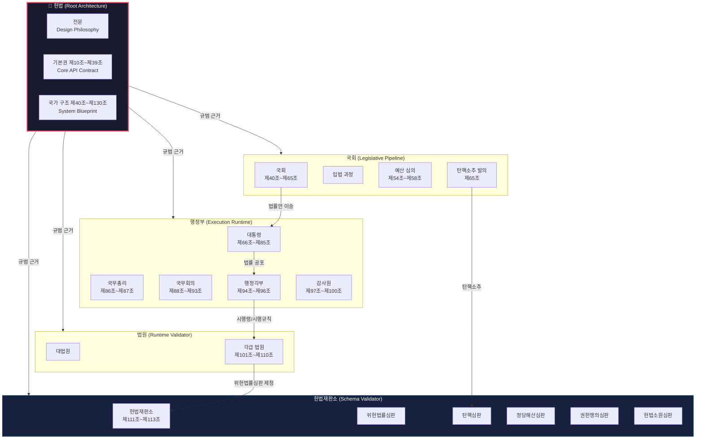
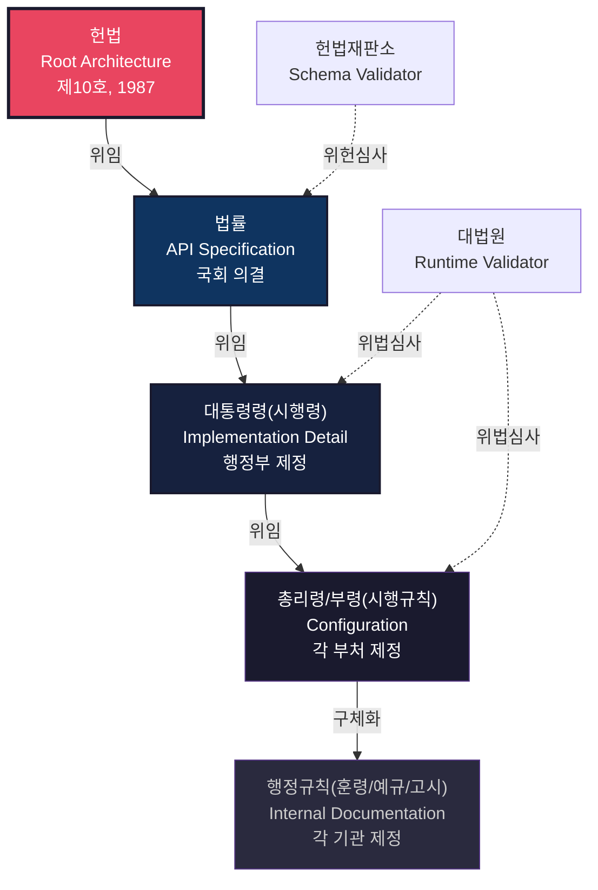
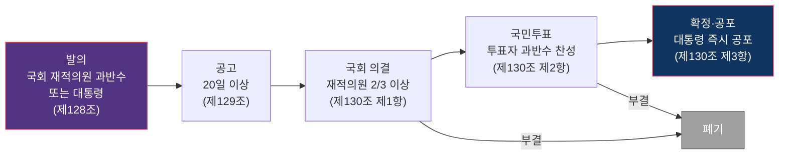

# 헌법 — 루트 아키텍처

> **한 줄 요약**: 대한민국 헌법은 국가라는 시스템의 Root Architecture — 다른 모든 법률, 기관, 절차가 의존하는 최상위 설계 문서이다.

## 면책 조항 (Disclaimer)

> 이 글은 정치 제도를 소프트웨어 엔지니어링의 메타포로 분석한 것입니다.
> 비유는 이해를 돕기 위한 도구이며, 현실을 완벽하게 설명하지 않습니다.
> 정확한 정보는 반드시 공식 자료를 확인하세요.

---

## 제도 개요 (System Overview)

대한민국 헌법은 1948년 7월 17일 제헌 이래 8차에 걸쳐 개정되어 현재 제10호(1987년 전부개정)가 시행되고 있습니다. 전문(前文), 본문 10장 130조, 부칙 6조로 구성되며, 대한민국의 모든 법률과 제도가 이 문서에 근거합니다. 헌법은 국민주권주의, 자유민주적 기본질서, 법치주의, 기본권 보장, 권력분립을 핵심 원리로 선언하고 있습니다.[^1]

소프트웨어 엔지니어의 관점에서 보면, 헌법은 **Root Architecture** — 시스템의 모든 하위 모듈이 의존하는 최상위 설계 문서입니다. 운영체제의 커널이 모든 프로세스의 실행 환경을 정의하듯, 헌법은 모든 법률의 유효성 조건을 정의합니다. 어떤 법률이든 헌법에 위배되면 무효가 되며, 이는 Schema Validation에 실패한 코드가 빌드를 통과할 수 없는 것과 구조적으로 동일합니다.

### 핵심 구성 요소

- **Actor**: 국민(sovereign — 주권자이자 최종 의사결정권자), 국회(legislative pipeline — 법률 생성 주체), 대통령과 행정부(execution runtime — 법률 집행 주체), 법원(validation engine — 법률 해석·적용 주체), 헌법재판소(schema validator — 위헌 여부 최종 판단 주체)
- **Input**: 헌법개정안(major version proposal — 제128조), 위헌법률심판 제청(validation request — 제111조), 탄핵소추(exception trigger — 제65조), 법률안(new module proposal — 제52조)
- **Process**: 입법 과정(legislative pipeline), 위헌심사(schema validation), 헌법개정절차(major version upgrade — 발의→공고→국회의결→국민투표), 탄핵심판(exception handling)
- **Output**: 법률의 합헌/위헌 판단, 국가기관 간 권한 배분, 기본권 보장의 구체적 내용, 국가 운영의 기본 틀
- **Constraint**: 헌법 전문의 가치 체계(design philosophy), 자유민주적 기본질서(immutable core principle), 경성헌법 구조(rigid version control — 국회 재적의원 2/3 이상 찬성 + 국민투표 과반 필요)[^2]

---

## 법적 근거 (Legal Basis)

헌법은 그 자체가 법적 근거의 최상위에 위치하므로, 이 섹션은 헌법이 스스로를 어떻게 정의하는지를 다룹니다. 이것은 소프트웨어에서 부트로더(bootloader)가 자기 자신을 메모리에 적재하는 **자기 참조 구조(self-referential structure)**와 유사합니다.

| 법령 | 조항 | 핵심 내용 |
|------|------|-----------|
| 대한민국 헌법 | 제1조 | "대한민국은 민주공화국이다." — 시스템의 기본 선언[^3] |
| 대한민국 헌법 | 제10조 | 인간의 존엄과 가치, 행복추구권 — Core API Contract의 첫 번째 엔드포인트[^4] |
| 대한민국 헌법 | 제111조 | 헌법재판소의 관장 사항 — Schema Validator의 기능 명세[^5] |
| 대한민국 헌법 | 제128조~제130조 | 헌법개정 절차 — Major Version Upgrade 프로토콜[^6] |
| 대한민국 헌법 | 전문 | 헌법의 이념과 역사적 정당성 — README / Design Philosophy[^7] |
| 대한민국 헌법 | 제37조 제2항 | 기본권 제한의 한계 — API Rate Limiting 규칙[^8] |
| 대한민국 헌법 | 제107조 | 위헌법률심사 및 명령·규칙 심사 — Validation 파이프라인[^9] |

헌법 제1조 제1항은 시스템의 가장 기본적인 선언입니다. "대한민국은 민주공화국이다."[^3] 소프트웨어로 비유하면, 이것은 시스템의 `type` 선언 — 이 국가가 어떤 종류의 시스템인지를 정의하는 첫 번째 줄입니다. 이 선언에 위배되는 모든 하위 규칙은 컴파일 타임에 거부됩니다.

특이한 점은 헌법이 자기 자신의 변경 절차까지 규정한다는 것입니다(제128조~제130조). 이는 마치 소프트웨어의 빌드 시스템이 자기 자신의 업그레이드 절차를 코드로 정의하고 있는 것과 같습니다. 헌법개정안은 국회 재적의원 과반수 또는 대통령의 발의로 제안되고(제128조 제1항), 20일 이상 공고 후(제129조), 국회 재적의원 2/3 이상의 찬성(제130조 제1항), 그리고 국민투표에서 투표자 과반수의 찬성을 얻어야 확정됩니다(제130조 제2항).[^6]

---

## 용어 매핑 (Terminology Map)

| 실제 제도 용어 | 엔지니어링 메타포 | 매핑 근거 |
|---------------|-------------------|-----------|
| 헌법 | Root Architecture | 다른 모든 규칙이 의존하는 최상위 설계 문서. 이 문서가 변경되면 전체 시스템에 영향이 전파된다. |
| 헌법 전문 | README / Design Philosophy | 시스템이 왜 존재하는지, 어떤 가치를 추구하는지를 선언하는 문서. 코드를 직접 실행하지는 않지만 모든 설계 판단의 기준이 된다. |
| 법률 체계 (헌법→법률→시행령→규칙) | Layered Architecture | 상위 계층이 하위 계층을 제약하는 엄격한 계층 구조. 하위 규칙은 상위 규칙의 범위를 벗어날 수 없다. |
| 법률 | API Specification | 국회가 정의하는 상위 수준의 규칙. 구체적인 구현(시행령)은 행정부에 위임된다. |
| 시행령 | Implementation Detail | 법률이 정한 틀 안에서 행정부가 구체화하는 세부 사항. 법률(API Specification)의 구현체에 해당한다. |
| 위헌 심사 | Schema Validation | 하위 규칙(법률)이 상위 스키마(헌법)에 부합하는지 검증하는 절차. 검증 실패 시 해당 규칙은 무효 처리된다. |
| 헌법재판소 | Validation Engine | 위헌 여부를 최종 판단하는 전용 검증 시스템. 법원의 제청 또는 헌법소원을 통해 작동한다.[^5] |
| 법원 | Runtime Validation Engine | 개별 사건에서 법률을 해석하고 적용하는 실행 시점 검증 시스템. |
| 국회 | Legislative Pipeline | 법안(입력)이 위원회 심사, 본회의 의결 등 여러 단계를 거쳐 법률(출력)이 되는 처리 흐름.[^10] |
| 국회의원 | Process Handler | 입법 파이프라인에서 법안을 처리하는 실행 주체. |
| 대통령 / 행정부 | Execution Runtime | 법률을 집행하는 실행 환경. 법률이라는 명령어를 실제로 수행한다. |
| 삼권분립 | Separation of Concerns | 입법·행정·사법의 책임을 분리하여 결합도를 낮추고, 각 컴포넌트가 독립적으로 동작하도록 하는 설계 원칙. |
| 기본권 (제10조~제39조) | Core API Contract | 시스템이 모든 사용자(국민)에게 보장하는 불가침의 인터페이스. 이 계약은 어떤 하위 모듈도 위반할 수 없다.[^4] |
| 탄핵 | Exception Flow | 정상적인 임기 만료가 아닌, 비상 경로를 통해 공직자를 파면하는 절차. 정상 흐름(normal flow)이 아닌 예외 흐름(exception flow)에 해당한다.[^11] |
| 선거 | Leadership Rotation | 주기적으로 실행 주체(대통령, 국회의원)를 교체하는 메커니즘. 대통령 5년 단임, 국회의원 4년 임기.[^12] |
| 위임 입법 | Dependency Injection | 상위 시스템(법률)이 구체적 구현을 하위 시스템(시행령)에 위임하는 구조. "법률이 정하는 바에 의하여"라는 문구가 의존성 주입 지점이다. |
| 헌법개정 | Major Version Upgrade | 호환성 파괴(breaking change)가 가능한 최상위 버전 변경. 일반 법률 개정(minor patch)과 달리, 국민투표라는 추가 검증 단계가 필요하다.[^6] |
| 국정감사 | System Audit | 국회가 행정부의 운영 상태를 정기적으로 감사하는 프로세스.[^13] |
| 감사원 | Internal Audit Module | 세입·세출 결산 검사와 공무원 직무 감찰을 수행하는 대통령 소속 모듈.[^14] |
| 계엄 | Emergency Override | 비상 상태에서 정상적인 접근 제어와 프로세스를 일시적으로 우회하는 메커니즘. 엄격한 조건과 해제 절차가 정의되어 있다.[^15] |
| 헌법소원 | User-Initiated Validation Request | 일반 사용자(국민)가 직접 Schema Validation을 요청하는 경로. |
| 법개정 | Changelog | 법의 변경 이력과 버전 관리. |

---

## 구조 분석 (Architecture Analysis)

### 다이어그램 1: 전체 구조 — 헌법 기반 국가 아키텍처

### 다이어그램 2: 법률 계층 구조 — Layered Architecture

### 다이어그램 3: 헌법개정 절차 — Major Version Upgrade Protocol

### 의존성 (Dependencies)

**이 시스템에 의존하는 것들 (Dependents):**

대한민국의 모든 법률, 기관, 절차는 헌법에 의존합니다. 이것은 단순한 비유가 아니라 법적 사실입니다. 헌법에 위배되는 법률은 헌법재판소의 위헌 결정으로 효력을 상실하며(제111조 제1항 제1호), 헌법에 근거하지 않는 국가기관은 존재할 수 없습니다.

구체적으로:

- **약 1,600개의 현행 법률**: 모두 헌법의 범위 내에서만 유효합니다. 법률이 헌법에 위반되면 헌법재판소가 위헌 결정을 내립니다.
- **10,000개 이상의 행정규칙**: 법률→시행령→시행규칙→행정규칙의 위임 체인을 통해 간접적으로 헌법에 의존합니다.
- **모든 국가기관**: 국회(제40조), 대통령(제66조), 법원(제101조), 헌법재판소(제111조), 감사원(제97조), 선거관리위원회(제114조) 등 모든 헌법기관은 헌법 조항에 근거하여 존재합니다.
- **지방자치단체**: 제117조~제118조에 근거합니다.

**이 시스템이 의존하는 것들 (Dependencies):**

- **국민주권**: 헌법 제1조 제2항 "대한민국의 주권은 국민에게 있고, 모든 권력은 국민으로부터 나온다."[^3] 헌법의 정당성은 국민의 동의에서 나옵니다. 이것은 소프트웨어에서 하드웨어에 해당하는 물리적 기반입니다 — 아무리 완벽한 코드도 하드웨어 없이는 실행될 수 없습니다.
- **헌법개정 절차 (제128조~제130조)**: 헌법은 자기 자신의 변경을 위해 자기 자신이 규정한 절차에 의존합니다. 이 절차가 무력화되면 헌법 자체가 정상적으로 작동할 수 없습니다.
- **헌법재판소의 실효적 작동**: Schema Validation이 실제로 작동하려면 검증 엔진이 독립적이고 기능적이어야 합니다.

### 장애 모드 (Failure Modes)

헌법이라는 Root Architecture에도 예측 가능한 장애 지점이 존재합니다. 역사적으로 이 장애들은 실제로 발생한 바 있습니다.

| 장애 모드 | 엔지니어링 메타포 | 설명 | 헌법 조항 |
|-----------|-------------------|------|-----------|
| 위헌법률 방치 | Technical Debt Accumulation | 위헌 소지가 있는 법률이 심판 제청 없이 장기간 존속하는 상태. Schema Validation이 트리거되지 않으면 부적합한 코드가 프로덕션에 남는다. | 제107조, 제111조 |
| 헌법재판소 기능 마비 | Validation Engine Down | 재판관 공석, 정치적 압력 등으로 헌법재판소가 정상 작동하지 못하는 상태. 검증 시스템이 다운되면 부적합한 코드를 걸러낼 수 없다. | 제111조~제113조 |
| 계엄 선포를 통한 권한 집중 | Emergency Override Abuse | 제77조의 계엄 선포가 비상사태가 아닌 상황에서 발동되는 경우. 디버그 모드나 관리자 권한이 남용되는 것과 유사하다. | 제77조 |
| 헌법개정 절차 악용 | Root Exploit | 개정 절차를 통해 헌법의 핵심 원리(민주공화국, 기본권)를 훼손하려는 시도. Root 권한으로 시스템의 보안 정책 자체를 무력화하는 것과 같다. | 제128조~제130조 |
| 삼권분립 형해화 | Separation of Concerns Violation | 한 기관이 다른 기관의 권한을 사실상 장악하여 분리된 설계가 무의미해지는 상태. 모듈 간 경계가 무너져 tightly coupled monolith가 되는 것과 같다. | 제40조, 제66조, 제101조 |
| 기본권 과잉 제한 | API Contract Violation | 제37조 제2항의 "필요한 경우에 한하여"라는 조건을 넘어서는 기본권 제한. API 계약에 명시된 응답을 반환하지 않는 것과 같다. | 제37조 제2항 |
| 헌법 규범과 현실의 괴리 | Specification Drift | 헌법이 규정하는 바와 실제 운영이 점진적으로 괴리되는 현상. API 문서와 실제 구현이 불일치하는 상태. | 전반 |

---

## 제도 연혁 (Version History)

대한민국 헌법은 1948년 제헌 이래 9차례 개정되어 총 10개 버전이 존재합니다. 소프트웨어의 버전 히스토리처럼, 각 버전은 당시의 요구사항과 환경에 따라 시스템의 구조를 변경했습니다.

| 시점 | 변경 내용 | 엔지니어링 메타포 |
|------|-----------|-------------------|
| 1948. 7. 17 | **제헌헌법 (제1호)** — 대통령제 + 국회 단원제. 대한민국 정부 수립과 함께 최초의 헌법 제정. | **v1.0 — Initial Release.** 새로운 시스템의 첫 번째 프로덕션 배포. |
| 1952. 7. 7 | **발췌개헌 (제2호)** — 대통령 직선제 + 양원제 도입. 한국전쟁 중 부산 임시수도에서 통과. | **v1.1 — Hotfix under duress.** 비정상적 런타임 환경(전시)에서 급하게 적용된 패치. |
| 1954. 11. 29 | **사사오입 개헌 (제3호)** — 초대 대통령 중임 제한 철폐. 의결 정족수 논란(반올림 해석). | **v1.2 — Controversial patch.** 반올림 로직 해석을 통해 통과된 논란의 변경. |
| 1960. 6. 15 | **제4호** — 의원내각제로 전환. 4·19 혁명 이후 대통령제에서 내각제로 시스템 아키텍처 변경. | **v2.0 — Architecture change.** 실행 구조(대통령제→내각제)의 근본적 변경. Breaking change. |
| 1960. 11. 29 | **제5호** — 부정선거 관련자 처벌 등 소급입법 허용 조항 추가. | **v2.1 — Cleanup patch.** 이전 시스템 운영 중 발생한 문제에 대한 후속 조치. |
| 1963. 12. 17 | **제6호** — 대통령제 복귀, 단원제 국회. 5·16 이후 새 체제. | **v3.0 — Architecture rollback.** 이전 아키텍처(대통령제)로의 회귀. |
| 1969. 10. 21 | **3선 개헌 (제7호)** — 대통령 3선 연임 허용. | **v3.1 — Term limit override.** 기존 제약 조건(2선 제한)을 제거하는 설정 변경. |
| 1972. 12. 27 | **유신헌법 (제8호)** — 대통령 권한 대폭 강화, 긴급조치권, 국회 해산권, 간접선거. | **v4.0 — Authoritarian rewrite.** 접근 제어와 권한 분리를 근본적으로 변경한 대규모 재작성. |
| 1980. 10. 27 | **제9호** — 대통령 7년 단임제, 간접선거 유지. | **v5.0 — Post-failure rebuild.** 이전 시스템 장애(시스템 붕괴) 이후의 재구축. |
| 1987. 10. 29 | **현행헌법 (제10호)** — 대통령 5년 단임 직선제, 헌법재판소 신설, 기본권 강화. 6월 항쟁 이후 민주화. | **v6.0 — Democratic restoration.** 사용자(국민) 요구에 의한 대규모 리팩터링. Schema Validator(헌법재판소) 신규 도입. |

특기할 사항은 v6.0(1987년 현행헌법) 이후 약 38년간 단 한 번의 패치도 이루어지지 않았다는 점입니다. 이것은 시스템의 안정성을 의미할 수도 있고, 개정 비용이 너무 높아(국회 2/3 + 국민투표) 필요한 업데이트가 지연되고 있음을 의미할 수도 있습니다.

---

## 국제 비교 (International Comparison)

같은 기능(Root Architecture)을 수행하는 다른 국가의 시스템과 비교합니다.

| 국가 | 제도 | 차이점 |
|------|------|--------|
| 🇺🇸 미국 | 합중국 헌법 (1787) | 세계에서 가장 오래 운영 중인 성문 헌법. 원문 7조 + 수정조항 27개로 구성. 한국의 "전부개정"과 달리, 원문을 그대로 두고 수정조항(Amendment)을 추가하는 방식 — **append-only changelog**에 가깝다. |
| 🇩🇪 독일 | 기본법 (Grundgesetz, 1949) | 나치 체제라는 **catastrophic system failure** 이후 재설계된 헌법. 제79조 제3항의 "영원 조항(Ewigkeitsklausel)"으로 인간 존엄, 연방 구조 등 핵심 원리의 개정을 금지 — 특정 상수(constant)를 **immutable**로 선언한 구조. 60회 이상 개정되어 변경에 적극적. |
| 🇬🇧 영국 | 불문헌법 (Unwritten Constitution) | 단일한 성문 헌법 문서가 존재하지 않음. 의회 제정법, 관습, 판례, 헌법적 관례(convention)의 조합으로 운영 — **단일 config 파일이 아닌, convention-based configuration**에 해당. 의회주권 원칙에 따라 이론상 어떤 법률이든 단순 다수결로 변경 가능. |
| 🇯🇵 일본 | 일본국 헌법 (1947) | 1947년 시행 이후 단 한 번도 개정되지 않은 헌법. 한국 현행헌법(1987)보다 더 긴 **무패치 운영 기간**을 가진다. 9조(전쟁 포기)를 둘러싼 해석 논쟁은 코드 변경 없이 런타임 해석만으로 동작을 변경하려는 시도에 해당한다. |

미국식 append-only 방식과 한국식 전부개정 방식의 차이는 흥미롭습니다. 미국 헌법은 원문을 변경하지 않고 수정조항을 덧붙이므로 변경 이력이 문서 자체에 남습니다. 반면 한국 헌법의 전부개정은 이전 버전을 완전히 새 버전으로 교체하므로, 변경 이력은 별도의 기록(관보, 헌법 연혁)에서만 추적할 수 있습니다. 이것은 `git rebase --squash`와 `git merge --no-ff`의 차이와 유사합니다.

---

## 이 비유의 한계 (Limits of the Analogy)

모든 메타포에는 한계가 있습니다. 헌법을 Root Architecture로 보는 시각이 유용하지만, 현실을 완벽하게 설명하지는 않습니다.

| 메타포가 작동하는 부분 | 메타포가 깨지는 부분 | 이유 |
|----------------------|---------------------|------|
| 계층 구조: 헌법→법률→시행령의 위계가 소프트웨어의 레이어 구조와 유사하다. | **해석의 다의성**: 소프트웨어 코드는 (대부분) 결정적(deterministic)으로 실행되지만, 헌법 조문은 해석이 필요하며 같은 조항에 대해 상반된 해석이 가능하다. | 자연어는 프로그래밍 언어와 달리 본질적으로 모호하며, 헌법 해석은 시대와 맥락에 따라 변화한다. "합리적 해석"이라는 개념 자체가 소프트웨어에는 존재하지 않는다. |
| Schema Validation: 위헌심사가 스키마 검증과 구조적으로 유사하다. | **검증의 비자동성**: 소프트웨어의 타입 체크는 자동으로 실행되지만, 위헌심사는 누군가가 제청하거나 헌법소원을 제기해야만 작동한다. | 헌법재판소는 스스로 위헌 여부를 판단하지 않는다. 요청이 없으면 위헌법률이 수년간 효력을 유지할 수 있다. Compiler는 모든 코드를 검사하지만, 헌법재판소는 제청된 것만 심사한다. |
| Version History: 헌법 개정을 버전 관리로 볼 수 있다. | **비가역성**: 소프트웨어는 롤백이 가능하지만, 헌법 변경은 실제 사회에 돌이킬 수 없는 결과를 낳는다. | 유신헌법(v4.0) 시기의 인권 침해는 이후 헌법 개정으로 "롤백"할 수 없다. 코드 롤백은 이전 상태를 복원하지만, 사회적 결과는 복원 불가능하다. |
| Separation of Concerns: 삼권분립이 관심사 분리와 유사하다. | **정치적 역학**: 소프트웨어 모듈은 정의된 인터페이스를 통해서만 소통하지만, 국가기관은 비공식적 영향력, 여론, 정치적 압력을 통해 상호 작용한다. | 현실의 권력 분립은 설계도상의 경계보다 훨씬 유동적이다. 여당이 국회와 행정부를 동시에 장악하면, 설계상의 분리가 실질적으로 무의미해질 수 있다. |
| Core API Contract: 기본권이 시스템 계약처럼 보장된다. | **실효적 보장의 문제**: API 계약은 기술적으로 강제되지만, 기본권의 보장은 제도적·정치적 의지에 의존한다. | 헌법에 기본권이 명시되어 있어도, 실제로 그 권리가 보장되려면 사법부의 독립, 시민사회의 감시, 정치적 의지가 필요하다. 코드의 타입 안전성과 달리, 헌법의 기본권 보장에는 "런타임 에러"가 빈번하다. |
| Emergency Override: 계엄이 비상 모드와 유사하다. | **남용 가능성의 차원 차이**: 소프트웨어의 관리자 모드는 로그가 남고 감사 추적이 가능하지만, 계엄 상태에서는 감시 시스템 자체가 무력화될 수 있다. | 물리적 강제력이 수반되는 국가 권력의 비상 모드는 소프트웨어의 그것과 질적으로 다르다. |

**종합**: Root Architecture 메타포는 헌법의 **구조적 특성**(계층성, 최상위 규범성, 다른 규범의 유효성 조건)을 이해하는 데 유용합니다. 그러나 헌법의 **정치적·역사적·해석적 차원** — 즉 권력 투쟁, 해석 논쟁, 사회적 맥락 — 은 이 메타포로 포착할 수 없습니다. 비유는 도구이지 결론이 아닙니다.

---

## 출처 (Sources)

### 1순위 — 법률 원문

- 대한민국 헌법 전문. 국가법령정보센터(법제처 공식). https://www.law.go.kr/LSW/lsInfoP.do?lsiSeq=61603

### 2순위 — 공식 문서

- 헌법재판소. 헌법재판소 소개. https://www.ccourt.go.kr
- 국회법률정보시스템. 입법과정. https://likms.assembly.go.kr

### 참고

- 대한민국 헌법 연혁(제1호~제10호). 국가법령정보센터 연혁법령 서비스.

---

## 각주

[^1]: 대한민국 헌법 전문 및 제1조~제9조(총강). https://www.law.go.kr/LSW/lsInfoP.do?lsiSeq=61603
[^2]: 대한민국 헌법 제130조. 헌법개정안은 국회 재적의원 2/3 이상의 찬성과 국민투표 과반수의 찬성이 필요하다.
[^3]: 대한민국 헌법 제1조. "①대한민국은 민주공화국이다. ②대한민국의 주권은 국민에게 있고, 모든 권력은 국민으로부터 나온다."
[^4]: 대한민국 헌법 제10조. "모든 국민은 인간으로서의 존엄과 가치를 가지며, 행복을 추구할 권리를 가진다."
[^5]: 대한민국 헌법 제111조 제1항. 헌법재판소의 관장사항: 위헌법률심판, 탄핵심판, 정당해산심판, 권한쟁의심판, 헌법소원심판.
[^6]: 대한민국 헌법 제128조~제130조. 헌법개정 절차.
[^7]: 대한민국 헌법 전문. "유구한 역사와 전통에 빛나는 우리 대한국민은 3·1운동으로 건립된 대한민국임시정부의 법통과 불의에 항거한 4·19민주이념을 계승하고..."
[^8]: 대한민국 헌법 제37조 제2항. "국민의 모든 자유와 권리는 국가안전보장·질서유지 또는 공공복리를 위하여 필요한 경우에 한하여 법률로써 제한할 수 있으며, 제한하는 경우에도 자유와 권리의 본질적인 내용을 침해할 수 없다."
[^9]: 대한민국 헌법 제107조. 위헌법률심판 제청 및 명령·규칙의 위법 심사.
[^10]: 대한민국 헌법 제52조~제53조. 법률안의 제출과 의결·공포 절차.
[^11]: 대한민국 헌법 제65조. 탄핵소추 절차.
[^12]: 대한민국 헌법 제70조(대통령 임기 5년), 제42조(국회의원 임기 4년).
[^13]: 대한민국 헌법 제61조. 국정감사 및 국정조사.
[^14]: 대한민국 헌법 제97조~제100조. 감사원의 설치, 구성, 직무.
[^15]: 대한민국 헌법 제77조. 계엄 선포의 요건, 종류, 효과, 해제.

---

## 관련 글 (See Also)

- [입법 과정 — Legislative Pipeline](../system/legislative-pipeline.md) *(예정)*
- [2016 탄핵 — Exception Flow in Action](../case/2016-impeachment.md) *(예정)*
- [2024 계엄 선포 — Emergency Override Abuse](../case/2024-martial-law.md) *(예정)*
- [법원 — Validation Engine](../../law/system/court-as-validation-engine.md) *(예정)*

---

<!-- 
시스템 분석 체크리스트 (methodology.md):
- [x] 1순위 또는 2순위 출처가 최소 1개 인용되어 있는가
- [x] Terminology map이 포함되어 있는가
- [x] Source basis가 명시되어 있는가
- [x] Limits of the analogy가 구체적으로 작성되어 있는가
- [x] Disclaimer가 포함되어 있는가
- [x] Mermaid 다이어그램이 포함되어 있는가 (3개)
- [x] 사용된 모든 메타포가 glossary(core 또는 시리즈)에 등록되어 있는가
- [x] 규범적 판단과 시스템 기술이 명확히 분리되어 있는가
- [x] See also 링크가 관련 글을 정확히 가리키는가 (예정 표시)
- [ ] notable_cases에 관련 케이스가 등록되어 있는가 (아직 케이스 글이 없음)

glossary 등록 필요 후보:
<!-- glossary-candidate: 헌법 전문 → README / Design Philosophy -->
<!-- glossary-candidate: 기본권 → Core API Contract -->
<!-- glossary-candidate: 삼권분립 → Separation of Concerns -->
<!-- glossary-candidate: 헌법개정 → Major Version Upgrade -->
<!-- glossary-candidate: 계엄 → Emergency Override -->
<!-- glossary-candidate: 헌법소원 → User-Initiated Validation Request -->
-->
