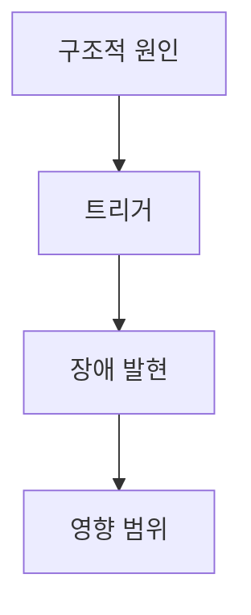

---
# 케이스 분석 템플릿 — Base Case Template
# 이 템플릿을 복사하여 사용하세요.
# 시리즈에 따라 public-addon.md 또는 corporate-addon.md의 추가 섹션을 포함하세요.
---

```yaml
# === Frontmatter ===
article_type: case
id: YYYY-event-slug | descriptive-slug   # 급성: YYYY-slug, 다년: YYYY-YYYY-slug, 만성: descriptive-slug
title_ko: "한국어 제목"
title_en: "English Title"
series: korea-systems | corporate-functions
domain: politics | law | economy | society | pm | legal | finance | hr | sales | marketing | operations | design
primary_system: system-article-id        # 연결된 시스템 분석 글 id
affected_systems: []                     # 영향받은 다른 시스템 id 목록
severity: critical | high | medium | low
tempo: acute | chronic
impact_scope: component | system | cross-system
failure_pattern: []                      # cascading-failure, resource-exhaustion, privilege-escalation, exception-flow, dependency-conflict, coordination-failure, feedback-loop, alert-fatigue, design-gap, scaling-failure, migration-failure
status: draft                            # draft → review → active → outdated → archived
last_reviewed: YYYY-MM-DD
related: []                              # 관련 글 id 목록
sources: []                              # 주요 출처 URL
```

# {title_ko}

> **한 줄 요약**: 이 케이스를 엔지니어링 메타포 한 문장으로 요약

## 면책 조항 (Disclaimer)

> 이 글은 {사건/현상}을 소프트웨어 엔지니어링의 메타포로 분석한 것입니다.
> 비유는 이해를 돕기 위한 도구이며, 현실을 완벽하게 설명하지 않습니다.
> 정확한 정보는 반드시 공식 자료를 확인하세요.

## 시스템 컨텍스트 (System Context)

이 케이스가 발생한 시스템의 구조를 간략히 요약합니다. 자세한 내용은 연결된 시스템 분석 글을 참고하세요.

- **연결된 시스템 글**: [{시스템 글 제목}](링크)
- **관련 시스템**: 

## 타임라인 (Timeline)

공식 자료 기반으로 시간순 사실 관계를 정리합니다.

| 시점 | 사건 | 출처 |
|------|------|------|
| | | |

## 트리거 vs 구조적 원인 (Trigger vs Root Cause)

### 직접적 트리거

사건의 직접적 계기를 기술합니다.

### 구조적 원인

시스템 설계에서 비롯된 근본적 원인을 기술합니다.



## 대응과 결과 (Response & Resolution)

### 누가 대응했는가

### 어떻게 대응했는가

### 결과는 무엇이었는가

## 시스템 변화 (What Changed After)

케이스 이후 제도/법률/정책이 어떻게 바뀌었는지를 기술합니다.

| 변화 | 엔지니어링 메타포 | 설명 |
|------|-------------------|------|
| | | |

## 이 비유의 한계 (Limits of the Analogy)

메타포가 성립하지 않는 지점을 **구체적으로** 기술합니다.

| 메타포가 작동하는 부분 | 메타포가 깨지는 부분 | 이유 |
|----------------------|---------------------|------|
| | | |

## 출처 (Sources)

### 1순위 — 법률/원문
- 

### 2순위 — 공식 문서/통계
- 

### 참고
- 

## 관련 글 (See Also)

- [연결된 시스템 글](링크)
- [관련 케이스](링크)

---

<!-- 시리즈별 추가 섹션은 public-addon.md 또는 corporate-addon.md를 참고하세요 -->
