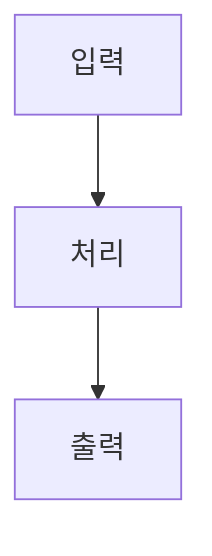

---
# 시스템 분석 템플릿 — Base System Template
# 이 템플릿을 복사하여 사용하세요.
# 시리즈에 따라 public-addon.md 또는 corporate-addon.md의 추가 섹션을 포함하세요.
---

```yaml
# === Frontmatter ===
article_type: system
id: slug-name                          # 영어, 소문자, 하이픈
title_ko: "한국어 제목"
title_en: "English Title"
series: korea-systems | corporate-functions
domain: politics | law | economy | society | pm | legal | finance | hr | sales | marketing | operations | design
status: draft                          # draft → review → active → outdated → archived
last_reviewed: YYYY-MM-DD
related: []                            # 관련 글 id 목록
sources: []                            # 주요 출처 URL
notable_cases: []                      # 연결된 케이스 id 목록
```

# {title_ko}

> **한 줄 요약**: 이 제도/시스템을 엔지니어링 메타포 한 문장으로 요약

## 면책 조항 (Disclaimer)

> 이 글은 {도메인} 제도를 소프트웨어 엔지니어링의 메타포로 분석한 것입니다.
> 비유는 이해를 돕기 위한 도구이며, 현실을 완벽하게 설명하지 않습니다.
> 정확한 정보는 반드시 공식 자료를 확인하세요.

## 제도 개요 (System Overview)

제도가 무엇인지, 왜 존재하는지, 어떤 맥락에서 만들어졌는지를 공식 자료 기반으로 설명합니다.

### 핵심 구성 요소

- **Actor**: 이 시스템에 참여하는 주체
- **Input**: 시스템에 들어오는 것
- **Process**: 처리 과정
- **Output**: 시스템이 생산하는 결과
- **Constraint**: 시스템을 제약하는 규칙/조건

## 용어 매핑 (Terminology Map)

| 실제 제도 용어 | 엔지니어링 메타포 | 매핑 근거 |
|---------------|-------------------|-----------|
| | | |
| | | |
| | | |

## 구조 분석 (Architecture Analysis)

엔지니어링 프레임으로 제도의 구조를 분석합니다.

### 다이어그램



### 의존성 (Dependencies)

이 시스템이 의존하는 다른 시스템, 또는 이 시스템에 의존하는 시스템을 기술합니다.

### 장애 모드 (Failure Modes)

이 설계에서 예측 가능한 장애 지점을 기술합니다.

## 이 비유의 한계 (Limits of the Analogy)

메타포가 성립하지 않는 지점을 **구체적으로** 기술합니다.

| 메타포가 작동하는 부분 | 메타포가 깨지는 부분 | 이유 |
|----------------------|---------------------|------|
| | | |

## 출처 (Sources)

### 1순위 — 법률/원문
- 

### 2순위 — 공식 문서/통계
- 

### 참고
- 

## 관련 글 (See Also)

- [관련 시스템 글](링크)
- [관련 케이스 글](링크)

---

<!-- 시리즈별 추가 섹션은 public-addon.md 또는 corporate-addon.md를 참고하세요 -->
